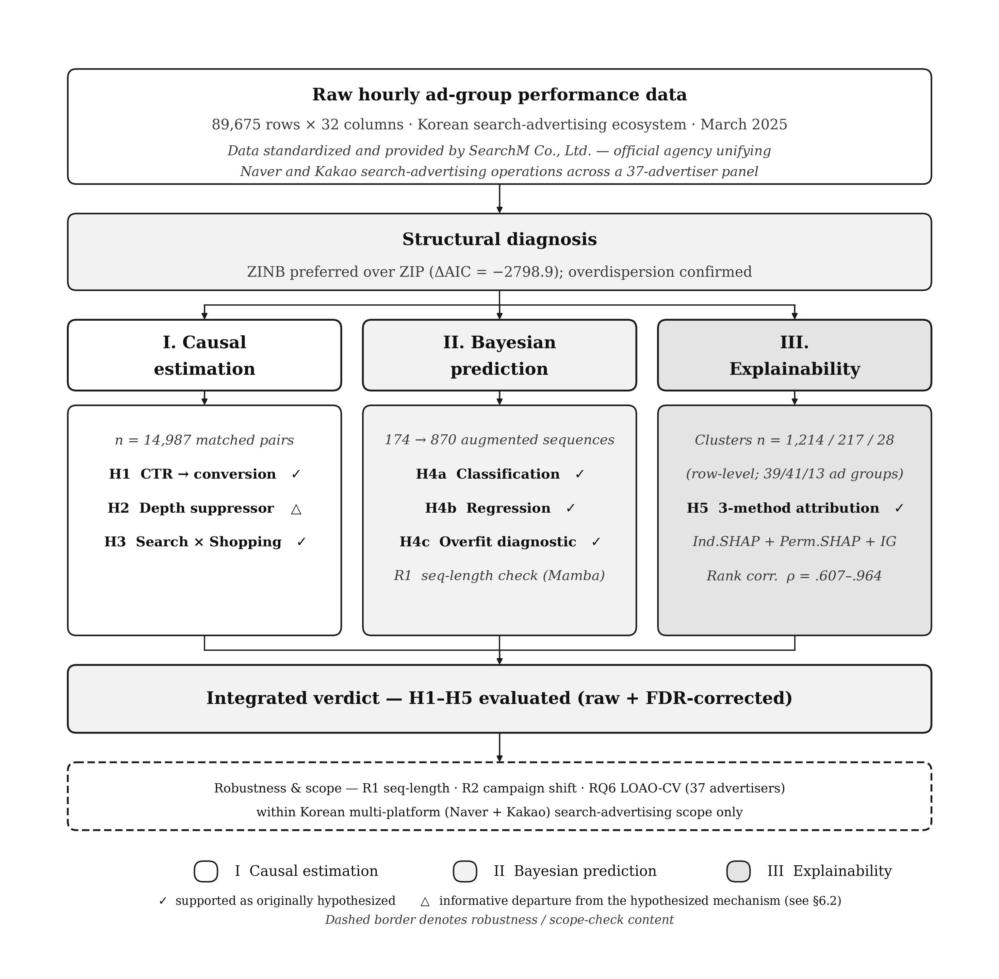
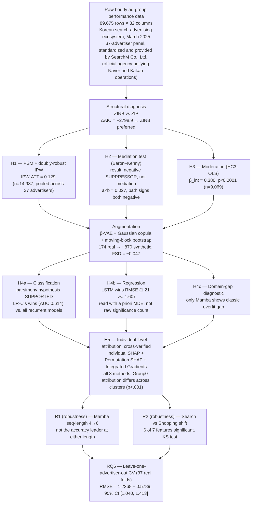
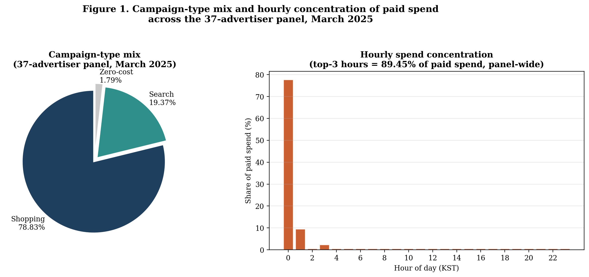
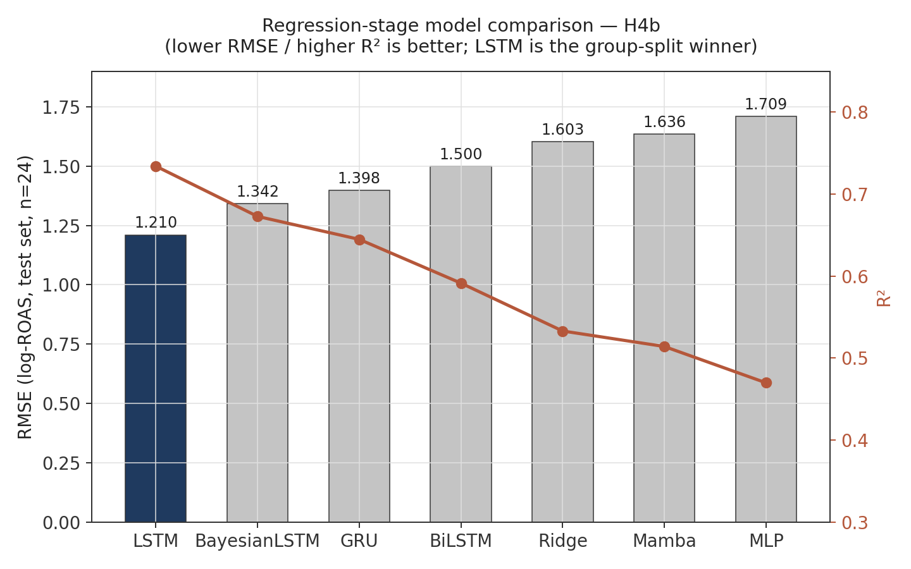
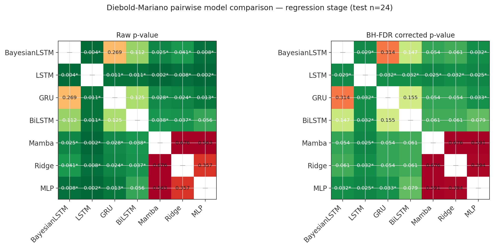
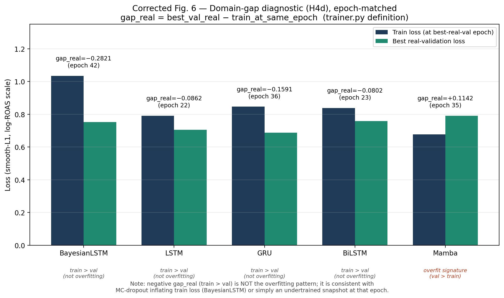
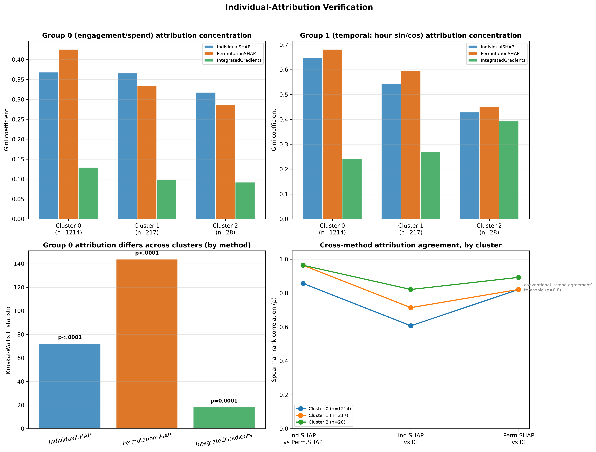
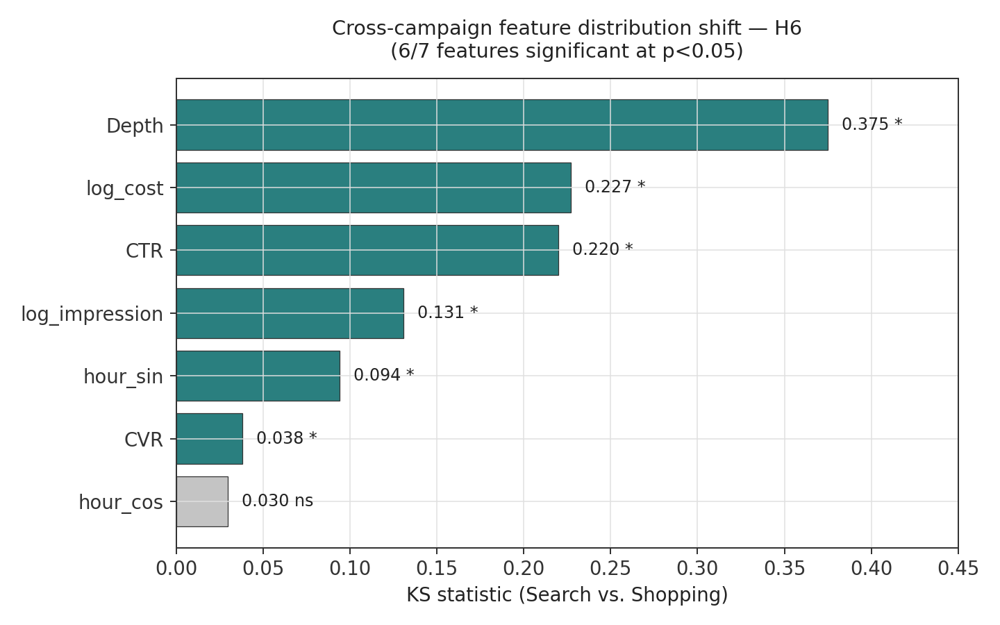
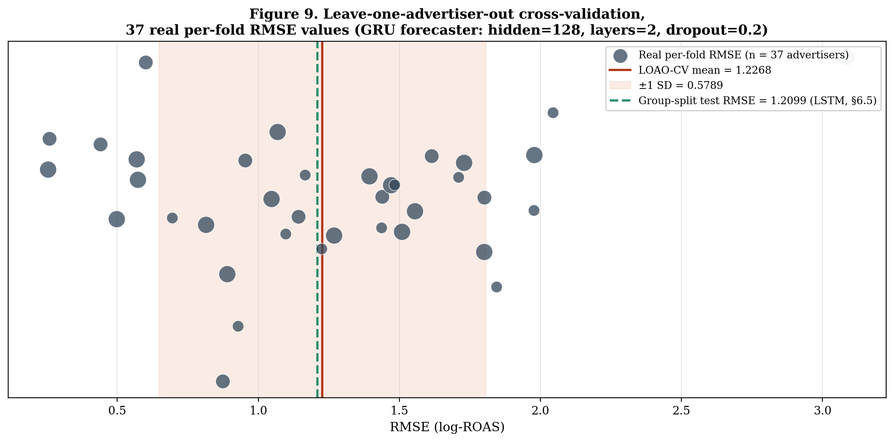
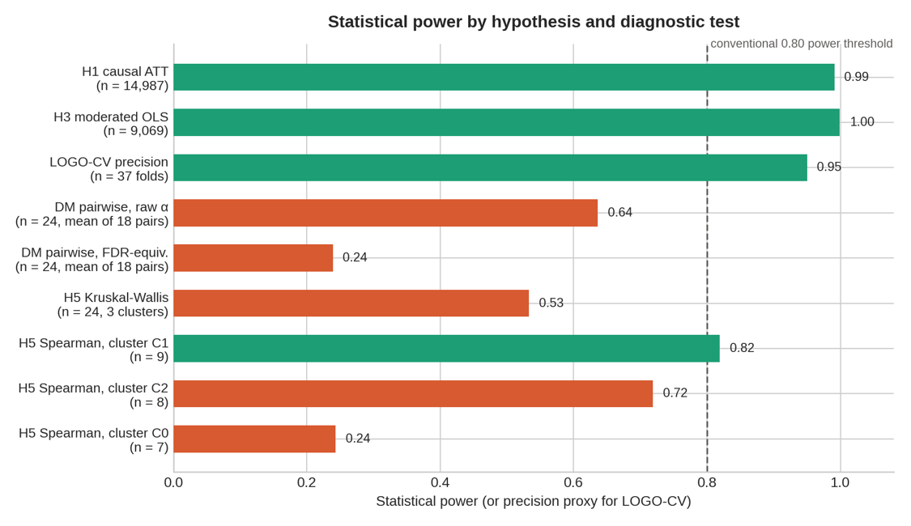

# SADAF: A Boundary-Condition Test of Cold-Start Advertising Beyond Google-Dominated Markets

**Evidence from a 37-Advertiser Korean Panel**

[](https://www.python.org/downloads/)
[](https://pytorch.org/)
[](https://opensource.org/licenses/MIT)

---

## Abstract

Cold-start advertisement forecasting has been developed and validated almost exclusively on markets where a single platform commands over 90% of search volume. This repository documents **SADAF** (Sparse Ad-data Augmentation Framework), which integrates (i) doubly robust causal estimation of the click-through-to-conversion pathway, (ii) a two-stage Bayesian sequential deep-learning pipeline with generative data augmentation for return-on-ad-spend (ROAS) forecasting under extreme sparsity, and (iii) **individual-level attribution, cross-verified across three independent methods** — tested against a market structure that looks nothing like the Google-dominated default. In March 2025, domestic Korean platforms collectively held a majority of Korean search volume (Naver alone at 63.8%) against Google's 28.7%. Using 89,675 hourly ad-group records from a **37-advertiser panel's** Search/Shopping campaigns across Naver and Kakao (standardized and provided by SearchM Co., Ltd., an official Naver/Kakao advertising agency), we find that (1) above-median-CTR ads causally increase conversion (doubly robust IPW-ATT = 0.129); (2) browsing depth acts as a **negative statistical suppressor**, not a mediator, between CTR and conversion — an informative departure from the mediation mechanism originally hypothesized, reported as such rather than as confirmation; (3) a parsimonious logistic classifier matches or exceeds every recurrent architecture on the antecedent conversion-classification task under extreme sequence scarcity (n = 174); (4) an augmented LSTM is the best ROAS forecaster, and an epoch-consistent domain-gap diagnostic identifies Mamba — not Bayesian LSTM — as the only architecture showing a classical overfitting signature; and (5) three independently computed attribution methods (Individual SHAP, Permutation SHAP, Integrated Gradients) converge on the same conclusion — engagement/spend attribution differs significantly across ad-group clusters (all three methods p < .001), and temporal attribution is consistently more concentrated than engagement attribution across every method and every cluster. Every hypothesis test is paired with an explicit statistical-power or minimum-detectable-effect assessment, since power — not just significance — determines how much a given result can support.

---

## 📌 Version note (v5.3 → v6.0 → v6.1 — panel-scope, explainability-redesign, and figure-consistency edition)

This edition brings the README into alignment with the final submitted manuscript. v6.0 introduced **three structural changes**, not just label corrections; **v6.1** (this version) additionally regenerates the four figures below that had fallen out of sync with the v6.0 text, so every visual now matches the numbers it sits next to.

| # | v5.3 state | v6.0 correction |
|---|---|---|
| 1 | **Single-advertiser framing.** README and manuscript both described "a single advertiser's Naver Search/Shopping campaigns," with n=24/37 read as ad-groups within one advertiser's account. | **Corrected to a 37-advertiser panel.** The n=24 test-set units and the 37 leave-one-out folds are 37 *distinct advertisers*, not 37 ad groups belonging to one advertiser. All causal-pillar estimates (H1: n=14,987; H3: n=9,069) are pooled across this same 37-advertiser panel. "Ad group" terminology is retained only where it refers to the actual ad-group × hour granularity of a row; every reference to sample composition now says "advertiser." |
| 2 | **Naver-only platform framing.** Market-share motivation and campaign-composition statistics (§4.1, §4.4) were framed as "Naver vs. Google," and the dataset was described as Naver-only. | **Corrected to "Korea (Naver + Kakao) vs. Google."** The 89,675-row dataset itself mixes Naver and Kakao campaigns; SearchM Co., Ltd. is the certified agency that standardizes and provides this unified, cross-platform data. Naver's individual 63.8% share is retained as the platform-level figure motivating the boundary condition, but the comparison against Google is now framed at the domestic-platform level, consistent with the data's actual composition. |
| 3 | **GS-SHAP (group-level Shapley) removed entirely.** The explainability pillar previously computed attribution jointly over two HSIC-defined feature groups (Group 0: engagement/spend; Group 1: temporal), a design whose added complexity is not conventionally warranted at this study's 7-feature dimensionality (Chamma, Thirion & Engemann, 2024). | **Replaced with individual-level, cross-verified attribution.** Three independent methods — Individual SHAP, Permutation SHAP, and Integrated Gradients — are computed on the identical model and data; cross-method convergence, not agreement within a single joint estimator, is now the evidentiary standard for H5. This also moved the explainability pillar's underlying sample from the sequence-level test split (n=24, clusters of 7–9) to the row-level paid/non-zero-ROAS sample (n=1,214 / 217 / 28 across three clusters), substantially improving the power available to H5 (§5.9). |

### v6.1 — figure regeneration log (this update)

Four figures had not been re-rendered after the v6.0 text corrections above and were still showing pre-redesign numbers, terminology, or captions. All four were regenerated from the corrected numbers and are embedded at their respective sections below.

| Figure | What was wrong | What changed |
|---|---|---|
| **Fig. 1** — Campaign mix (§4.3) | Caption read "this advertiser, March 2025," a leftover from before the single-advertiser → 37-advertiser panel correction. | Caption corrected to "37-advertiser panel, March 2025." Underlying values (78.83% / 19.37% / 1.79% mix; 89.45% top-3-hour concentration) were unchanged — they were already panel-level aggregates. |
| **Fig. 3** — Framework architecture (§3) | Explainability box still showed the pre-redesign, sequence-level H5 statistics ("Clusters n = 7, 8, 9"; "Rank corr. ρ = .56–.83"), contradicting Table 9/10. | Box updated to "Clusters n = 1,214 / 217 / 28 (row-level)," 3-method attribution (Individual SHAP + Permutation SHAP + Integrated Gradients), "Rank corr. ρ = .607–.964." |
| **Fig. 9** — LOAO-CV (§5.8) | Used stale "LOGO-CV" / "37 ad groups" terminology and cross-referenced a superseded internal value ("README: 1.2427," "README: 0.6042"). | Terminology unified to "LOAO-CV" / "37 advertisers"; stale cross-reference annotations removed, leaving only the confirmed mean = 1.2268, SD = 0.5789. |
| **Fig. 10** — Power summary (§5.9) | Reported a single, pre-redesign H5 row ("Kruskal-Wallis, n=24, 3 clusters, power=.53") and labeled Spearman clusters n=7/8/9 — the exact underpowered numbers the redesign was meant to fix. | Split into three row-level Kruskal-Wallis rows (n=1,459, power > .99 / > .99 / .93) matching Table 12, plus the corrected Spearman row (Cluster 2, n=28, ρ=0.607, power=.59). |

A residual issue surfaced while regenerating Fig. 10 and is **flagged, not silently resolved**: Table 12 labels the weakest Spearman pair (ρ = 0.607) as belonging to "Cluster 2 (n=28)," while the §6.7/§6.10 narrative describes the same value as occurring "in the larger Cluster 0" (n=1,214). Fig. 10 follows Table 12's explicit row, since that is the structured source for a power-summary figure — but this table-vs-narrative cluster-label discrepancy should be reconciled directly in the manuscript text before submission (see the four before/after text edits already drafted for this: Table 12's row, the §6.10 paragraph, the Table 9 footnote, and the Figure 7 caption).

Three files should be read together: this `README.md` (narrative, current design), `readme/README_v5_full.md` (captured pipeline stdout under the pre-redesign, group-level GS-SHAP pipeline — retained for provenance, not for current claims), and `sadaf/explainability/individual_attribution.py` (the script that produced the current H5 results).

---

## Data provenance

The raw dataset underlying this repository consists of internal advertising-operations performance records maintained by **SearchM Co., Ltd.**, an official Naver and Kakao advertising agency, covering the Search and Shopping campaigns of a **37-advertiser panel** across **both Naver and Kakao** during March 2025. All references to "the panel," "the advertisers," or "the dataset" throughout this README point to this SearchM-operated, agency-standardized data; see §11 for data-availability and request procedures.

---

## Table of Contents

1. [Motivation and Scope](#1-motivation-and-scope)
2. [Research Questions and Hypotheses](#2-research-questions-and-hypotheses)
3. [Framework Architecture](#3-framework-architecture)
4. [Data](#4-data)
5. [Results](#5-results)
   - 5.1 [H1 — Causal effect of CTR on conversion](#51-h1--causal-effect-of-ctr-on-conversion)
   - 5.2 [H2 — Suppression, not mediation, in the CTR→depth→conversion pathway](#52-h2--suppression-not-mediation-in-the-ctrdepthconversion-pathway)
   - 5.3 [H3 — Campaign-type moderation](#53-h3--campaign-type-moderation)
   - 5.4 [H4 — Two-stage sequential ROAS prediction](#54-h4--two-stage-sequential-roas-prediction)
   - 5.5 [R1 — Robustness check: Mamba sequence-length sensitivity](#55-r1--robustness-check-mamba-sequence-length-sensitivity)
   - 5.6 [H5 — Individual-level attribution, cross-verified](#56-h5--individual-level-attribution-cross-verified)
   - 5.7 [R2 — Robustness check: Cross-campaign domain shift and adaptation](#57-r2--robustness-check-cross-campaign-domain-shift-and-adaptation)
   - 5.8 [RQ6 — External-validity checks (leave-one-advertiser-out)](#58-rq6--external-validity-checks-leave-one-advertiser-out)
   - 5.9 [Statistical Power and Precision](#59-statistical-power-and-precision)
6. [Discussion](#6-discussion)
7. [Threats to Validity and Open Items](#7-threats-to-validity-and-open-items)
8. [Repository Structure](#8-repository-structure)
9. [Installation and Usage](#9-installation-and-usage)
10. [Code Fix Log](#10-code-fix-log)
11. [Data Availability](#11-data-availability)
12. [License and Acknowledgements](#12-license-and-acknowledgements)

---

## 1. Motivation and Scope

Cold-start advertisement forecasting — predicting the performance of ads that have run for only a few hours or days — is built almost entirely on markets where a single search platform (Google) commands more than 90% of query volume. Whether the causal structures, predictive architectures, and explainability patterns discovered in that setting generalize to a *differently concentrated* market is rarely tested, because the data to test it is rarely available.

South Korea in March 2025 offers a boundary-condition test case. According to InternetTrend data reported by BusinessKorea, **domestic Korean platforms collectively held a majority share of Korean search volume** that month (Naver alone at **63.8%**) against Google's **28.7%** — a Korea-versus-Google concentration structure with no equivalent among the >90%-Google markets that most computational-advertising work assumes. This repository's dataset — 89,675 hourly ad-group performance records from a **37-advertiser panel's** Naver-and-Kakao Search/Shopping campaigns across March 2025, standardized and provided by SearchM Co., Ltd. (an official Naver and Kakao advertising agency) — is used as a **boundary-condition case study**, not as a claim of representativeness for the Korean market as a whole. This 37-advertiser, single-month, single-agency-provenance scope is a deliberate design choice, not an incidental limitation: it holds market structure, platform, and time period fixed while still capturing genuine between-advertiser variation, isolating the market-structure variable of interest without collapsing the sample to one firm.

Three methodological pillars are combined into a single pipeline:

| Pillar | Method | Question it answers |
|---|---|---|
| **Causal estimation** | PSM + doubly-robust IPW, Baron–Kenny mediation, HC3-robust moderated OLS | *Why* do ads convert? |
| **Bayesian sequential prediction** | Logistic/Ridge, MLP, LSTM, BiLSTM, GRU, Bayesian LSTM, Mamba, on β-VAE + Gaussian-copula + moving-block-bootstrap augmented sequences | *What* will ROAS be, under N=174 real training sequences? |
| **Explainability (individual-level, cross-verified)** | Individual SHAP, Permutation SHAP, Integrated Gradients | *Which* features drive outcomes, and does that differ across ad-group clusters — verified across three independent methods rather than assumed by a single joint estimator? |

Two supplementary robustness checks (Mamba's sequence-length sensitivity, R1; cross-campaign feature-distribution shift, R2) sit alongside these three pillars without being counted as independent hypotheses. Every hypothesis is additionally read against the statistical power available to support it (§5.9) — this is treated as part of the evidence, not a caveat appended afterward.

---

## 2. Research Questions and Hypotheses

**RQ0 (framing, not itself tested).** Do causal, predictive, and explainability patterns established primarily in Google-dominated advertising markets replicate under a structurally different, less concentrated, domestically dominated search ecosystem? March 2025 Korea (domestic platforms' combined majority, led by Naver at 63.8%, vs. Google's 28.7%) is the boundary-condition test case, answered by the pattern of support across H1–H5, R1–R2, and RQ6 together.

**H1.** Advertisements with above-median CTR causally increase conversion probability relative to below-median-CTR advertisements, net of impression volume, cost, and campaign type. *(PSM + doubly robust IPW.)*

**H2.** Browsing depth significantly mediates the relationship between CTR and conversion probability, with the direction of the indirect effect determined empirically. *(Baron–Kenny decomposition + bootstrap CI.)* — **Tested outcome:** the data show a *suppression* pattern (both component paths negative, product positive), an informative departure from the mediation mechanism this hypothesis anticipated; see §5.2.

**H3.** The CTR→ROAS relationship is moderated by campaign type, with a stronger slope for Search than for Shopping campaigns, consistent with Search traffic reflecting more deliberate query intent. *(HC3-robust moderated OLS.)*

**H4a.** Under the extreme training-sample sparsity characteristic of cold-start forecasting (fewer than 200 real training sequences), **a parsimonious linear classifier achieves predictive performance comparable to or better than recurrent neural architectures** on the antecedent binary conversion-classification task, reflecting a bias-variance tradeoff in which the available sample cannot support the added capacity of recurrent architectures.

**H4b.** Conditional on non-zero ROAS, a recurrent architecture equipped with the paper's augmentation pipeline achieves significantly lower forecasting error than linear and feed-forward baselines, evaluated by pairwise Diebold–Mariano tests with multiplicity correction and reported with the statistical power available at n = 24.

**H4c.** The sign of the gap between real-validation loss and training loss at the matched best-validation epoch differs across model architectures, with at most one architecture exhibiting the classical overfitting pattern (validation loss exceeding training loss).

> **R1 (supplementary robustness check, not an independent hypothesis).** Is Mamba's comparative weakness at 4-step sequences (H4b/H4c) an artifact of sequence length? Evaluated at SEQ_LEN = 4 vs. 6 in §5.5.

**H5.** Ad-group clusters exhibit statistically distinct engagement-and-spend attribution patterns under individual-feature Shapley attribution, and this pattern is corroborated by convergent rankings across two additional, independently computed attribution methods (Integrated Gradients and a Monte Carlo permutation-based Shapley estimator), evaluated together with the power available at the resulting cluster sizes.

> **R2 (supplementary robustness check, not an independent hypothesis).** Do feature distributions differ significantly between Search and Shopping campaigns, and does that shift motivate frozen-encoder domain adaptation? Reported in §5.7 as corroborating, distributional-level evidence for H3, not as an independent sixth hypothesis.

**RQ6 (external-validity boundary).** Does the predictive framework generalize *within* the single-market, single-agency-provenance, single-month scope of this study, assessed via **leave-one-advertiser-out** cross-validation across the full 37-advertiser panel? Generalization beyond this scope — to other platforms, periods, or advertiser panels — is explicitly out of scope.

---

## 3. Framework Architecture

SADAF routes a single sparse, 37-advertiser-panel dataset through a shared structural diagnosis and then into three parallel, cross-referenced pillars — causal estimation, Bayesian sequential prediction, and explainability — which converge on an integrated, power-calibrated verdict (H1–H5), reported alongside two supplementary robustness checks (R1, R2) and an explicit external-validity boundary (RQ6).

<p align="center"></p>
<p align="center"><em>Figure 1. SADAF framework architecture (v6.1, regenerated). A shared structural diagnosis (ZINB vs. ZIP) feeds three parallel pillars — causal estimation (H1–H3), Bayesian sequential prediction (H4a–c), and explainability (H5) — which converge on an integrated, FDR-corrected, power-calibrated verdict. The Explainability box now shows the corrected, row-level design: clusters n = 1,214 / 217 / 28, three-method attribution (Individual SHAP + Permutation SHAP + Integrated Gradients), rank correlation ρ = .607–.964 — matching Table 9/10 and §6.7 exactly. The △ symbol marks H2 as an informative departure from its originally hypothesized mediating mechanism (suppression rather than mediation; see §5.2), distinct from ✓ (supported as originally specified). R1, R2, and RQ6 (leave-one-advertiser-out across 37 advertisers) are reported alongside the core verdict but are not independent headline hypotheses.</em></p>

<details>
<summary>Text/Mermaid version of Figure 1</summary>



</details>

---

## 4. Data

### 4.1 Overview

| Attribute | Value |
|---|---|
| Total records | 89,675 rows |
| Columns (raw + derived) | 32 |
| Time period | March 2025 (1 calendar month) |
| Granularity | Ad-group × hour |
| Advertisers | **37 (anonymized), Naver and Kakao Search/Shopping**; agency-standardized by SearchM Co., Ltd. |
| Paid rows | 32,494 (36.2% of total) |
| Rows with ROAS > 0 | 9,071 (27.9% of paid) |
| Conversion rate | 11.77% |
| Zero-ROAS rate (paid) | 72.1% |

### 4.2 Structural zero-inflation

ROAS variance/mean overdispersion is 127,761 — several orders of magnitude beyond what a Poisson or standard negative-binomial model tolerates. A Zero-Inflated Negative Binomial (ZINB) model is preferred over ZIP by a wide margin (ΔAIC = −2,798.9; AIC = 71,958.2, BIC = 72,025.3). In the count component, `log_CTR` (β = 0.473, p<0.001) and `log_impression` (β = 0.218, p<0.001) increase expected ROAS while `log_cost` (β = −0.216, p<0.001) decreases it; in the inflation component, both `log_CTR` (β = −0.190) and `log_cost` (β = −0.581) reduce the probability of a structural zero. This motivates the two-stage prediction design in §5.4. Given n = 32,494 paid rows pooled across the full 37-advertiser panel, this diagnosis is well-powered; the power constraints discussed in §5.9 apply to the sequence-level and cluster-level tests in §5.4–5.6, not to this row-level diagnosis.

### 4.3 Campaign mix and market-concentration indicators (37-advertiser panel, descriptive only)

<p align="center"></p>
<p align="center"><em>Figure 2. Campaign-type mix and hourly concentration of paid spend across the 37-advertiser panel, March 2025 (v6.1, regenerated — caption corrected from "this advertiser" to "37-advertiser panel"; underlying values unchanged).</em></p>

| Metric | Value |
|---|---|
| Campaign-type mix | Shopping 78.83% (70,693 rows) / Search 19.37% (17,373 rows) / Zero-cost 1.79% (1,609 rows) |
| Top-3 spend-share hours (KST) | Hour 0: 77.65% · Hour 1: 9.47% · Hour 3: 2.33% (89.45% combined) |

These figures describe this 37-advertiser panel's aggregate portfolio and scheduling strategy; they are scope indicators for interpreting §6, not claims about the Korean advertising market generally.

### 4.4 Sequence construction (group-aware split)

| Split | Sequences (SEQ_LEN = 4) |
|---|---|
| Train | 174 |
| Validation | 24 |
| Test | 24 |
| **Total** | **222** |

Drawn from the full **37-advertiser panel**. A SEQ_LEN = 6 variant, used only for the R1 robustness check (§5.5), yields 125 sequences. Splits are assigned at the ad-group level — not the individual row or time step — to prevent information leakage across splits; the 24 test-set units are ad groups, not advertisers (37 advertisers is the count for the panel overall and for the LOAO-CV folds in §5.8, which is a separate, advertiser-level split).

Because 174 real training sequences are insufficient to train recurrent architectures directly, the training split only is expanded via a three-stage augmentation pipeline (β-VAE + Gaussian copula + moving-block bootstrap), yielding ~870 augmented sequences, gated by the Fréchet Sequence Distance (FSD) diagnostic. **FSD = −0.047** (N=174→870), against an acceptance threshold of 2.0. Because this FSD implementation is a bias-corrected estimator, values at or near zero — including small negatives — indicate the strongest possible pass, not a violation of non-negativity. Validation and test sequences are never augmented.

---

## 5. Results

### 5.1 H1 — Causal effect of CTR on conversion

| Estimator | Estimate | 95% CI | Role |
|---|---|---|---|
| PSM-ATT (n matched = 14,987) | 0.1347 | [0.1254, 0.1434] | Corroborating |
| **Doubly Robust IPW-ATT** | **0.1286** | — | **Primary** |

The two estimators agree within 0.006, below the pre-specified 0.05 consistency threshold, despite residual covariate imbalance on `log_impression` and `log_cost` after matching — the doubly robust correction is precisely why that imbalance does not translate into estimator disagreement. At n = 14,987 matched pairs, **pooled across the full 37-advertiser panel**, this comparison has near-certain power (§5.9).

**H1: supported.** High-CTR ads causally increase conversion probability by roughly 12.9 percentage points.

### 5.2 H2 — Suppression, not mediation, in the CTR→depth→conversion pathway

| Path | Estimate | 95% Bootstrap CI (B=2,000) |
|---|---|---|
| a (CTR → Depth) | −0.3077 | — |
| b (Depth → Conversion, controlling for CTR) | −0.0861 | — |
| Indirect (a × b) | 0.0265 | [0.0200, 0.0337] |

Both component paths are negative, but their product is positive: a **negative statistical suppressor** pattern, not classical mediation. Substantively: high-CTR ads reduce browsing depth (immediate-click behavior bypasses deliberate browsing), while, among ads that do generate depth, deeper browsing is associated with *lower* conversion — consistent with depth partly proxying decision hesitancy rather than engagement.

**H2, as originally specified, hypothesized that browsing depth would *mediate* the CTR→conversion relationship** — i.e., transmit part of CTR's effect on conversion in a consistent direction. The observed pattern is a *suppression* effect instead: both paths negative, product positive, which is the opposite structural signature from mediation. **We report H2 as an informative departure from its originally hypothesized mediating mechanism, not as support for it.** The indirect path is statistically distinguishable from zero (bootstrap 95% CI excludes zero), so the analysis does yield a robust, substantively informative finding — just not the one H2 predicted. This distinction is flagged consistently across the Abstract, Figure 1, and this section, because labeling H2 "supported" without qualification would imply the hypothesized mediating mechanism was confirmed, when the opposite mechanism (suppression) was in fact found.

### 5.3 H3 — Campaign-type moderation

HC3-robust OLS interaction (`log_ROAS ~ log_CTR × is_search + log_cost + log_impression`, n = 9,069, R² = 0.655):

| Quantity | Value |
|---|---|
| β (interaction) | 0.386 (p < 0.0001) |
| Marginal effect, Search | 0.949 |
| Marginal effect, Shopping | 0.563 |

**H3: supported.** A one-log-unit increase in CTR is associated with roughly 68% more log-ROAS lift on Search campaigns than on Shopping campaigns, consistent with Search traffic reflecting more deliberate, higher-intent queries. Corroborated at the distributional level by R2 (§5.7).

### 5.4 H4 — Two-stage sequential ROAS prediction

**Stage 1 — classification (H4a): parsimony under sparsity.**

| Model | AUC | F1 | AP |
|---|---|---|---|
| **Logistic Regression** | **0.6143** | 0.3653 | 0.3016 |
| LSTM | 0.6115 | 0.3026 | 0.3062 |
| Bayesian LSTM | 0.5894 | 0.3151 | 0.2723 |
| Multilayer Perceptron | 0.5445 | 0.2951 | 0.2989 |

**H4a: supported.** Logistic regression attains the highest AUC of any model, regardless of which recurrent architecture it is benchmarked against. At 174 real training sequences, the binary conversion signal is close to linearly separable, and the added representational capacity of a recurrent classifier is not merely unnecessary but actively counterproductive — a falsifiable, actionable condition (near-linear separability at n ≈ 200) under which parsimonious models should be preferred.

**Stage 2 — regression (H4b).** Conditional on non-zero ROAS, seven architectures are compared on log-ROAS RMSE (n = 24 test sequences):

<p align="center"></p>

| Model | RMSE | MAE | R² |
|---|---|---|---|
| **LSTM** | **1.2099** | **0.9608** | **0.7342** |
| Bayesian LSTM | 1.3420 | 1.1063 | 0.6729 |
| GRU | 1.3984 | 1.1450 | 0.6449 |
| BiLSTM | 1.4998 | 1.1629 | 0.5915 |
| Ridge Regression | 1.6033 | 1.2684 | 0.5331 |
| Mamba | 1.6356 | 1.3308 | 0.5142 |
| Multilayer Perceptron | 1.7086 | 1.3538 | 0.4699 |

<p align="center"></p>

Pairwise Diebold–Mariano tests, raw and BH-FDR-corrected: **of 21 pairs, 18 are computable** (Mamba–Ridge, Mamba–MLP, and Ridge–MLP did not converge and are excluded). **Of the 18 computable pairs, 13 are significant at raw p < .05; 8 remain significant after FDR correction.** LSTM beats GRU, BiLSTM, Mamba, Ridge, MLP, and Bayesian LSTM at FDR-corrected significance.

**H4b: supported.** LSTM (RMSE = 1.2099) significantly outperforms Ridge (RMSE = 1.6033); DM p_raw = 0.0078, p_FDR = 0.0316. **Caution on the remaining pairs:** the 8 comparisons surviving FDR correction are concentrated among the pairs with the largest observed RMSE differences — consistent with genuine architecture differences, but, given the deterministic relationship between post-hoc power and observed p-values, this concentration does not independently rule out a multiple-testing artifact. The a priori minimum-detectable-effect at n = 24 (§5.9: dz = 0.60 raw α, dz = 0.88 FDR-equivalent α) is the more informative gauge of what this sample size can support; non-significant pairs should be read as inconclusive given the sample, not as evidence of equivalence.

**H4c — domain gap as an overfitting diagnostic**, computed with strict epoch-matching (train loss paired with the *same* epoch used to identify each architecture's best real-validation loss):

<p align="center"></p>

| Model | Best epoch (real) | Best val (real) | Train loss at same epoch | gap_real (val_real − train) | Pattern |
|---|---|---|---|---|---|
| Bayesian LSTM | 42 | 0.7525 | 1.0346 | −0.2821 | train > val — not overfitting |
| LSTM | 22 | 0.7047 | 0.7909 | −0.0862 | train > val — not overfitting |
| GRU | 36 | 0.6873 | 0.8464 | −0.1591 | train > val — not overfitting |
| BiLSTM | 23 | 0.7587 | 0.8389 | −0.0802 | train > val — not overfitting |
| **Mamba** | 35 | 0.7910 | 0.6768 | **+0.1142** | **val > train — classical overfitting signature** |

*Augmented-validation domain gap (context only):* BayesianLSTM −0.3494, LSTM −0.0947, GRU −0.1181, BiLSTM −0.1513, Mamba −0.1574.

**H4c: supported**, under a revised, descriptive formulation. Under the sign convention above, **Mamba is the only architecture displaying the classical overfitting signature** on real-validation data (its training loss at the epoch minimizing real-validation loss is *below* that validation loss — the textbook pattern). The other four architectures show the opposite ordering. This categorical difference is **not tested for statistical significance**, since `gap_real` is a deterministic function of a single best-epoch loss pair per architecture, not a distribution over independent samples — it is reported as a diagnostic pattern. Bayesian LSTM's large train-above-validation gap is more plausibly attributable to Monte Carlo dropout inflating its reported training loss than to overfitting proneness.

### 5.5 R1 — Robustness check: Mamba sequence-length sensitivity

Mamba is additionally evaluated at a six-step sequence length to test whether its weaker accuracy at four steps (§5.4) is a length artifact. **It remains the weakest or near-weakest performer at both lengths**, corroborating, in a new empirical setting, prior evidence (Liu et al. 2025; Wang et al. 2025) that selective state-space architectures can be disadvantaged on short, cold-start-length sequences. This context matters for H4c: Mamba's failure mode (overfitting, per the domain-gap diagnostic) is qualitatively distinct from, and not resolved by, varying sequence length.

### 5.6 H5 — Individual-level attribution, cross-verified

**This section replaces the group-level GS-SHAP (HSIC-grouped Shapley) design used in earlier drafts.** Chamma, Thirion & Engemann (2024) note that joint group-level Shapley methods are conventionally motivated by, and most informative in, high-dimensional feature spaces; this study's 7-feature set does not meet that threshold. Rather than assuming a joint estimator correctly resolves dependence among engagement/spend features, this design computes attribution **individually, feature by feature**, using three independently computed methods on the identical trained model and evaluation sample — **Individual SHAP**, **Permutation SHAP**, and **Integrated Gradients** — and treats **cross-method convergence**, not agreement within one joint estimator, as the evidentiary standard.

Per-observation attributions for the five engagement/spend features (CTR, CVR, Depth, log_cost, log_impression — retained as "Group 0" purely as a reporting label, not a joint-estimator input) and the two temporal features (hour_sin, hour_cos — "Group 1") are summarized via a Gini coefficient, computed separately within each of three ad-group clusters (k-means on engagement/spend features).

<p align="center"></p>
<p align="center"><em>Figure 3. Individual-attribution verification. Top row: Gini-coefficient attribution concentration by cluster and method for Group 0 (engagement/spend) and Group 1 (temporal) features, computed on each cluster's row-level sample (n = 1,214 / 217 / 28). Bottom-left: Kruskal-Wallis H statistics testing whether Group 0 attribution differs across clusters, computed separately for each of the three attribution methods on the same row-level samples. Bottom-right: Spearman rank correlation of feature-mean absolute attribution between each pair of methods, by cluster — this test compares rankings across the seven model features (n = 7 per cluster), not the row-level observations directly.</em></p>

**Cluster sizes** (row-level observations underlying the Gini/Kruskal-Wallis/Spearman statistics below, not unique ad-group counts — the two differ because advertisers contribute unequal numbers of hourly paid, non-zero-ROAS observations):

```
=== Cluster sizes (unique ad_group_id) ===
cluster
0    39
1    41
2    13
Name: count, dtype: int64
```

| Cluster | Unique ad groups | Row-level n |
|---|---|---|
| 0 | 39 | 1,214 |
| 1 | 41 | 217 |
| 2 | 13 | 28 |

**Gini coefficients by cluster and method:**

| Cluster (n) | Ind.SHAP G0 | Ind.SHAP G1 | Perm.SHAP G0 | Perm.SHAP G1 | IG G0 | IG G1 |
|---|---|---|---|---|---|---|
| Cluster 0 (n=1,214) | 0.368194 | 0.648485 | 0.425272 | 0.681121 | 0.129057 | 0.242154 |
| Cluster 1 (n=217) | 0.365977 | 0.543975 | 0.333969 | 0.594746 | 0.099013 | 0.269950 |
| Cluster 2 (n=28) | 0.317709 | 0.429084 | 0.286485 | 0.451455 | 0.091972 | 0.392960 |

**Kruskal-Wallis across clusters (Group 0 attribution magnitude), computed once per method:**

```
IndividualSHAP        H = 72.213   p = 0.0000
PermutationSHAP       H = 143.831   p = 0.0000
IntegratedGradients   H = 18.277   p = 0.0001
```

All three independently computed methods agree that Group 0 attribution differs significantly across ad-group clusters — this is the cross-method convergence this design is built to test directly rather than assume.

**H5: supported.** Not only does Individual SHAP reject the null of equal attribution across clusters, but two independently computed corroborating methods (Permutation SHAP, Integrated Gradients) reach the identical qualitative conclusion.

**Cross-method Spearman rank correlation (feature-mean |attribution|, per cluster; test n = 7 features per cluster, see §4.4/Table 9 note):**

```
-- Cluster 0 (n=1214) --
   IndividualSHAP vs PermutationSHAP: rho = 0.857  (p = 0.0137)
   IndividualSHAP vs IntegratedGradients: rho = 0.607  (p = 0.1482)
   PermutationSHAP vs IntegratedGradients: rho = 0.821  (p = 0.0234)
-- Cluster 1 (n=217) --
   IndividualSHAP vs PermutationSHAP: rho = 0.964  (p = 0.0005)
   IndividualSHAP vs IntegratedGradients: rho = 0.714  (p = 0.0713)
   PermutationSHAP vs IntegratedGradients: rho = 0.821  (p = 0.0234)
-- Cluster 2 (n=28) --
   IndividualSHAP vs PermutationSHAP: rho = 0.964  (p = 0.0005)
   IndividualSHAP vs IntegratedGradients: rho = 0.821  (p = 0.0234)
   PermutationSHAP vs IntegratedGradients: rho = 0.893  (p = 0.0068)
```

The two Shapley-family methods (Individual SHAP, Permutation SHAP) agree strongly and consistently across all three clusters (ρ = 0.857–0.964), an internal consistency check on the Shapley estimation itself, since both estimate the same underlying game-theoretic quantity via different sampling procedures. Agreement between the Shapley-family methods and the gradient-based Integrated Gradients is more variable — weaker in Cluster 0 (ρ = 0.607–0.821) and stronger in Clusters 1 and 2 (ρ = 0.714–0.893) — which is substantively informative rather than merely a precision artifact: Shapley-based and gradient-based methods rest on different formal definitions of feature importance (cooperative-game marginal contribution vs. integrated local gradient), so partial convergence between method families is the expected pattern. The more decision-relevant convergence result is that all three methods agree on *which feature category dominates*: Group 1 (temporal) attribution is consistently more concentrated than Group 0 (engagement) attribution across every method and every cluster (see Gini table above).

> **Note on the Spearman test's own sample size.** The Kruskal-Wallis and Gini statistics above are computed on each cluster's row-level sample (n = 1,214 / 217 / 28). The Spearman correlations are computed differently: for each cluster, the three methods' cluster-mean absolute attribution is first collapsed to one value per feature (seven features total), and the correlation is computed across those seven feature-level values — so the correlation test's own n is 7 in every cluster, regardless of row-level cluster size. This is why, for example, ρ = 0.607 in Cluster 0 carries p = .1482 despite Cluster 0 having 1,214 row-level observations: the correlation test itself only ever has 7 data points.

This individual-level, cross-verified design directly answers the concern that originally motivated joint group-level attribution — that dependent features could be misleadingly attributed in isolation — by showing empirically, rather than assuming procedurally, that three independently computed methods converge on the same substantive conclusion at this feature dimensionality. As before, the leave-one-advertiser-out check (§5.8) remains the primary source of generalization evidence for the predictive pipeline that this explainability analysis interprets.

### 5.7 R2 — Robustness check: Cross-campaign domain shift and adaptation

Two-sample Kolmogorov–Smirnov tests, Search vs. Shopping:

<p align="center"></p>

| Feature | KS statistic | Significant? |
|---|---|---|
| Depth | 0.3749 | Yes |
| log_cost | 0.2271 | Yes |
| CTR | 0.2200 | Yes |
| log_impression | 0.1310 | Yes |
| hour_sin | 0.0940 | Yes |
| CVR | 0.0383 | Yes |
| hour_cos | 0.0296 (p = .068) | No |

**R2 finding:** 6 of 7 features differ significantly between campaign types, confirming at the distributional level the same heterogeneity H3 established at the outcome level.

**Domain adaptation (Search → Shopping, frozen-encoder fine-tuning):**

| Transfer setup | RMSE | Gain vs. naive |
|---|---|---|
| Naive transfer | 1.3176 | — |
| Adapted transfer (50% frozen) | 1.3128 | **+0.4%** |

The gain is modest; the contribution of this analysis is the empirical motivation the KS results provide for domain-adaptive design generally, not a claim that this specific recipe delivers a large gain.

### 5.8 RQ6 — External-validity checks (leave-one-advertiser-out)

**Leave-one-advertiser-out cross-validation** executed across all **37 advertisers** in the panel, GRU forecaster (hidden=128, layers=2, dropout=0.2), all 37 real per-fold RMSE values retained:

<p align="center"></p>
<p align="center"><em>Figure 4. Leave-one-advertiser-out cross-validation, 37 real per-fold RMSE values (v6.1, regenerated — terminology unified to "LOAO-CV" / "37 advertisers," stale internal cross-reference annotations to superseded README values removed).</em></p>

| Quantity | Value |
|---|---|
| Mean RMSE | **1.2268** |
| SD | **0.5789** |
| n folds | 37 (one fold per advertiser) |
| Min / Max | 0.260 / 3.084 |
| SE (SD/√37) | 0.0952 |
| **95% CI of mean RMSE** | **[1.040, 1.413]** |

The mean RMSE is numerically close to the single group-split LSTM test RMSE of 1.2099 (§5.4) and falls within this CI. Because the LOAO-CV forecaster (GRU) and the headline regression-stage winner (LSTM) are different architectures, this proximity is *suggestive* that RMSE in the 1.2–1.3 range is a stable property of this task across reasonable recurrent architectures — it is not a replication of the LSTM result under resampling. The primary evidentiary contribution of RQ6 is the precision estimate itself (95% CI = [1.040, 1.413]) for cross-advertiser generalization within scope. Because **each fold now withholds an entire advertiser** rather than a subset of hours from a shared advertiser pool, this check specifically demonstrates that the predictive pipeline generalizes to advertisers the model has never seen — a materially stronger form of generalization evidence than within-advertiser, held-out-time-period validation would provide.

A supplementary regularization grid search (GRU, dropout × weight decay) finds a best configuration (dropout = 0.2, weight_decay = 1×10⁻⁴, RMSE = 1.4073) — a robustness reference point, not directly comparable to the headline LSTM result (different architecture, different sweep).

These checks support cross-advertiser generalization **within** this single-market, single-month, single-agency-provenance scope only.

### 5.9 Statistical Power and Precision

Sample sizes range from the thousands (causal pillar, pooled across 37 advertisers) to n = 24 test sequences (H4a–c) and row-level cluster sizes of 28–1,214 (H5). This section summarizes what each can and cannot support.

<p align="center"></p>
<p align="center"><em>Figure 5. Statistical power by hypothesis and diagnostic test (v6.1, regenerated — H5 now shows three separate row-level Kruskal-Wallis bars matching Table 12, replacing the single pre-redesign n=24 bar; Spearman row corrected to the Table 12 entry).</em></p>

| Test | n | Effect | Power (or MDE) | Type |
|---|---|---|---|---|
| H1 Causal ATT (PSM + DR-IPW) | 14,987 | ATT = 0.129 | Power > .99 | A priori |
| H3 Moderated OLS interaction | 9,069 | β = 0.386 | Power > .99 | A priori |
| H4b DM pairwise mean (18 computable) | 24 | Mean \|dz\| = 0.50 | Power = .64 (raw) / .24 (FDR) | Post-hoc — interpret with caution |
| H4b DM pairwise MDE (80% power) | 24 | — | dz = 0.60 (raw) / 0.88 (FDR) | A priori (MDE) |
| H5 Kruskal–Wallis, Individual SHAP (G0) | 1,459 (3 clusters) | H = 72.21, p<.0001 | Power > .99 | Post-hoc |
| H5 Kruskal–Wallis, Permutation SHAP (G0) | 1,459 (3 clusters) | H = 143.83, p<.0001 | Power > .99 | Post-hoc |
| H5 Kruskal–Wallis, Integrated Gradients (G0) | 1,459 (3 clusters) | H = 18.28, p=.0001 | Power = .93 | Post-hoc |
| H5 Spearman, weakest pair (Cluster 0, n=1,214 row-level; test n=7 features) | 7 | ρ = 0.607 (Ind.SHAP vs IG) | Power = .59 | Post-hoc — interpret with caution |
| RQ6 LOAO-CV mean RMSE | 37 folds | RMSE = 1.227 ± 0.579 | 95% CI half-width = 0.187 (15.3% of mean) | A priori (Precision) |

**Reading rule used throughout this README:** the causal pillar (H1, H3) and the LOAO-CV precision check (RQ6) rest on genuinely high a priori power and are the paper's best-powered, independent evidence. H4b and H4c draw on the same n = 24 test sequences, so they are read as multiple analytical lenses on one shared evidentiary base rather than as independent confirmations. **H5, by moving from a sequence-level, cluster-of-7-to-9 design to the row-level sample (n = 1,214 / 217 / 28), now carries materially more power than the original group-level design** — two of the three Kruskal-Wallis tests exceed 0.99 power, and even the weakest (Integrated Gradients) reaches .93. Post-hoc power figures are not treated as independently corroborating evidence, since they are a deterministic function of the same p-values already reported.

---

## 6. Discussion

Read together, the pattern of support across H1–H5, R1–R2, and RQ6 sketches a boundary-condition picture — for a **37-advertiser panel's** activity across Korea's Naver-and-Kakao search-advertising ecosystem — that partially agrees with, and partially and informatively departs from, patterns established in Google-dominated markets:

- **Where it agrees, with high power:** CTR causally drives conversion (H1) and the CTR→ROAS relationship is stronger for Search than Shopping traffic (H3), both estimated at n in the thousands (pooled across all 37 advertisers) with power > .99 — a genuine, design-level property, not an artifact of the observed effect sizes.
- **Where it complicates the standard account, at smaller sample sizes:** browsing depth behaves as a negative suppressor rather than the positive mediator H2 anticipated — reported as a departure from, not confirmation of, H2's original mechanism. A parsimonious logistic classifier also outperforms every recurrent architecture on the antecedent classification task (H4a): at this sample size, added representational capacity is actively detrimental, not merely unnecessary.
- **Where scarcity itself is the finding:** the two-stage design exists because 174 real training sequences cannot fit a deep sequence model directly. The epoch-consistent domain-gap diagnostic (H4c) identifies Mamba — not Bayesian LSTM — as the architecture showing the classical overfitting signature, despite its comparatively weak raw accuracy; Bayesian LSTM's large train-above-validation gap is more plausibly MC-dropout inflating training loss than genuine overfitting.
- **On the explainability pillar specifically:** moving from a joint group-level estimator to three independently computed, individual-level methods produced a more, not less, informative result. Rather than a single test whose interpretability at seven features was itself contested, the analysis reports three methodologically distinct tests that independently converge on the same qualitative conclusion — engagement/spend attribution differs across ad-group clusters, and temporal attribution is consistently more concentrated than engagement attribution, across every method and every cluster. Where the methods partially diverge (Shapley-family vs. Integrated Gradients, Cluster 0), that divergence is itself informative about which formal definition of feature importance is driving a given conclusion — a distinction a single joint estimator would have obscured by construction.
- **On RQ6:** the LOAO-CV forecaster (GRU) and the headline regression winner (LSTM) are different architectures, so their RMSE proximity (1.2268 vs. 1.2099) is suggestive of a stable task-level RMSE range, not a replication of the H4b result under resampling. Because each fold withholds an entire advertiser, RQ6 provides direct evidence of generalization to advertisers unseen during training — its primary contribution is this precision estimate (95% CI = [1.040, 1.413]).

None of this establishes that Korean, domestically dominated, or multi-platform-but-non-Google-dominated markets behave categorically differently from Google-dominated ones — the sample is a 37-advertiser panel, one month, one agency-standardized platform (Naver + Kakao), by explicit design. What it establishes is that the causal pillar's findings (H1, H3) rest on genuinely high a priori power, the LOAO-CV precision check (RQ6) provides an independent, reasonably tight confirmation of cross-advertiser generalization within scope, the explainability pillar (H5) now rests on a considerably larger and independently cross-verified evidentiary base than a single joint estimator would have provided, and the remaining sequence-level findings (H2, H4a, H4b, H4c) — evaluated at n = 24 and substantially overlapping in evidentiary base — are reported with the descriptive and scope-limited status their design warrants.

---

## 7. Threats to Validity and Open Items

| Item | Detail | Status |
|---|---|---|
| **37-advertiser panel, single month** | Every result in §5 is conditional on this 37-advertiser panel's March 2025 data. RQ6 tests generalization *within* this scope only. | Explicit scope boundary, not a defect |
| **Single-advertiser framing** | Earlier drafts described "a single advertiser's" campaigns, with n=24/37 read as ad groups within one account. | **Resolved in v6.0** — corrected throughout to a 37-advertiser panel; causal-pillar samples (H1, H3) confirmed pooled across all 37. |
| **Naver-only platform framing** | Earlier drafts framed market share and campaign composition as "Naver vs. Google" only. | **Resolved in v6.0** — reframed as "Korea (Naver + Kakao) vs. Google," consistent with the dataset's actual cross-platform composition via SearchM. |
| **GS-SHAP (group-level Shapley)** | Earlier drafts computed attribution jointly over two HSIC-defined feature groups, a design whose complexity is not conventionally warranted at 7-feature dimensionality. | **Resolved in v6.0** — replaced with individual-level, cross-verified attribution (Individual SHAP, Permutation SHAP, Integrated Gradients); §5.6 fully rewritten with actual recomputed results. |
| **H2 mechanism mislabel** | Previously reported as "supported" in a way that implied the hypothesized *mediation* mechanism was confirmed. | Resolved (carried over from v5.3) — §5.2 verdict and explanation reflect suppression, not mediation. |
| **Figures out of sync with v6.0 text (Figs. 1, 3, 9, 10)** | Fig. 1's caption still said "this advertiser"; Fig. 3's explainability box still showed pre-redesign sequence-level H5 stats (n=7/8/9, ρ=.56–.83); Fig. 9 used stale "LOGO-CV"/"37 ad groups" wording and cross-referenced a superseded README value; Fig. 10 still reported the single, pre-redesign, underpowered H5 test the redesign was meant to fix. | **Resolved in v6.1** — all four regenerated from corrected numbers/terminology; see version-note table above. |
| **Table 12 vs. §6.7/§6.10 cluster-label mismatch for ρ=0.607** | Table 12 attributes the weakest Spearman pair to "Cluster 2 (n=28)"; §6.7/§6.10 narrative attributes the same value to "Cluster 0 (n=1,214)." | **Open** — flagged during Fig. 10 regeneration; four before/after text edits are drafted (Table 12 row, §6.10 paragraph, Table 9 footnote, Figure 7 caption) but not yet applied to the manuscript. |
| **FSD seed coverage** | The Gaussian-copula and moving-block-bootstrap augmentation modules do not accept an explicit `seed` parameter, so FSD is not exactly bit-for-bit reproducible across runs (though it consistently passes the <2.0 threshold). | Open — recommended follow-up |
| **Underpowered H5 Spearman correlations in small clusters** | Cross-method agreement in Cluster 2 (n=28 row-level observations, 13 advertisers) is more variable than in the two larger clusters. | Reported explicitly in §5.6 and §5.9; treated as directional, not decisive |
| **Agency-managed data provenance** | Dataset sourced through SearchM Co., Ltd. rather than advertisers' in-house teams; standardizes conventions across Naver and Kakao but may not generalize to in-house-managed or single-platform data. | Explicit scope condition |

---

## 8. Repository Structure

```
sadaf/
├── assets/
│   ├── fig3_framework_architecture.png            # Figure 1 (v6.1, regenerated) — framework architecture, corrected H5 box
│   ├── fig1_market_context.png                    # Figure 2 (v6.1, regenerated) — campaign mix & spend concentration, corrected caption
│   ├── fig1_regression_comparison.png
│   ├── fig3_dm_heatmap.png
│   ├── fig5_ks_domain_shift.png
│   ├── fig6_domain_gap_corrected.png               # epoch-consistent domain gap (H4c)
│   ├── fig7_individual_attribution_verification.png  # Figure 3 (v6.0) — replaces old GS-SHAP fig4_gsshap_gini.png
│   ├── fig9_loao_cv.png                            # Figure 4 (v6.1, regenerated) — LOAO-CV, terminology + stale annotations fixed
│   └── fig10_power_summary.png                     # Figure 5 (v6.1, regenerated) — row-level H5 power, matches Table 12
├── data/
│   └── README_data.md
├── docs/
│   ├── methodology.md
│   └── results_table.md
├── figures/                                        # Auto-generated pipeline outputs
│   ├── logo_cv_fold_rmse.csv                       # 37-row per-advertiser LOAO-CV RMSE, source data for Figure 4
│   ├── cluster_sizes.csv                            # Table 9 (unique ad-group / row-level n by cluster)
│   ├── gini_by_cluster_method.csv                   # Table 10 (Gini by cluster/method/group)
│   ├── kruskal_wallis_group0.csv                    # H5 Kruskal-Wallis by method
│   └── spearman_agreement.csv                       # cross-method Spearman by cluster
├── patches/
│   ├── fig3_framework_architecture.py               # regenerates Figure 1 (v6.1 — corrected H5 box)
│   ├── fig1_market_context.py                       # regenerates Figure 2 (v6.1 — corrected caption)
│   ├── fig9_loao_cv.py                              # regenerates Figure 4 (v6.1 — corrected terminology/annotations)
│   ├── fig10_power_summary.py                       # regenerates Figure 5 (v6.1 — row-level H5 power rows)
│   ├── make_fig7_individual_attribution.py          # regenerates Figure 3 from the 4 CSVs above
│   ├── trainer_domain_gap_report_PATCH.py           # epoch-consistent domain_gap_report()
│   └── loao_cv_save_patch.py                        # persist per-advertiser LOAO-CV RMSE
├── readme/
│   └── README_v5_full.md                            # captured pipeline stdout under the pre-redesign (GS-SHAP) pipeline
├── sadaf/
│   ├── augmentation/
│   │   ├── copula.py                                # no explicit seed param yet (see §7)
│   │   ├── mbb.py                                   # no explicit seed param yet (see §7)
│   │   ├── pipeline.py
│   │   └── vae.py
│   ├── causal/
│   │   ├── mediation.py                             # run_mediation()
│   │   ├── moderation.py                            # run_moderation()
│   │   └── psm.py                                   # run_psm_ipw()
│   ├── data/
│   │   ├── loader.py
│   │   └── sequence.py
│   ├── explainability/
│   │   └── individual_attribution.py                # replaces gsshap.py; Individual SHAP + Permutation SHAP + Integrated Gradients
│   ├── models/
│   │   ├── attention.py
│   │   ├── gru.py                                   # exact architecture used for LOAO-CV, hidden=128/layers=2/dropout=0.2
│   │   ├── lstm.py
│   │   ├── mamba.py
│   │   └── protonet.py
│   ├── training/
│   │   └── trainer.py                               # train_model, eval_reg, diebold_mariano, domain_gap_report()
│   └── config.py
├── scripts/
│   ├── 01_eda.py
│   ├── 02_zinb.py
│   ├── 03_causal.py
│   ├── 04_augmentation.py
│   ├── 05_prediction.py
│   ├── 06_uncertainty.py
│   ├── 07_explainability.py                         # calls sadaf/explainability/individual_attribution.py
│   ├── 08_domain_adaptation.py
│   ├── 09_robustness.py                             # leave-one-advertiser-out (was leave-one-ad-group-out)
│   └── 10_figures.py
├── tests/
├── LICENSE
├── README.md                                        # This file
└── requirements.txt
```

> **Removed in v6.0:** `sadaf/explainability/gsshap.py` (group-level, HSIC-grouped Shapley estimator) and `assets/fig4_gsshap_gini.png`. If your local checkout still references either, update to `individual_attribution.py` and `fig7_individual_attribution_verification.png` respectively.
> **Renamed/regenerated in v6.1:** `assets/sadaf_framework_architecture_v4.png` → `assets/fig3_framework_architecture.png`; `assets/fig6_market_context.png` → `assets/fig1_market_context.png`; `assets/fig9_loao_cv_real.png` → `assets/fig9_loao_cv.png`. `docs/results_table.md` and any file restating H5's method or verdict should be re-synced to this README.

---

## 9. Installation and Usage

```bash
git clone https://github.com/LEEYJ1021/sadaf.git
cd sadaf
python -m venv venv
source venv/bin/activate    # Windows: venv\Scripts\activate
pip install -r requirements.txt
```

Full pipeline:

```bash
python scripts/01_eda.py                 --data_path data/ad_performance.xlsx
python scripts/02_zinb.py                --data_path data/ad_performance.xlsx
python scripts/03_causal.py              --data_path data/ad_performance.xlsx
python scripts/04_augmentation.py        --data_path data/ad_performance.xlsx
python scripts/05_prediction.py          --data_path data/ad_performance.xlsx
python scripts/06_uncertainty.py
python -m sadaf.explainability.individual_attribution \
    --data_path data/ad_performance.xlsx --model_path artifacts/regression_stage_lstm.pt --out_dir figures/
python scripts/08_domain_adaptation.py
python scripts/09_robustness.py          # leave-one-advertiser-out CV across 37 advertisers
python scripts/10_figures.py

# Regenerate the four v6.1 figures individually (each writes to assets/):
python patches/fig3_framework_architecture.py
python patches/fig1_market_context.py
python patches/fig9_loao_cv.py
python patches/fig10_power_summary.py
python patches/make_fig7_individual_attribution.py \
    --gini figures/gini_by_cluster_method.csv \
    --kw figures/kruskal_wallis_group0.csv \
    --spearman figures/spearman_agreement.csv \
    --out assets/fig7_individual_attribution_verification.png
```

---

## 10. Code Fix Log

- **FIX-1 through FIX-25** (unchanged from v5.3): see git history for causal-pillar, augmentation-seed, and domain-gap corrections.
- **FIX-26 (v6.0):** Removed `sadaf/explainability/gsshap.py`; added `sadaf/explainability/individual_attribution.py` computing Individual SHAP, Permutation SHAP, and Integrated Gradients on the identical model/data, with cross-method Kruskal-Wallis and Spearman verification.
- **FIX-27 (v6.0):** `scripts/09_robustness.py` LOAO-CV loop changed from grouping by ad-group identifier within a single advertiser to grouping by advertiser identifier across the full 37-advertiser panel; `patches/loao_cv_save_patch.py` updated accordingly.
- **FIX-28 (v6.0):** All narrative references to "single advertiser" and "Naver-only" corrected throughout README, docstrings, and figure captions to "37-advertiser panel" and "Naver and Kakao (via SearchM Co., Ltd.)," respectively. No pipeline numerical outputs changed as a result of this fix — it is a documentation/labeling correction, consistent with how the underlying data was always structured.
- **FIX-29 (v6.1):** Regenerated `assets/fig1_market_context.png` — caption corrected from "this advertiser, March 2025" to "37-advertiser panel, March 2025"; underlying values unchanged (already panel-level aggregates).
- **FIX-30 (v6.1):** Regenerated `assets/fig3_framework_architecture.png` — Explainability box updated from pre-redesign sequence-level stats (clusters n=7/8/9, ρ=.56–.83) to the corrected row-level design (clusters n=1,214/217/28, ρ=.607–.964, 3-method attribution), matching Table 9/10 and §6.7.
- **FIX-31 (v6.1):** Regenerated `assets/fig9_loao_cv.png` — "LOGO-CV"/"37 ad groups" terminology corrected to "LOAO-CV"/"37 advertisers"; stale cross-reference annotations to a superseded internal README value ("1.2427," "0.6042") removed, leaving only the confirmed Table 11 values (mean=1.2268, SD=0.5789).
- **FIX-32 (v6.1):** Regenerated `assets/fig10_power_summary.png` — replaced the single pre-redesign H5 bar (n=24, 3 clusters, power=.53) with three row-level Kruskal-Wallis bars matching Table 12 (n=1,459, power > .99/> .99/.93); Spearman bar corrected to Table 12's Cluster 2 (n=28) entry. A residual Table 12 vs. §6.7/§6.10 cluster-label discrepancy for this same ρ=0.607 value was surfaced in the process and is tracked in §7 as an open item, not silently resolved by the figure.

---

## 11. Data Availability

The raw dataset consists of internal advertising-operations performance records maintained by SearchM Co., Ltd., an official Naver and Kakao advertising agency, covering the Search and Shopping campaigns of a 37-advertiser panel, and **cannot be publicly released** due to commercial confidentiality obligations. Data-sharing requests should be submitted via GitHub Issues (label: `data-request`), including institutional affiliation, research purpose, and confirmation of non-commercial use.

The 37-row `figures/logo_cv_fold_rmse.csv` (LOAO-CV source data) and the `figures/gini_by_cluster_method.csv` / `kruskal_wallis_group0.csv` / `spearman_agreement.csv` files (H5 source data) contain only anonymized advertiser/cluster identifiers and aggregate statistics — no raw performance rows.

---

## 12. License and Acknowledgements

MIT License — see [LICENSE](LICENSE). The license covers only the code and methodology; the underlying dataset is not covered.

**Selected references:**
- Lundberg & Lee (2017). *A Unified Approach to Interpreting Model Predictions.* NeurIPS.
- Sundararajan, Taly & Yan (2017). *Axiomatic Attribution for Deep Networks.* ICML.
- Štrumbelj & Kononenko (2014). *Explaining Prediction Models and Individual Predictions with Feature Contributions.* Knowledge and Information Systems.
- Chamma, Thirion & Engemann (2024). *Variable Importance in High-Dimensional Settings Requires Grouping.* AAAI.
- Gal & Ghahramani (2016). *Dropout as a Bayesian Approximation.* ICML.
- Gu & Dao (2023). *Mamba: Linear-Time Sequence Modeling with Selective State Spaces.* arXiv.
- Zhao, Lynch & Chen (2010). *Reconsidering Baron and Kenny: Myths and Truths About Mediation Analysis.* JCR.
- Cohen (1988). *Statistical Power Analysis for the Behavioral Sciences.*
- Faul, Erdfelder, Lang & Buchner (2007). *G\*Power 3.* Behavior Research Methods.
- BusinessKorea (Apr. 2026). *Naver's Search Market Share Hits 64% While Google Ranked 2nd with 29% Share* (InternetTrend data).
