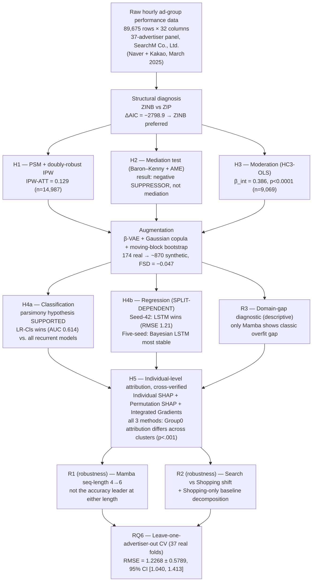
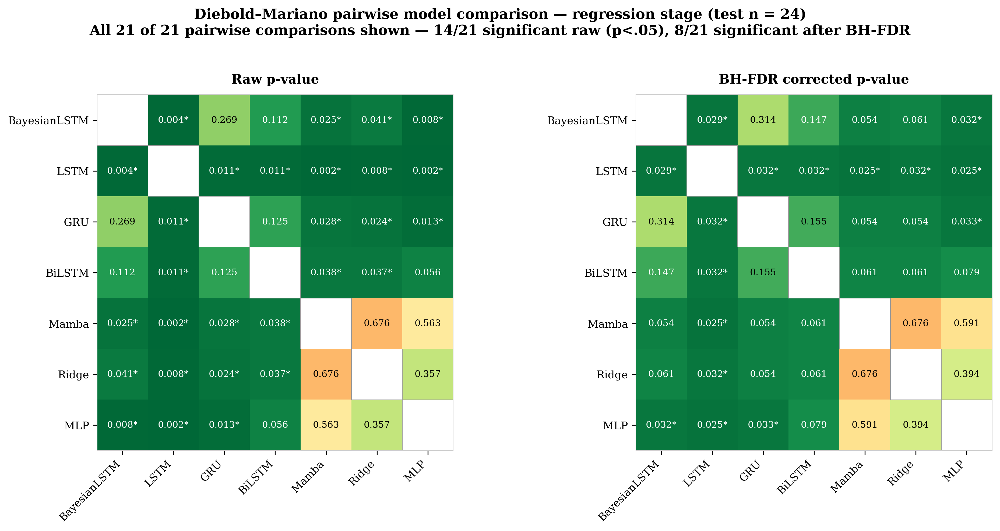
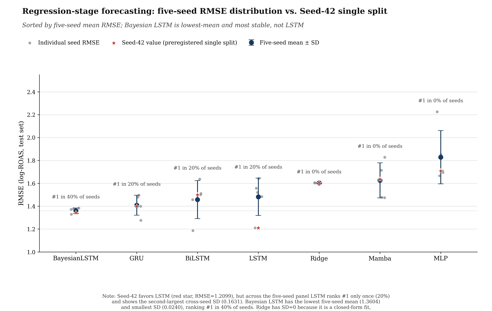

# SADAF: A Boundary-Condition Test of Cold-Start Advertising Beyond Google-Dominated Markets

**Evidence from a 37-Advertiser Korean Panel**

[](https://www.python.org/downloads/)
[](https://pytorch.org/)
[](https://opensource.org/licenses/MIT)

---

## Abstract

Cold-start advertising forecasting, which estimates advertising performance from
limited early-stage campaign observations, has been developed almost exclusively in
Google-dominated search markets, leaving open whether its causal, predictive, and
explainability findings generalize to structurally different platform ecosystems.
Using 89,675 hourly ad-group records from 37 Korean advertisers across Naver and
Kakao, we develop the **Sparse Ad Data Augmentation Framework (SADAF)**, integrating
doubly robust causal inference, Bayesian sequential forecasting, and cross-verified
explainable attribution. Click-through rate exhibits a positive causal effect on
conversion (ATT = 0.129), whereas browsing depth functions as a statistical suppressor
rather than the hypothesized mediator. Although a single-split evaluation favored an
augmented LSTM, **five-seed replication showed this advantage to be split-dependent**:
a Bayesian LSTM achieved the most stable forecasting performance, while data
augmentation primarily mitigated overfitting rather than consistently improving
predictive accuracy. Leave-one-advertiser-out cross-validation across all 37
advertisers corroborated the overall forecasting error range (RMSE = 1.227 ± 0.579;
95% CI [1.040, 1.413]). These findings extend cold-start advertising evidence beyond
Google-centered markets and highlight the importance of replication-aware evaluation
and power-calibrated inference for reliable forecasting under severe data scarcity.

**Keywords:** Cold start advertising forecasting; Causal inference; Bayesian deep
learning; Explainable AI; Market concentration; Statistical power

---

## 📌 Version note (v6.1 → v7.0 — replication-aware revision)

This edition incorporates a full round of reviewer feedback and, in response to it,
adds three new empirical analyses that were not part of earlier versions: a **five-seed
replication** of the regression-stage architecture comparison, a **real-only vs.
augmented ablation** isolating what the augmentation pipeline actually contributes, and
a **Shopping-only baseline** decomposing the domain-adaptation result. These are not
wording changes — they revise the paper's headline predictive claim.

| Area | v6.1 state | v7.0 change |
|---|---|---|
| **Regression-stage "best model" claim (H4b)** | A single train/validation/test split (Seed 42) reported LSTM as the outright best forecaster (RMSE = 1.2099). | **Revised.** Five-seed replication shows this ranking is split-dependent: LSTM ranks #1 in only 1 of 5 seeds. **Bayesian LSTM** has the lowest five-seed mean RMSE and the smallest cross-seed SD. H4b is now read as *partially supported*: recurrent/gated architectures beat linear and feed-forward baselines (holds), but "LSTM specifically is best" does not replicate. See `replication_extension/`. |
| **Augmentation pipeline's role** | Presented primarily as an accuracy-improving step validated by the Fréchet Sequence Distance (FSD) quality gate. | **Revised.** A real-only-trained control condition shows augmentation slightly *increases* RMSE for 6 of 7 architectures; its one clear, statistically distinguishable benefit is preventing catastrophic overfitting in the MLP baseline. Reframed as primarily a **regularizer for overfitting-prone architectures**, not a general accuracy improver. |
| **H4c (overfitting hypothesis)** | Phrased as a directional hypothesis ("at least one model will show validation loss exceeding training loss"), which reviewers flagged as reverse-engineered from the result. | **Reclassified as R3**, a descriptive robustness diagnostic rather than a falsifiable hypothesis. The result itself (Mamba alone shows the classical overfitting signature) is unchanged. |
| **Domain adaptation (R2 / Section 6.8)** | Reported naive vs. adapted Search→Shopping transfer RMSE with no baseline isolating genuine domain shift from Shopping's intrinsic forecasting difficulty. | **Extended.** A new Shopping-only baseline (trained and evaluated entirely within Shopping campaigns) shows the "recoverable" domain-shift gap is small (~0.005 RMSE) and the adaptation recipe already captures nearly all of it — the naive transfer's error is mostly intrinsic Shopping-forecasting difficulty, not recoverable domain shift. |
| **RQ6 vs. "H6" numbering** | Some readers read the leave-one-advertiser-out check as a mislabeled sixth hypothesis. | Clarified explicitly: RQ6 is a scope question evaluated descriptively, not a sixth directional, falsifiable hypothesis in the H-series. |
| **Mediation effect reporting (H2)** | Only the indirect effect (a × b) was reported. | **Extended.** A second panel reports the probability-scale direct, total, and indirect effects (average marginal effects), alongside the original coefficient-product decomposition, with an explicit note that the two panels use different scales and should not be summed. |
| **Elasticity interpretation (H3)** | Risked being read as "Shopping campaigns see a 68% ROAS lift from CTR increases." | Reworded to state the Search vs. Shopping elasticity estimates (0.949 vs. 0.563) directly, without the aggregate percentage framing. |
| **Figures (Fig. 1/3/4/5 in this README)** | Framework-architecture figure showed the pre-revision H4b/H4c framing; no figure existed for the five-seed replication or the full DM heatmap. | **Regenerated / added.** `fig3_framework_architecture.png` now marks H4b with △ (informative departure — split-dependent) rather than ✓; two new figures, `fig4_regression_fiveseed.png` and `fig5_dm_heatmap.png`, visualize the five-seed distribution and the complete 21-pair Diebold–Mariano heatmap (raw + BH-FDR), respectively. |

All three new analyses, their scripts, logs, derived tables, and the two new figures
are organized in a self-contained new folder, **[`replication_extension/`](replication_extension/README.md)**,
described in full there. Nothing in the original `sadaf/` pipeline was modified; the
new analyses are additive.

---

## Data provenance

The raw dataset underlying this repository consists of internal advertising-operations
performance records maintained by **SearchM Co., Ltd.**, one of a limited number of
agencies holding simultaneous official certification from both Naver and Kakao,
covering the Search and Shopping campaigns of a **37-advertiser panel** during March
2025. This dual certification requires the agency to meet each platform's
campaign-management, reporting, and data-handling standards, which is the basis for
the standardized measurement practices referenced throughout this README. All
references to "the panel," "the advertisers," or "the dataset" point to this
SearchM-operated data; see [§11](#11-data-availability) for access procedures.

---

## Table of Contents

1. [Motivation and Scope](#1-motivation-and-scope)
2. [Research Questions and Hypotheses](#2-research-questions-and-hypotheses)
3. [Framework Architecture](#3-framework-architecture)
4. [Data](#4-data)
5. [Results](#5-results)
   - 5.1 [H1 — Causal effect of CTR on conversion](#51-h1--causal-effect-of-ctr-on-conversion)
   - 5.2 [H2 — Suppression, not mediation, in the CTR→depth→conversion pathway](#52-h2--suppression-not-mediation-in-the-ctrdepthconversion-pathway)
   - 5.3 [H3 — Campaign-type moderation](#53-h3--campaign-type-moderation)
   - 5.4 [H4 — Two-stage sequential ROAS prediction (revised, replication-aware)](#54-h4--two-stage-sequential-roas-prediction-revised-replication-aware)
   - 5.5 [R1 — Robustness check: Mamba sequence-length sensitivity](#55-r1--robustness-check-mamba-sequence-length-sensitivity)
   - 5.6 [R3 — Domain-gap diagnostic (descriptive, formerly H4c)](#56-r3--domain-gap-diagnostic-descriptive-formerly-h4c)
   - 5.7 [H5 — Individual-level attribution, cross-verified](#57-h5--individual-level-attribution-cross-verified)
   - 5.8 [R2 — Cross-campaign domain shift, adaptation, and the Shopping-only baseline](#58-r2--cross-campaign-domain-shift-adaptation-and-the-shopping-only-baseline)
   - 5.9 [RQ6 — External-validity checks (leave-one-advertiser-out)](#59-rq6--external-validity-checks-leave-one-advertiser-out)
   - 5.10 [Statistical Power and Precision](#510-statistical-power-and-precision)
6. [Discussion](#6-discussion)
7. [Threats to Validity and Open Items](#7-threats-to-validity-and-open-items)
8. [Repository Structure](#8-repository-structure)
9. [Installation and Usage](#9-installation-and-usage)
10. [Code Fix Log](#10-code-fix-log)
11. [Data Availability](#11-data-availability)
12. [License and Acknowledgements](#12-license-and-acknowledgements)

---

## 1. Motivation and Scope

Cold-start advertisement forecasting — predicting the performance of ads that have run
for only a few hours or days — is built almost entirely on markets where a single
search platform (Google) commands more than 90% of query volume. Whether the causal
structures, predictive architectures, and explainability patterns discovered in that
setting generalize to a *differently concentrated* market is rarely tested, because the
data to test it is rarely available.

South Korea in March 2025 offers a boundary-condition test case. Domestic Korean
platforms collectively held a majority share of Korean search volume that month (Naver
alone at **63.8%**) against Google's **28.7%** — a concentration structure with no
equivalent among the >90%-Google markets that most computational-advertising work
assumes. This repository's dataset — 89,675 hourly ad-group performance records from a
**37-advertiser panel's** Naver-and-Kakao Search/Shopping campaigns across March 2025,
provided by SearchM Co., Ltd. — is used as a **boundary-condition case study**, not as a
claim of representativeness for the Korean market as a whole.

Testing this boundary condition requires more than re-running existing pipelines on
new data: three features of the dataset itself independently break standard
assumptions on which causal, predictive, and explainability methods rely, and each maps
directly onto one of SADAF's three pillars:

| Pillar | Method | What it addresses |
|---|---|---|
| **Causal estimation** | PSM + doubly-robust IPW, Baron–Kenny mediation, HC3-robust moderated OLS | *Why* do ads convert? |
| **Bayesian sequential prediction** | Logistic/Ridge, MLP, LSTM, BiLSTM, GRU, Bayesian LSTM, Mamba, on β-VAE + Gaussian-copula + moving-block-bootstrap augmented sequences | *What* will ROAS be, under N=174 real training sequences? Structured as a two-stage pipeline because of ROAS's structural zero-inflation. |
| **Explainability (individual-level, cross-verified)** | Individual SHAP, Permutation SHAP, Integrated Gradients | *Which* features drive outcomes, and does that differ across ad-group clusters — verified across three independent methods rather than assumed by a single joint estimator, since joint group-level Shapley methods are not conventionally warranted at this study's 7-feature dimensionality? |

Two supplementary robustness checks (Mamba's sequence-length sensitivity, R1;
cross-campaign feature-distribution shift and domain adaptation, R2) and a descriptive
overfitting diagnostic (R3) sit alongside these three pillars without being counted as
independent hypotheses. Every hypothesis is additionally read against the statistical
power available to support it (§5.10).

---

## 2. Research Questions and Hypotheses

**RQ0 (framing, not itself tested).** Do causal, predictive, and explainability
patterns established primarily in Google-dominated advertising markets replicate under
a structurally different, less concentrated, domestically dominated search ecosystem?
March 2025 Korea (domestic platforms' combined majority, led by Naver at 63.8%, vs.
Google's 28.7%) is the boundary-condition test case, answered by the pattern of support
across H1–H5, R1–R3, and RQ6 together.

**H1.** Advertisements with above-median CTR causally increase conversion probability
relative to below-median-CTR advertisements, net of impression volume, cost, and
campaign type. *(PSM + doubly robust IPW.)*

**H2.** Browsing depth significantly mediates the relationship between CTR and
conversion probability, with the direction of the indirect effect determined
empirically. *(Baron–Kenny decomposition + bootstrap CI, now paired with a
probability-scale direct/total-effect decomposition; see §5.2.)* — **Tested outcome:**
the data show a *suppression* pattern (both component paths negative, product
positive), an informative departure from the mediation mechanism this hypothesis
anticipated.

**H3.** The CTR→ROAS relationship is moderated by campaign type, with a stronger slope
for Search than for Shopping campaigns, because Search campaigns are triggered by
user-typed queries that reveal explicit purchase intent, whereas Shopping campaigns
surface algorithmically matched product listings with comparatively less revealed
intent. *(HC3-robust moderated OLS.)*

**H4a.** Under the extreme training-sample sparsity characteristic of cold-start
forecasting (fewer than 200 real training sequences), **a parsimonious linear
classifier achieves predictive performance comparable to or better than recurrent
neural architectures** on the antecedent binary conversion-classification task.

**H4b.** Conditional on non-zero ROAS, a recurrent architecture equipped with the
paper's augmentation pipeline achieves significantly lower forecasting error than
linear and feed-forward baselines, evaluated by pairwise Diebold–Mariano tests with
multiplicity correction and reported with the statistical power available at n = 24.
**As of v7.0, this is tested both on the preregistered single split and on a
five-seed replication; see §5.4.**

> **R1 (supplementary robustness check, not an independent hypothesis).** Is Mamba's
> comparative weakness at 4-step sequences an artifact of sequence length? Evaluated at
> SEQ_LEN = 4 vs. 6 in §5.5.

> **R3 (descriptive diagnostic, not a directional hypothesis; formerly phrased as
> H4c).** Rather than predicting *which* architecture will show the classical
> overfitting signature, we report, for each of the seven architectures, the
> epoch-consistent gap between real-validation loss and training loss at the matched
> best epoch — reported descriptively because the relationship between architectural
> complexity and this gap is not established a priori for four-to-six-step cold-start
> sequences. See §5.6.

**H5.** Ad-group clusters exhibit statistically distinct engagement-and-spend
attribution patterns under individual-feature Shapley attribution, corroborated by
convergent rankings across two additional, independently computed attribution methods
(Integrated Gradients and a Monte Carlo permutation-based Shapley estimator).

> **R2 (supplementary robustness check, not an independent hypothesis).** Do feature
> distributions differ significantly between Search and Shopping campaigns, and does
> that shift motivate frozen-encoder domain adaptation? Reported in §5.8, now including
> a Shopping-only baseline that decomposes the naive-transfer error into a genuine
> domain-shift component and Shopping's intrinsic forecasting difficulty.

**RQ6 (external-validity boundary, not a sixth hypothesis).** Does the predictive
framework generalize *within* the single-market, single-agency-provenance, single-month
scope of this study, assessed via **leave-one-advertiser-out** cross-validation across
the full 37-advertiser panel? We label this RQ6, not H6, deliberately: H1–H5 are
directional, falsifiable hypotheses paired with a specific statistical test, while RQ6
is a scope question evaluated descriptively. Generalization beyond this scope — to
other platforms, periods, or advertiser panels — is explicitly out of scope.

---

## 3. Framework Architecture

SADAF routes a single sparse, 37-advertiser-panel dataset through a shared structural
diagnosis and then into three parallel, cross-referenced pillars — causal estimation,
Bayesian sequential prediction, and explainability — which converge on an integrated,
power-calibrated verdict.

<p align="center"></p>
<p align="center"><em>Figure 1. SADAF framework architecture (v7.0). A shared structural diagnosis (ZINB vs. ZIP) feeds three parallel pillars — causal estimation (H1–H3), Bayesian sequential prediction (H4a, H4b, R1), and explainability (H5) — which converge on an integrated, FDR-corrected, power-calibrated verdict. H4b is now marked △ (informative departure) rather than ✓: the single-split result favored LSTM, but this ranking is split-dependent under five-seed replication (see §5.4 and <code>replication_extension/</code>). R1, R2, R3, and RQ6 (leave-one-advertiser-out across 37 advertisers) are reported alongside the core verdict but are not independent headline hypotheses.</em></p>

<details>
<summary>Text/Mermaid version of Figure 1</summary>



</details>

---

## 4. Data

### 4.1 Overview

| Attribute | Value |
|---|---|
| Total records | 89,675 rows |
| Columns (raw + derived) | 32 |
| Time period | March 2025 (1 calendar month) |
| Granularity | Ad-group × hour |
| Advertisers | **37 (anonymized), Naver and Kakao Search/Shopping**; agency-standardized by SearchM Co., Ltd. |
| Paid rows | 32,494 (36.2% of total) |
| Rows with ROAS > 0 | 9,071 (27.9% of paid) |
| Conversion rate | 11.77% |
| Zero-ROAS rate (paid) | 72.1% |

### 4.2 Structural zero-inflation

ROAS variance/mean overdispersion is 127,761 — several orders of magnitude beyond what
a Poisson or standard negative-binomial model tolerates. A Zero-Inflated Negative
Binomial (ZINB) model is preferred over ZIP by a wide margin (ΔAIC = −2,798.9; AIC =
71,958.2, BIC = 72,025.3). This distributional profile is the row-level evidence that a
single end-to-end regression cannot adequately separate "does this ad group convert at
all" from "how much ROAS, given that it converts" — which is exactly why §5.4 formalizes
prediction as a two-stage pipeline rather than a single model.

### 4.3 Sequence construction (group-aware split)

| Split | Sequences (SEQ_LEN = 4) |
|---|---|
| Train | 174 |
| Validation | 24 |
| Test | 24 |
| **Total** | **222** |

Splits are assigned at the ad-group level to prevent information leakage. Because 174
real training sequences are insufficient to train recurrent architectures directly, the
training split only is expanded via the three-stage augmentation pipeline (β-VAE +
Gaussian copula + moving-block bootstrap), yielding ~870 augmented sequences (5× the
real training count — a pre-registered ceiling, not an empirically tuned value),
gated by the Fréchet Sequence Distance (FSD) diagnostic: **FSD = −0.047**, against an
acceptance threshold of 2.0. Validation and test sequences are never augmented.

> **v7.0 addition:** whether this augmentation actually improves downstream accuracy —
> as opposed to merely passing the FSD distributional check — is now tested directly
> via a real-only-trained control condition; see §5.4 and
> [`replication_extension/`](replication_extension/README.md#2-real-only-vs-augmented-ablation-11_augmentation_ablationpy).

---

## 5. Results

### 5.1 H1 — Causal effect of CTR on conversion

| Estimator | Estimate | 95% CI | Role |
|---|---|---|---|
| PSM-ATT (n matched = 14,987) | 0.1347 | [0.1254, 0.1434] | Corroborating |
| **Doubly Robust IPW-ATT** | **0.1286** | — | **Primary** |

**H1: supported.** High-CTR ads causally increase conversion probability by roughly
12.9 percentage points. At n = 14,987 matched pairs, this comparison has near-certain
power (§5.10).

### 5.2 H2 — Suppression, not mediation, in the CTR→depth→conversion pathway

**Panel A — coefficient-product decomposition:**

| Path | Estimate | 95% Bootstrap CI (B=2,000) |
|---|---|---|
| a (CTR → Depth) | −0.3077 | — |
| b (Depth → Conversion, controlling for CTR) | −0.0861 | — |
| Indirect (a × b) | 0.0265 | [0.0200, 0.0337] |

**Panel B — probability-scale direct/total decomposition (average marginal effects):**

| Quantity | Estimate | 95% Bootstrap CI |
|---|---|---|
| Total effect of CTR (Depth excluded) | 0.0037 | [0.0034, 0.0041] |
| Direct effect of CTR (Depth held constant) | 0.0031 | [0.0028, 0.0034] |
| Indirect effect (Total − Direct) | 0.0006 | [0.0005, 0.0008] |

*Note: Panels A and B are estimated on different scales (mixed OLS/logit coefficients
vs. probability-scale AME) and are two distinct, independently bootstrapped estimates —
they should not be summed or compared in magnitude.*

Both component paths in Panel A are negative, but their product is positive: a
**negative statistical suppressor** pattern, not classical mediation. Panel B
corroborates this on an independent scale: the indirect pathway is positive and
distinguishable from zero, while the direct effect remains ~83% of the total AME
(0.0031 of 0.0037) — CTR's influence on conversion is overwhelmingly direct, not
depth-mediated.

**H2, as originally specified, hypothesized a mediating mechanism. We report H2 as an
informative departure from that mechanism, not as support for it** — both paths
negative, product positive is the opposite structural signature from mediation, though
the indirect path is itself a robust, statistically distinguishable finding.

### 5.3 H3 — Campaign-type moderation

HC3-robust OLS interaction (`log_ROAS ~ log_CTR × is_search + log_cost + log_impression`,
n = 9,069, R² = 0.655):

| Quantity | Value |
|---|---|
| β (interaction) | 0.386 (p < 0.0001) |
| Marginal effect, Search | 0.949 |
| Marginal effect, Shopping | 0.563 |

**H3: supported.** The estimated CTR–ROAS elasticity is 0.949 for Search campaigns and
0.563 for Shopping campaigns — CTR improvements are associated with a stronger ROAS
response on Search than on Shopping, consistent with Search traffic reflecting more
deliberate, higher-intent queries.

### 5.4 H4 — Two-stage sequential ROAS prediction (revised, replication-aware)

**Stage 1 — classification (H4a): parsimony under sparsity.**

| Model | AUC | F1 | AP |
|---|---|---|---|
| **Logistic Regression** | **0.6143** | 0.3653 | 0.3016 |
| LSTM | 0.6115 | 0.3026 | 0.3062 |
| Bayesian LSTM | 0.5894 | 0.3151 | 0.2723 |
| Multilayer Perceptron | 0.5445 | 0.2951 | 0.2989 |

**H4a: supported**, though the margin over LSTM is narrow relative to bootstrap
uncertainty at n = 24 (evidence of parity rather than large superiority). The n=24 test
set's class balance (17 of 24 sequences, 70.8%, contain a conversion event) is a
byproduct of group-aware splitting, not a designed ratio, and is flagged as a plausible
contributor to this narrow margin.

**Stage 2 — regression (H4b), single-split result:**
*(Bar-chart figure for this table is unchanged from v6.1 and carried over from the existing `figures/` pipeline output; not reproduced in this update.)*

| Model | RMSE | MAE | R² |
|---|---|---|---|
| **LSTM** | **1.2099** | **0.9608** | **0.7342** |
| Bayesian LSTM | 1.3420 | 1.1063 | 0.6729 |
| GRU | 1.3984 | 1.1450 | 0.6449 |
| BiLSTM | 1.4998 | 1.1629 | 0.5915 |
| Ridge Regression | 1.6033 | 1.2684 | 0.5331 |
| Mamba | 1.6356 | 1.3308 | 0.5142 |
| Multilayer Perceptron | 1.7086 | 1.3538 | 0.4699 |

Full pairwise Diebold–Mariano heatmap (raw and BH-FDR corrected, all 21 pairs):

<p align="center"></p>

Of 21 pairs, 18 are computable (Mamba–Ridge, Mamba–MLP, Ridge–MLP did not converge);
13 of 18 are significant at raw p < .05, and **8 remain significant after FDR
correction** — all 6 pairs involving LSTM, plus GRU vs. Ridge and GRU vs. MLP.

**v7.0 revision — five-seed replication:**

<p align="center"></p>
<p align="center"><em>Figure 2. Regression-stage forecasting, five-seed RMSE distribution vs. the preregistered Seed-42 single split. Sorted by five-seed mean RMSE. LSTM's Seed-42 result (red star, RMSE=1.2099) is the lowest single score in the whole panel, but LSTM ranks #1 in only 1 of 5 seeds (20%) and has the second-largest cross-seed SD. Bayesian LSTM has the lowest five-seed mean (1.3604) and smallest SD (0.0240), ranking #1 in 2 of 5 seeds (40%).</em></p>

| Model | Single-split (Seed 42) RMSE | Five-seed mean RMSE | Five-seed SD | % seeds ranked #1 |
|---|---|---|---|---|
| Bayesian LSTM | 1.3420 | **1.3604** | **0.0240** | 40.0 |
| GRU | 1.3984 | 1.4080 | 0.0873 | 20.0 |
| BiLSTM | 1.4998 | 1.4577 | 0.1661 | 20.0 |
| LSTM | **1.2099** | 1.4821 | 0.1631 | 20.0 |
| Ridge | 1.6033 | 1.6033 | 0.0000 | 0.0 |
| Mamba | 1.6356 | 1.6254 | 0.1530 | 0.0 |
| MLP | 1.7086 | 1.8284 | 0.2328 | 0.0 |

Kendall's W (rank concordance across the 5-seed × 7-architecture panel) = 0.6514
(moderate, not near-1 concordance); a Friedman test confirms architecture RMSEs are not
interchangeable across seeds (χ²=19.54, p=.0033) — architecture matters, but *which*
architecture wins is not fixed at n=24.

**H4b: partially supported.** The specific single-split claim "LSTM is the best
forecaster" does not replicate — it is a Seed-42-favorable artifact. The broader claim
— gated recurrent architectures (Bayesian LSTM, GRU, BiLSTM, LSTM) outperform linear
and feed-forward baselines (Ridge, MLP) — holds across both the single split and the
five-seed panel, and Bayesian LSTM emerges as the most reliable single candidate on
this evidence, combining the lowest mean error with the highest stability. Full
detail, scripts, and raw per-seed data: [`replication_extension/`](replication_extension/README.md#1-five-seed-stability-check-10_multiseed_stabilitypy).

**v7.0 addition — real-only vs. augmented ablation.** A matched control trained on the
174 real sequences only (no augmentation) shows augmentation slightly *increases* mean
RMSE for 6 of 7 architectures (none significant at n=5 seeds, Wilcoxon p≥.0625). The
sole clear exception is MLP, where augmentation prevents catastrophic overfitting
(real-only RMSE 4.17–4.74 vs. augmented ~1.83; Wilcoxon p=.0625, the minimum attainable
at n=5). **The augmentation pipeline's demonstrated contribution in this dataset is
primarily regularization for overfitting-prone architectures, not a general accuracy
improvement for recurrent forecasters already well suited to short sequences.** Passing
the FSD distributional-fidelity gate (§4.3) and improving downstream accuracy are shown
here to be distinct properties. Full detail: [`replication_extension/`](replication_extension/README.md#2-real-only-vs-augmented-ablation-11_augmentation_ablationpy).

### 5.5 R1 — Robustness check: Mamba sequence-length sensitivity

Mamba is additionally evaluated at a six-step sequence length. **It remains the
weakest or near-weakest performer at both lengths and across the five-seed panel**,
corroborating prior evidence that selective state-space architectures can be
disadvantaged on short, cold-start-length sequences.

### 5.6 R3 — Domain-gap diagnostic (descriptive, formerly H4c)

Computed with strict epoch-matching (train loss paired with the same epoch used to
identify each architecture's best real-validation loss):

| Model | Best epoch (real) | Best val (real) | Train loss at same epoch | gap_real | Pattern |
|---|---|---|---|---|---|
| Bayesian LSTM | 42 | 0.7525 | 1.0346 | −0.2821 | train > val — not overfitting |
| LSTM | 22 | 0.7047 | 0.7909 | −0.0862 | train > val — not overfitting |
| GRU | 36 | 0.6873 | 0.8464 | −0.1591 | train > val — not overfitting |
| BiLSTM | 23 | 0.7587 | 0.8389 | −0.0802 | train > val — not overfitting |
| **Mamba** | 35 | 0.7910 | 0.6768 | **+0.1142** | **val > train — classical overfitting signature** |

Reported descriptively, not as a directional hypothesis test, since `gap_real` is a
deterministic function of a single best-epoch loss pair per architecture rather than a
distribution over independent samples. **Mamba is the only architecture displaying the
classical overfitting signature** on real-validation data. Bayesian LSTM's large
train-above-validation gap is more plausibly attributable to Monte Carlo dropout
inflating its reported training loss than to genuine overfitting proneness.

### 5.7 H5 — Individual-level attribution, cross-verified

Three independently computed attribution methods — Individual SHAP, Permutation SHAP,
Integrated Gradients — are computed on the identical model and evaluation sample, and
cross-method convergence is treated as the evidentiary standard, following the
observation that joint group-level Shapley methods are conventionally motivated by,
and most informative in, higher-dimensional feature spaces than this study's 7 features.

**Cluster sizes:**

| Cluster | Unique ad groups | Row-level n |
|---|---|---|
| 0 | 39 | 1,214 |
| 1 | 41 | 217 |
| 2 | 13 | 28 |

**Kruskal-Wallis across clusters (Group 0 attribution magnitude), one test per method:**

```
IndividualSHAP        H = 72.213   p = 0.0000
PermutationSHAP       H = 143.831   p = 0.0000
IntegratedGradients   H = 18.277   p = 0.0001
```

**H5: supported.** All three independently computed methods agree that Group 0
(engagement/spend) attribution differs significantly across ad-group clusters.
Cross-method Spearman rank correlation ranges ρ = 0.607–0.964 across clusters
(test n = 7 features per cluster); Group 1 (temporal) attribution is consistently more
concentrated than Group 0 attribution across every method and every cluster.

### 5.8 R2 — Cross-campaign domain shift, adaptation, and the Shopping-only baseline

Two-sample Kolmogorov–Smirnov tests, Search vs. Shopping: 6 of 7 features differ
significantly (all but `hour_cos`, p=.068).

**Domain adaptation (Search → Shopping, frozen-encoder fine-tuning):**

| Transfer setup | RMSE |
|---|---|
| Naive transfer | 1.3176–1.3169 (single-seed / three-seed mean) |
| Adapted transfer (50% frozen) | 1.3128–1.3114 |

**v7.0 addition — Shopping-only baseline.** A model trained and evaluated entirely
within Shopping-campaign sequences (never exposed to Search) achieves RMSE ≈ 1.3115,
essentially matching the adapted-transfer RMSE. Decomposing the naive-transfer error:

| Quantity | Value | Interpretation |
|---|---|---|
| Domain-shift recoverable gap (naive − Shopping-only) | 0.0048 | total error attributable to being trained on the wrong domain at all |
| Adaptation-captured gap (naive − adapted) | 0.0050 | how much of that gap the fine-tuning recipe recovers |
| Adaptation-capture ratio | ~1.06 | the recipe recovers essentially all of the (small) recoverable gap |

**Reading:** the KS-test evidence for distributional shift between Search and Shopping
features is real, but that shift carries very little exploitable forecasting cost for
this architecture and task — most of the naive-transfer RMSE reflects Shopping's
intrinsic forecasting difficulty, not a recoverable domain-shift cost the adaptation
recipe is leaving on the table. Full detail: [`replication_extension/`](replication_extension/README.md#3-shopping-only-baseline-12_shopping_only_baselinepy).

### 5.9 RQ6 — External-validity checks (leave-one-advertiser-out)

Leave-one-advertiser-out cross-validation across all **37 advertisers**, GRU forecaster
(hidden=128, layers=2, dropout=0.2) — GRU is designated a priori as SADAF's
infrastructure-level reference architecture for pipeline diagnostics repeated across
many folds, independent of the separate architecture-accuracy comparison in §5.4:

| Quantity | Value |
|---|---|
| Mean RMSE | **1.2268** |
| SD | **0.5789** |
| n folds | 37 (one fold per advertiser) |
| 95% CI of mean RMSE | **[1.040, 1.413]** |

A supplementary regularization grid search (GRU, dropout × weight decay) finds a best
configuration (dropout=0.2, weight_decay=1×10⁻⁴, RMSE=1.4073).

### 5.10 Statistical Power and Precision

| Test | n | Effect | Power (or MDE) | Type |
|---|---|---|---|---|
| H1 Causal ATT (PSM + DR-IPW) | 14,987 | ATT = 0.129 | Power > .99 | A priori |
| H3 Moderated OLS interaction | 9,069 | β = 0.386 | Power > .99 | A priori |
| H4b DM pairwise MDE (80% power) | 24 | — | dz = 0.60 (raw) / 0.88 (FDR) | A priori (MDE) |
| H5 Kruskal–Wallis, Individual SHAP (G0) | 1,459 (3 clusters) | H = 72.21, p<.0001 | Power > .99 | Post-hoc |
| H5 Kruskal–Wallis, Integrated Gradients (G0) | 1,459 (3 clusters) | H = 18.28, p=.0001 | Power = .93 | Post-hoc |
| H5 Spearman, weakest pair | 7 | ρ = 0.607 | Power = .59 | Post-hoc — interpret with caution |
| RQ6 LOAO-CV mean RMSE | 37 folds | RMSE = 1.227 ± 0.579 | 95% CI half-width = 0.187 (15.3%) | A priori (Precision) |

The causal pillar (H1, H3) and the LOAO-CV precision check (RQ6) rest on genuinely high
a priori power. H4b/R3 draw on the same n=24 test sequences, so they are read as
multiple analytical lenses on one shared evidentiary base — this is precisely why the
v7.0 five-seed replication matters: at n=24, a single split's ranking is not, on its
own, adequately powered evidence of which architecture is genuinely best.

---

## 6. Discussion

Read together, the pattern of support across H1–H5, R1–R3, and RQ6 sketches a
boundary-condition picture that partially agrees with, and partially and informatively
departs from, patterns established in Google-dominated markets:

- **Where it agrees, with high power:** CTR causally drives conversion (H1) and the
  CTR→ROAS relationship is stronger for Search than Shopping traffic (H3), both at
  power > .99.
- **Where it complicates the standard account:** browsing depth behaves as a negative
  suppressor rather than the positive mediator H2 anticipated. A parsimonious logistic
  classifier matches every recurrent architecture on the antecedent classification task
  (H4a).
- **Where a single split misled:** the original claim that LSTM is the single best
  ROAS forecaster does not survive five-seed replication. Bayesian LSTM is the more
  stable candidate, and the augmentation pipeline's demonstrated value is regularization
  against overfitting, not general accuracy improvement — a materially different, and
  more defensible, characterization of what SADAF's predictive pillar actually shows.
- **On domain adaptation:** the Shopping-only baseline shows the adaptation recipe is
  already close to the achievable floor; the modest naive-vs-adapted gain is real but
  small because most of Shopping-campaign forecasting difficulty is intrinsic, not a
  recoverable consequence of cross-campaign transfer.
- **On RQ6:** the LOAO-CV forecaster (GRU) and the regression-stage comparison (§5.4)
  use different architectures by design; their RMSE proximity (1.2268 vs. 1.2099) is
  suggestive of a stable task-level RMSE range, not a replication of any single
  architecture's ranking.

None of this establishes that Korean, domestically dominated, or multi-platform-but-
non-Google-dominated markets behave categorically differently from Google-dominated
ones — the sample is a 37-advertiser panel, one month, one agency-standardized
platform, by explicit design.

---

## 7. Threats to Validity and Open Items

| Item | Detail | Status |
|---|---|---|
| **Single-split H4b claim** | Earlier versions reported LSTM as the outright best forecaster from a single Seed-42 split. | **Resolved in v7.0** — five-seed replication added; claim revised to "recurrent architectures beat linear/feed-forward baselines; Bayesian LSTM is the most stable single candidate." |
| **Augmentation pipeline's role unverified** | Earlier versions treated the FSD quality-gate pass as evidence the augmentation pipeline was helping accuracy. | **Resolved in v7.0** — real-only ablation shows augmentation's demonstrated benefit is regularization (MLP specifically), not general accuracy improvement. |
| **H4c framing as a directional hypothesis** | Reviewers flagged the original H4c wording as reverse-engineered from the observed result. | **Resolved in v7.0** — reclassified as R3, a descriptive diagnostic. |
| **No Shopping-only baseline for domain adaptation** | The naive-vs-adapted RMSE range could not be decomposed into genuine domain-shift cost vs. intrinsic Shopping difficulty. | **Resolved in v7.0** — Shopping-only baseline added; decomposition reported in §5.8. |
| **Augmentation seed coverage** | The Gaussian-copula and moving-block-bootstrap modules do not accept an explicit `seed` parameter, so the five-seed replication confounds model-initialization variance with synthetic-draw variance. | **Open** — flagged as the top item in the replication agenda; a seed-controllable augmentation pipeline is a direct next step. |
| **Five seeds is itself a small panel** | The Wilcoxon tests comparing real-only vs. augmented RMSE are underpowered by design (minimum attainable two-sided p = .0625 at n=5). | **Open, disclosed** — a 20–30-seed replication is the recommended extension. |
| **4-hour vs. 6-hour base sequence length** | The choice of SEQ_LEN=4 as the base window (vs. 6, used only for R1) does not have an explicit a priori justification beyond the R1 robustness framing. | **Open** |
| **Underpowered H5 Spearman correlations in small clusters** | Cross-method agreement in Cluster 2 (n=28 row-level observations) is more variable than in the two larger clusters. | Reported explicitly; treated as directional, not decisive. |

---

## 8. Repository Structure

```
sadaf/
├── assets/
│   ├── fig3_framework_architecture.png            # Figure 1 (v7.0) — updated H4b framing (△ not ✓)
│   ├── fig4_regression_fiveseed.png                # Figure 2 (v7.0, NEW) — five-seed RMSE distribution
│   └── fig5_dm_heatmap.png                         # Figure (v7.0, NEW) — full 21-pair DM heatmap
├── replication_extension/                          # v7.0 — NEW self-contained analysis folder
│   ├── README.md                                   # full write-up of all three new analyses
│   ├── scripts/
│   │   ├── 10_multiseed_stability.py                # five-seed replication of Table 7
│   │   ├── 11_augmentation_ablation.py               # real-only vs. augmented ablation
│   │   ├── 12_shopping_only_baseline.py              # Shopping-only forecaster baseline
│   │   ├── fig3_framework_architecture.py
│   │   ├── fig4_regression_fiveseed.py
│   │   └── fig5_dm_heatmap.py
│   ├── logs/
│   │   ├── 10_multiseed_stability.log
│   │   ├── 11_augmentation_ablation.log
│   │   └── 12_shopping_only_baseline.log
│   └── figures/                                     # derived CSVs + copies of the two new figures
├── data/
│   └── README_data.md
├── docs/
│   ├── methodology.md
│   └── results_table.md
├── figures/                                         # Auto-generated pipeline outputs (unchanged from v6.1)
│   ├── logo_cv_fold_rmse.csv
│   ├── cluster_sizes.csv
│   ├── gini_by_cluster_method.csv
│   ├── kruskal_wallis_group0.csv
│   └── spearman_agreement.csv
├── sadaf/
│   ├── augmentation/                                # unmodified; seed-parameter gap noted in §7
│   ├── causal/
│   ├── data/
│   ├── explainability/
│   ├── models/
│   ├── training/
│   │   └── trainer.py                               # unmodified; domain_gap_report() used by R3
│   └── config.py
├── scripts/
│   ├── 01_eda.py … 07_explainability.py              # unchanged from v6.1
│   ├── 08_domain_adaptation.py                       # unchanged; now paired with 12_shopping_only_baseline.py
│   ├── 09_robustness.py                              # unchanged; LOAO-CV (RQ6), regularization grid, DM correction
│   └── 10_figures.py
├── LICENSE
├── README.md                                         # This file
└── requirements.txt
```

---

## 9. Installation and Usage

```bash
git clone https://github.com/LEEYJ1021/sadaf.git
cd sadaf
python -m venv venv
source venv/bin/activate    # Windows: venv\Scripts\activate
pip install -r requirements.txt
```

Full pipeline (unchanged from v6.1):

```bash
python scripts/01_eda.py                 --data_path data/ad_performance.xlsx
python scripts/02_zinb.py                --data_path data/ad_performance.xlsx
python scripts/03_causal.py              --data_path data/ad_performance.xlsx
python scripts/04_augmentation.py        --data_path data/ad_performance.xlsx
python scripts/05_prediction.py          --data_path data/ad_performance.xlsx
python scripts/06_uncertainty.py
python -m sadaf.explainability.individual_attribution \
    --data_path data/ad_performance.xlsx --model_path artifacts/regression_stage_lstm.pt --out_dir figures/
python scripts/08_domain_adaptation.py
python scripts/09_robustness.py          # leave-one-advertiser-out CV across 37 advertisers
python scripts/10_figures.py
```

New in v7.0 — replication extension:

```bash
# Five-seed replication of the Table 7 regression comparison
python replication_extension/scripts/10_multiseed_stability.py \
    --data_path data/ad_performance.xlsx --seeds 42 1 7 123 2024

# Real-only vs. augmented ablation
python replication_extension/scripts/11_augmentation_ablation.py \
    --data_path data/ad_performance.xlsx --seeds 42 1 7 123 2024

# Shopping-only baseline / domain-shift decomposition
python replication_extension/scripts/12_shopping_only_baseline.py \
    --data_path data/ad_performance.xlsx --seeds 42 1 7

# Regenerate the three v7.0 figures
python replication_extension/scripts/fig3_framework_architecture.py
python replication_extension/scripts/fig4_regression_fiveseed.py
python replication_extension/scripts/fig5_dm_heatmap.py
```

---

## 10. Code Fix Log

- **FIX-1 through FIX-32** (unchanged from v6.1): see git history.
- **FIX-33 (v7.0):** Added `replication_extension/scripts/10_multiseed_stability.py`
  — five-seed replication of the Table 7 regression-stage comparison, reusing the
  identical group-aware split across seeds; revises the H4b headline claim.
- **FIX-34 (v7.0):** Added `replication_extension/scripts/11_augmentation_ablation.py`
  — real-only-trained control condition for every architecture across the same five
  seeds; reframes the augmentation pipeline's demonstrated contribution as
  regularization rather than general accuracy improvement.
- **FIX-35 (v7.0):** Added `replication_extension/scripts/12_shopping_only_baseline.py`
  — Shopping-only forecaster baseline, decomposing the naive-vs-adapted domain-transfer
  RMSE gap into a genuine domain-shift component and Shopping's intrinsic forecasting
  difficulty.
- **FIX-36 (v7.0):** Regenerated `assets/fig3_framework_architecture.png` — H4b marked
  △ (informative departure, split-dependent) instead of ✓; R3 replaces the previous
  H4c framing.
- **FIX-37 (v7.0):** Added `assets/fig4_regression_fiveseed.png` (five-seed RMSE
  distribution) and `assets/fig5_dm_heatmap.png` (full 21-pair Diebold–Mariano heatmap,
  raw + BH-FDR), both new to this version.
- **FIX-38 (v7.0):** H4c reclassified as R3 throughout the README and figures —
  descriptive diagnostic rather than a directional, falsifiable hypothesis.
- **FIX-39 (v7.0):** H2 (§5.2) extended with a second, probability-scale direct/total
  effect decomposition (average marginal effects) alongside the original
  coefficient-product decomposition.
- **FIX-40 (v7.0):** H3 elasticity reporting (§5.3) reworded to avoid the aggregate
  "68% more lift" framing; now reports the Search (0.949) and Shopping (0.563)
  elasticities directly.

---

## 11. Data Availability

The raw dataset consists of internal advertising-operations performance records
maintained by SearchM Co., Ltd., covering the Search and Shopping campaigns of a
37-advertiser panel, and **cannot be publicly released** due to commercial
confidentiality obligations. Data-sharing requests should be submitted via GitHub
Issues (label: `data-request`), including institutional affiliation, research purpose,
and confirmation of non-commercial use.

All CSV files under `figures/` and `replication_extension/figures/` contain only
anonymized advertiser/cluster identifiers, per-seed model metrics, and aggregate
statistics — no raw performance rows.

---

## 12. License and Acknowledgements

MIT License — see [LICENSE](LICENSE). The license covers only the code and
methodology; the underlying dataset is not covered.

**Selected references:**
- Lundberg & Lee (2017). *A Unified Approach to Interpreting Model Predictions.* NeurIPS.
- Sundararajan, Taly & Yan (2017). *Axiomatic Attribution for Deep Networks.* ICML.
- Štrumbelj & Kononenko (2014). *Explaining Prediction Models and Individual Predictions with Feature Contributions.* Knowledge and Information Systems.
- Chamma, Thirion & Engemann (2024). *Variable Importance in High-Dimensional Settings Requires Grouping.* AAAI.
- Gal & Ghahramani (2016). *Dropout as a Bayesian Approximation.* ICML.
- Gu & Dao (2023). *Mamba: Linear-Time Sequence Modeling with Selective State Spaces.* arXiv.
- Zhao, Lynch & Chen (2010). *Reconsidering Baron and Kenny: Myths and Truths About Mediation Analysis.* JCR.
- Desai, Freeman, Wang & Beaver (2021). *TimeVAE: A Variational Auto-Encoder for Multivariate Time Series Generation.* arXiv.
- Cohen (1988). *Statistical Power Analysis for the Behavioral Sciences.*
- Faul, Erdfelder, Lang & Buchner (2007). *G\*Power 3.* Behavior Research Methods.
- Hoenig & Heisey (2001). *The Abuse of Power: The Pervasive Fallacy of Power Calculations for Data Analysis.* The American Statistician.
