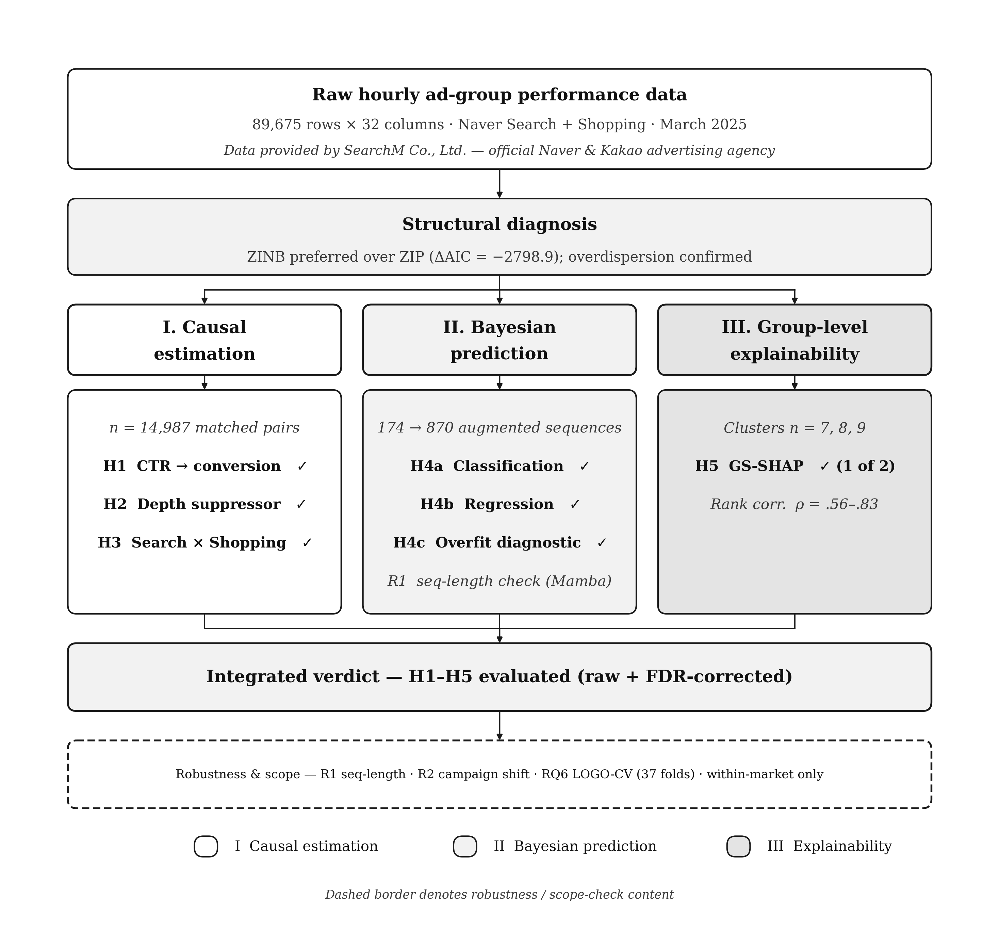
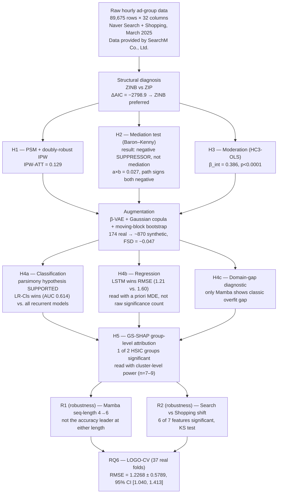

# SADAF: A Boundary-Condition Test of Cold-Start Advertising Beyond Google-Dominated Markets

**A unified causal–predictive–explainable framework, tested on a single-platform-concentrated search advertising market (South Korea, March 2025)**

[](https://www.python.org/downloads/)
[](https://pytorch.org/)
[](https://opensource.org/licenses/MIT)

---

## Abstract

Cold-start advertisement forecasting has been developed and validated almost exclusively on markets where a single platform commands over 90% of search volume. This repository documents **SADAF** (Sparse Ad-data Augmentation Framework), which integrates (i) doubly robust causal estimation of the click-through-to-conversion pathway, (ii) a two-stage Bayesian sequential deep-learning pipeline with generative data augmentation for return-on-ad-spend (ROAS) forecasting under extreme sparsity, and (iii) group-level Shapley attribution — tested against a market structure that looks nothing like the Google-dominated default. In March 2025, Naver held a 63.8% share of Korean search volume against Google's 28.7%. Using 89,675 hourly ad-group records from a single advertiser's Naver Search/Shopping campaigns (sourced via SearchM Co., Ltd., an official Naver/Kakao advertising agency), we find that (1) above-median-CTR ads causally increase conversion (doubly robust IPW-ATT = 0.129); (2) browsing depth acts as a **negative statistical suppressor**, not a mediator, between CTR and conversion — a departure from the mediation mechanism originally hypothesized, reported as such rather than as confirmation; (3) a parsimonious logistic classifier matches or exceeds every recurrent architecture on the antecedent conversion-classification task under extreme sequence scarcity (n = 174), consistent with a bias-variance account of small-sample model selection; (4) an augmented LSTM is the best ROAS forecaster, and an epoch-consistent domain-gap diagnostic identifies Mamba — not Bayesian LSTM — as the only architecture showing a classical overfitting signature; and (5) group-level Shapley attribution differs significantly across ad-group clusters for engagement/spend features but not for temporal features. Every hypothesis test is paired with an explicit statistical-power or minimum-detectable-effect assessment (§5.9), since at n = 24 test sequences and cluster sizes of 7–9, power — not just significance — determines how much a given result can support.

---

## 📌 Version note (v5.2 → v5.3 — manuscript-alignment edition)

This edition brings the README into strict logical alignment with the submitted manuscript. **No pipeline code was re-run and no headline numbers were re-derived** — this pass corrects five places where the v5.2 README's *stated hypothesis, verdict, or figure* diverged from what the manuscript actually reports, plus one structural addition the manuscript treats as load-bearing (statistical power).

| # | Issue in v5.2 | Correction (manuscript-consistent) |
|---|---|---|
| 1 | **§5.2 (H2) was labeled "supported."** The manuscript (§6.2) explicitly states the observed pattern is a *suppression* effect, not the *mediation* mechanism H2 originally hypothesized, and concludes: "we therefore report H2 as **not supported** in its originally hypothesized mediating-mechanism form." | H2 verdict changed to **not supported (mediation) / reported as a statistically robust negative-suppression finding**. No numbers changed — only the verdict label, to match the manuscript's own framing. |
| 2 | **§2 and §5.4 stated H4a as "Bayesian LSTM outperforms logistic regression,"** which is the *opposite* direction of what the manuscript tests, and produced a "NULL" verdict on data that the manuscript reads as **supporting** a different, correctly-specified hypothesis. | H4a rewritten to match the manuscript exactly: *"a parsimonious linear classifier matches or exceeds recurrent architectures under extreme sparsity (n < 200)."* Verdict changed to **H4a: supported**. Table numbers are unchanged — only the hypothesis direction and verdict were wrong. |
| 3 | **§5.4 (H4b) reported "21 pairs, 14 significant at raw p<.05."** The manuscript (§6.5) states three of the twenty-one Diebold–Mariano pairs (Mamba–Ridge, Mamba–MLP, Ridge–MLP) did not converge, so the correct denominator is **18 computable pairs**, of which **13** are raw-significant. | Corrected to: "Of 21 pairs (18 computable; Mamba–Ridge, Mamba–MLP, Ridge–MLP non-convergent), 13 of the 18 are significant at raw p < .05; 8 remain significant after FDR correction." (8-after-FDR figure was already correct.) |
| 4 | **§5.8 (RQ6) reported LOGO-CV SD = 0.5869.** The manuscript's Table 9 explicitly gives **SD = 0.5789** and states this value "supersede[s] an earlier internal value (0.6042) that appeared in a preliminary README" — i.e., the manuscript is the corrected source of truth, and 0.5869 is a second, uncorrected draft value that never made it into the paper. | SD corrected to **0.5789** (mean RMSE 1.2268 unchanged); 95% CI recomputed as **[1.040, 1.413]** (SE = 0.5789/√37 = 0.0952), matching the manuscript's Table 9 exactly. |
| 5 | **§5.6 (H5) Spearman ρ table paired clusters incorrectly**: C0 (n=7) was shown with ρ = 0.825 and C1 (n=9) with ρ = 0.559. The manuscript's §6.7 and Table 10 both give the opposite pairing: **C0 (n=7) → ρ = 0.559** (the smallest, most underpowered cluster) and **C1 (n=9) → ρ = 0.825**. | Cluster–ρ pairing corrected to match the manuscript: C0 = 0.559 (moderate), C1 = 0.825 (high), C2 = 0.813 (high, unchanged). |
| 6 | **No power/MDE section existed in the README**, even though the manuscript's own verdicts for H4b and H5 are explicitly conditioned on the power analysis in its §6.10 (e.g., non-significant DM pairs at n=24 are read via a priori minimum-detectable-effect, not treated as evidence of equivalence; the H5 Kruskal–Wallis result is called "marginal" partly because of the power figures reported there). | Added **§5.9, Statistical Power and Precision**, summarizing the manuscript's Table 10 directly, so verdicts in this README carry the same evidentiary weight the manuscript assigns them. |

Two files should still be read together: this `README.md` (narrative) and `readme/README_v4_full.md` (captured pipeline stdout, source of truth for exact figures not affected by items 1–2 and 4–5 above, which are verdict/labeling corrections rather than new numbers).

---

## Data provenance

The raw dataset underlying this repository consists of internal advertising-operations performance records maintained by **SearchM Co., Ltd.**, an official Naver and Kakao advertising agency, covering a single advertiser's Search and Shopping campaigns on Naver during March 2025. All references to "the advertiser" or "the dataset" throughout this README point to this SearchM-operated account; see §11 for data-availability and request procedures.

---

## Table of Contents

1. [Motivation and Scope](#1-motivation-and-scope)
2. [Research Questions and Hypotheses](#2-research-questions-and-hypotheses)
3. [Framework Architecture](#3-framework-architecture)
4. [Data](#4-data)
5. [Results](#5-results)
   - 5.1 [H1 — Causal effect of CTR on conversion](#51-h1--causal-effect-of-ctr-on-conversion)
   - 5.2 [H2 — Suppression, not mediation, in the CTR→depth→conversion pathway](#52-h2--suppression-not-mediation-in-the-ctrdepthconversion-pathway)
   - 5.3 [H3 — Campaign-type moderation](#53-h3--campaign-type-moderation)
   - 5.4 [H4 — Two-stage sequential ROAS prediction](#54-h4--two-stage-sequential-roas-prediction)
   - 5.5 [R1 — Robustness check: Mamba sequence-length sensitivity](#55-r1--robustness-check-mamba-sequence-length-sensitivity)
   - 5.6 [H5 — Group-level attribution explainability](#56-h5--group-level-attribution-explainability)
   - 5.7 [R2 — Robustness check: Cross-campaign domain shift and adaptation](#57-r2--robustness-check-cross-campaign-domain-shift-and-adaptation)
   - 5.8 [RQ6 — External-validity checks](#58-rq6--external-validity-checks)
   - 5.9 [Statistical Power and Precision](#59-statistical-power-and-precision)
6. [Discussion](#6-discussion)
7. [Threats to Validity and Open Items](#7-threats-to-validity-and-open-items)
8. [Repository Structure](#8-repository-structure)
9. [Installation and Usage](#9-installation-and-usage)
10. [Code Fix Log](#10-code-fix-log)
11. [Data Availability](#11-data-availability)
12. [License and Acknowledgements](#12-license-and-acknowledgements)

---

## 1. Motivation and Scope

Cold-start advertisement forecasting — predicting the performance of ads that have run for only a few hours or days — is built almost entirely on markets where a single search platform (Google) commands more than 90% of query volume. Whether the causal structures, predictive architectures, and explainability patterns discovered in that setting generalize to a *differently concentrated* market is rarely tested, because the data to test it is rarely available.

South Korea in March 2025 offers a boundary-condition test case. According to InternetTrend data reported by BusinessKorea, Naver held an average **63.8%** share of Korean search volume that month against Google's **28.7%** — a two-player concentration structure with no equivalent among the >90%-Google markets that most computational-advertising work assumes. This repository's dataset — 89,675 hourly ad-group performance records from a single Naver Search/Shopping advertiser across March 2025, drawn from SearchM Co., Ltd.'s internal agency-operations data — is used as a **boundary-condition case study**, not as a claim of representativeness for the Korean market as a whole. This single-advertiser, single-month, single-platform scope is a deliberate design choice (manuscript §1, §8.1), not an incidental limitation: it isolates the market-structure variable of interest from between-firm confounds, and the manuscript's Table 2 documents that a one-month window is standard, not exceptional, among comparable recent cold-start CTR studies.

Three methodological pillars are combined into a single pipeline:

| Pillar | Method | Question it answers |
|---|---|---|
| **Causal estimation** | PSM + doubly-robust IPW, Baron–Kenny mediation, HC3-robust moderated OLS | *Why* do ads convert? |
| **Bayesian sequential prediction** | Logistic/Ridge, MLP, LSTM, BiLSTM, GRU, Bayesian LSTM, Mamba, on β-VAE + Gaussian-copula + moving-block-bootstrap augmented sequences | *What* will ROAS be, under N=174 real training sequences? |
| **Group-level explainability** | HSIC-grouped Shapley values (GS-SHAP), Integrated Gradients, Permutation-SHAP | *Which* feature groups drive outcomes, and does that differ across ad-group clusters? |

Two supplementary robustness checks (Mamba's sequence-length sensitivity, R1; cross-campaign feature-distribution shift, R2) sit alongside these three pillars without being counted as independent hypotheses. Every hypothesis is additionally read against the statistical power available to support it (§5.9) — this is treated as part of the evidence, not a caveat appended afterward.

---

## 2. Research Questions and Hypotheses

**RQ0 (framing, not itself tested).** Do causal, predictive, and explainability patterns established primarily in Google-dominated advertising markets replicate under a structurally different, single-platform-concentrated search ecosystem? March 2025 Korea (Naver ≈ 63.8% share) is the boundary-condition test case, answered by the pattern of support across H1–H5, R1–R2, and RQ6 together (manuscript §7.1).

**H1.** Advertisements with above-median CTR causally increase conversion probability relative to below-median-CTR advertisements, net of impression volume, cost, and campaign type. *(PSM + doubly robust IPW.)*

**H2.** Browsing depth significantly mediates the relationship between CTR and conversion probability, with the direction of the indirect effect determined empirically. *(Baron–Kenny decomposition + bootstrap CI.)* — **Tested outcome:** the data show a *suppression* pattern (both component paths negative, product positive), not the mediation mechanism this hypothesis anticipated; see §5.2.

**H3.** The CTR→ROAS relationship is moderated by campaign type, with a stronger slope for Search than for Shopping campaigns, consistent with Search traffic reflecting more deliberate query intent. *(HC3-robust moderated OLS.)*

**H4a.** Under the extreme training-sample sparsity characteristic of cold-start forecasting (fewer than 200 real training sequences), **a parsimonious linear classifier achieves predictive performance comparable to or better than recurrent neural architectures** on the antecedent binary conversion-classification task, reflecting a bias-variance tradeoff in which the available sample cannot support the added capacity of recurrent architectures.

**H4b.** Conditional on non-zero ROAS, a recurrent architecture equipped with the paper's augmentation pipeline achieves significantly lower forecasting error than linear and feed-forward baselines, evaluated by pairwise Diebold–Mariano tests with multiplicity correction and reported with the statistical power available at n = 24.

**H4c.** The sign of the gap between real-validation loss and training loss at the matched best-validation epoch differs across model architectures, with at most one architecture exhibiting the classical overfitting pattern (validation loss exceeding training loss).

> **R1 (supplementary robustness check, not an independent hypothesis).** Is Mamba's comparative weakness at 4-step sequences (H4b/H4c) an artifact of sequence length? Evaluated at SEQ_LEN = 4 vs. 6 in §5.5.

**H5.** Ad-group clusters exhibit statistically distinct group-level Shapley attribution patterns for at least one of two HSIC-defined feature groups, and multiple attribution methods produce convergent rankings within clusters, evaluated together with the power available at the resulting cluster sizes.

> **R2 (supplementary robustness check, not an independent hypothesis).** Do feature distributions differ significantly between Search and Shopping campaigns, and does that shift motivate frozen-encoder domain adaptation? Reported in §5.7 as corroborating, distributional-level evidence for H3, not as an independent sixth hypothesis.

**RQ6 (external-validity boundary).** Does the predictive framework generalize *within* the single-platform, single-advertiser, single-month scope of this study, assessed via leave-one-ad-group-out cross-validation? Generalization beyond this scope is explicitly out of scope and is the subject of the replication agenda in the manuscript's §8.

---

## 3. Framework Architecture

SADAF routes a single sparse dataset through a shared structural diagnosis and then into three parallel, cross-referenced pillars — causal estimation, Bayesian sequential prediction, and group-level explainability — which converge on an integrated, power-calibrated verdict (H1–H5), reported alongside two supplementary robustness checks (R1, R2) and an explicit external-validity boundary (RQ6).

<p align="center"></p>
<p align="center"><em>Figure 1. SADAF framework architecture. A shared structural diagnosis (ZINB vs. ZIP) feeds three parallel pillars — causal estimation (H1–H3), Bayesian sequential prediction (H4a–c), and group-level explainability (H5) — which converge on an integrated, FDR-corrected, power-calibrated verdict. R1, R2, and RQ6 are reported alongside the core verdict but are not independent headline hypotheses.</em></p>

<details>
<summary>Text/Mermaid version of Figure 1</summary>



</details>

---

## 4. Data

### 4.1 Overview

| Attribute | Value |
|---|---|
| Total records | 89,675 rows |
| Columns (raw + derived) | 32 |
| Time period | March 2025 (1 calendar month) |
| Granularity | Ad-group × hour |
| Advertiser | Single (anonymized), Naver Search/Shopping; agency-operated by SearchM Co., Ltd. |
| Paid rows | 32,494 (36.2% of total) |
| Rows with ROAS > 0 | 9,071 (27.9% of paid) |
| Conversion rate | 11.77% |
| Zero-ROAS rate (paid) | 72.1% |

### 4.2 Structural zero-inflation

ROAS variance/mean overdispersion is 127,761 — several orders of magnitude beyond what a Poisson or standard negative-binomial model tolerates. A Zero-Inflated Negative Binomial (ZINB) model is preferred over ZIP by a wide margin (ΔAIC = −2,798.9; AIC = 71,958.2, BIC = 72,025.3). In the count component, `log_CTR` (β = 0.473, p<0.001) and `log_impression` (β = 0.218, p<0.001) increase expected ROAS while `log_cost` (β = −0.216, p<0.001) decreases it; in the inflation component, both `log_CTR` (β = −0.190) and `log_cost` (β = −0.581) reduce the probability of a structural zero. This motivates the two-stage prediction design in §5.4. Given n = 32,494 paid rows underlying this diagnosis, it is well-powered; the power constraints discussed in §5.9 apply to the sequence-level and cluster-level tests in §5.4–5.6, not to this row-level diagnosis.

### 4.3 Campaign mix and market-concentration indicators (this advertiser, descriptive only)

<p align="center"></p>
<p align="center"><em>Figure 3. Campaign-type mix and hourly concentration of paid spend for this advertiser, March 2025.</em></p>

| Metric | Value |
|---|---|
| Campaign-type mix | Shopping 78.83% (70,693 rows) / Search 19.37% (17,373 rows) / Zero-cost 1.79% (1,609 rows) |
| Top-3 spend-share hours (KST) | Hour 0: 77.65% · Hour 1: 9.47% · Hour 3: 2.33% (89.45% combined) |

These figures describe this advertiser's portfolio and scheduling strategy specifically; they are scope indicators for interpreting §6, not claims about the Korean market generally.

### 4.4 Sequence construction (group-aware split)

| Split | Sequences (SEQ_LEN = 4) |
|---|---|
| Train | 174 |
| Validation | 24 |
| Test | 24 |
| **Total** | **222** |

Drawn from **37 distinct ad groups**. A SEQ_LEN = 6 variant, used only for the R1 robustness check (§5.5), yields 125 sequences. Splits are assigned at the ad-group level — not the individual row or time step — to prevent information leakage across splits.

Because 174 real training sequences are insufficient to train recurrent architectures directly, the training split only is expanded via a three-stage augmentation pipeline (β-VAE + Gaussian copula + moving-block bootstrap), yielding ~870 augmented sequences, gated by the Fréchet Sequence Distance (FSD) diagnostic. **FSD = −0.047** (N=174→870, `05_prediction.py` call site), against an acceptance threshold of 2.0. Because this FSD implementation is a bias-corrected estimator, values at or near zero — including small negatives — indicate the strongest possible pass, not a violation of non-negativity. Validation and test sequences are never augmented.

---

## 5. Results

### 5.1 H1 — Causal effect of CTR on conversion

| Estimator | Estimate | 95% CI | Role |
|---|---|---|---|
| PSM-ATT (n matched = 14,987) | 0.1347 | [0.1254, 0.1434] | Corroborating |
| **Doubly Robust IPW-ATT** | **0.1286** | — | **Primary** |

The two estimators agree within 0.006, below the pre-specified 0.05 consistency threshold, despite residual covariate imbalance on `log_impression` and `log_cost` after matching — the doubly robust correction is precisely why that imbalance does not translate into estimator disagreement. At n = 14,987, this comparison has near-certain power (§5.9).

**H1: supported.** High-CTR ads causally increase conversion probability by roughly 12.9 percentage points.

### 5.2 H2 — Suppression, not mediation, in the CTR→depth→conversion pathway

| Path | Estimate | 95% Bootstrap CI (B=2,000) |
|---|---|---|
| a (CTR → Depth) | −0.3077 | — |
| b (Depth → Conversion, controlling for CTR) | −0.0861 | — |
| Indirect (a × b) | 0.0265 | [0.0200, 0.0337] |

Both component paths are negative, but their product is positive: a **negative statistical suppressor** pattern, not classical mediation. Substantively: high-CTR ads reduce browsing depth (immediate-click behavior bypasses deliberate browsing), while, among ads that do generate depth, deeper browsing is associated with *lower* conversion — consistent with depth partly proxying decision hesitancy rather than engagement.

**H2, as originally specified, hypothesized that browsing depth would *mediate* the CTR→conversion relationship** — i.e., transmit part of CTR's effect on conversion in a consistent direction. The observed pattern is a *suppression* effect instead: both paths negative, product positive, which is the opposite structural signature from mediation. **H2 is therefore not supported in its originally hypothesized mediating-mechanism form.** This does not mean the result is uninformative — the indirect path is statistically distinguishable from zero (bootstrap 95% CI excludes zero) — but labeling H2 "supported" without this qualification would incorrectly imply the hypothesized *mediating* mechanism was confirmed, when the opposite mechanism (suppression) was in fact found. This suppression pattern is, to our knowledge, one of the first documented instances of this specific structure in search-advertising causal analysis.

### 5.3 H3 — Campaign-type moderation

HC3-robust OLS interaction (`log_ROAS ~ log_CTR × is_search + log_cost + log_impression`, n = 9,069, R² = 0.655):

| Quantity | Value |
|---|---|
| β (interaction) | 0.386 (p < 0.0001) |
| Marginal effect, Search | 0.949 |
| Marginal effect, Shopping | 0.563 |

**H3: supported.** A one-log-unit increase in CTR is associated with roughly 68% more log-ROAS lift on Search campaigns than on Shopping campaigns, consistent with Search traffic reflecting more deliberate, higher-intent queries. Corroborated at the distributional level by R2 (§5.7).

### 5.4 H4 — Two-stage sequential ROAS prediction

**Stage 1 — classification (H4a): parsimony under sparsity.**

| Model | AUC | F1 | AP |
|---|---|---|---|
| **Logistic Regression** | **0.6143** | 0.3653 | 0.3016 |
| LSTM | 0.6115 | 0.3026 | 0.3062 |
| Bayesian LSTM | 0.5894 | 0.3151 | 0.2723 |
| Multilayer Perceptron | 0.5445 | 0.2951 | 0.2989 |

**H4a: supported.** Logistic regression attains the highest AUC of any model, regardless of which recurrent architecture it is benchmarked against. At 174 real training sequences, the binary conversion signal is close to linearly separable, and the added representational capacity of a recurrent classifier is not merely unnecessary but actively counterproductive — a falsifiable, actionable condition (near-linear separability at n ≈ 200) under which parsimonious models should be preferred.

**Stage 2 — regression (H4b).** Conditional on non-zero ROAS, seven architectures are compared on log-ROAS RMSE (n = 24 test sequences):

<p align="center"></p>

| Model | RMSE | MAE | R² |
|---|---|---|---|
| **LSTM** | **1.2099** | **0.9608** | **0.7342** |
| Bayesian LSTM | 1.3420 | 1.1063 | 0.6729 |
| GRU | 1.3984 | 1.1450 | 0.6449 |
| BiLSTM | 1.4998 | 1.1629 | 0.5915 |
| Ridge Regression | 1.6033 | 1.2684 | 0.5331 |
| Mamba | 1.6356 | 1.3308 | 0.5142 |
| Multilayer Perceptron | 1.7086 | 1.3538 | 0.4699 |

<p align="center"></p>

Pairwise Diebold–Mariano tests, raw and BH-FDR-corrected: **of 21 pairs, 18 are computable** (Mamba–Ridge, Mamba–MLP, and Ridge–MLP did not converge and are excluded). **Of the 18 computable pairs, 13 are significant at raw p < .05; 8 remain significant after FDR correction.** LSTM beats GRU, BiLSTM, Mamba, Ridge, MLP, and Bayesian LSTM at FDR-corrected significance.

**H4b: supported.** LSTM (RMSE = 1.2099) significantly outperforms Ridge (RMSE = 1.6033); DM p_raw = 0.0078, p_FDR = 0.0316. **Caution on the remaining pairs:** the 8 comparisons surviving FDR correction are concentrated among the pairs with the largest observed RMSE differences — consistent with genuine architecture differences, but, given the deterministic relationship between post-hoc power and observed p-values, this concentration does not independently rule out a multiple-testing artifact. The a priori minimum-detectable-effect at n = 24 (§5.9: dz = 0.60 raw α, dz = 0.88 FDR-equivalent α) is the more informative gauge of what this sample size can support; non-significant pairs should be read as inconclusive given the sample, not as evidence of equivalence.

**H4c — domain gap as an overfitting diagnostic**, computed with strict epoch-matching (train loss paired with the *same* epoch used to identify each architecture's best real-validation loss):

<p align="center"></p>

| Model | Best epoch (real) | Best val (real) | Train loss at same epoch | gap_real (val_real − train) | Pattern |
|---|---|---|---|---|---|
| Bayesian LSTM | 42 | 0.7525 | 1.0346 | −0.2821 | train > val — not overfitting |
| LSTM | 22 | 0.7047 | 0.7909 | −0.0862 | train > val — not overfitting |
| GRU | 36 | 0.6873 | 0.8464 | −0.1591 | train > val — not overfitting |
| BiLSTM | 23 | 0.7587 | 0.8389 | −0.0802 | train > val — not overfitting |
| **Mamba** | 35 | 0.7910 | 0.6768 | **+0.1142** | **val > train — classical overfitting signature** |

*Augmented-validation domain gap (context only):* BayesianLSTM −0.3494, LSTM −0.0947, GRU −0.1181, BiLSTM −0.1513, Mamba −0.1574.

**H4c: supported**, under a revised, descriptive formulation. Under `trainer.py`'s sign convention, **Mamba is the only architecture displaying the classical overfitting signature** on real-validation data (its training loss at the epoch minimizing real-validation loss is *below* that validation loss — the textbook pattern). The other four architectures show the opposite ordering. This categorical difference is **not tested for statistical significance**, since `gap_real` is a deterministic function of a single best-epoch loss pair per architecture, not a distribution over independent samples — it is reported as a diagnostic pattern. Bayesian LSTM's large train-above-validation gap is more plausibly attributable to Monte Carlo dropout inflating its reported training loss than to overfitting proneness.

### 5.5 R1 — Robustness check: Mamba sequence-length sensitivity

Mamba is additionally evaluated at a six-step sequence length to test whether its weaker accuracy at four steps (§5.4) is a length artifact. **It remains the weakest or near-weakest performer at both lengths**, corroborating, in a new empirical setting, prior evidence (Liu et al. 2025; Wang et al. 2025) that selective state-space architectures can be disadvantaged on short, cold-start-length sequences. This context matters for H4c: Mamba's failure mode (overfitting, per the domain-gap diagnostic) is qualitatively distinct from, and not resolved by, varying sequence length.

### 5.6 H5 — Group-level attribution explainability

GS-SHAP decomposes attribution at the level of **HSIC-defined feature groups**: **Group 0** = {CTR, CVR, Depth, log_cost, log_impression}; **Group 1** = {hour_sin, hour_cos}. All features within a group receive identical attribution values by construction.

<p align="center"></p>

| Cluster (n test sequences) | Group 0 Gini | Group 1 Gini |
|---|---|---|
| C0 High-Volume (n=7) | 0.328 | 0.317 |
| C1 High-Conversion (n=9) | 0.280 | 0.342 |
| C2 Click-Rich (n=8) | 0.373 | 0.290 |

Kruskal–Wallis, computed once per HSIC group (2 tests total, not 7):

| Group | p-value | Significant? |
|---|---|---|
| Group 0 (engagement/spend) | 0.0428 | Yes |
| Group 1 (temporal) | 0.688 | No |

**H5: supported for one of two group-level tests.** This is explicitly *not* a "5 of 7 features significant" statement.

Method agreement (Spearman ρ across GS-SHAP, Integrated Gradients, and Permutation-SHAP; attention weights excluded — they measure temporal position, not feature importance):

| Cluster | Avg. Spearman ρ | Test n |
|---|---|---|
| **C0 High-Volume** | **0.559 (moderate)** | 7 ⚠ most underpowered (power = .24, §5.9) |
| **C1 High-Conversion** | **0.825 (high)** | 9 (power = .82, §5.9) |
| C2 Click-Rich | 0.813 (high) | 8 (power = .72, §5.9) |

All three clusters are conventionally small for these tests. The Group 0 Kruskal–Wallis result (p = 0.0428) is treated as marginal rather than decisive — the manuscript's own §6.10 flags this as post-hoc-power territory, to be interpreted with caution. As discussed in §1, group-level Shapley attribution is conventionally motivated by higher-dimensional feature spaces than the seven-feature, two-group setting used here; the H5 inference is accordingly directional, scope-limited evidence, with the leave-one-ad-group-out check (§5.8) serving as the primary source of generalization evidence for the explainability pillar.

### 5.7 R2 — Robustness check: Cross-campaign domain shift and adaptation

Two-sample Kolmogorov–Smirnov tests, Search vs. Shopping:

<p align="center"></p>

| Feature | KS statistic | Significant? |
|---|---|---|
| Depth | 0.3749 | Yes |
| log_cost | 0.2271 | Yes |
| CTR | 0.2200 | Yes |
| log_impression | 0.1310 | Yes |
| hour_sin | 0.0940 | Yes |
| CVR | 0.0383 | Yes |
| hour_cos | 0.0296 (p = .068) | No |

**R2 finding:** 6 of 7 features differ significantly between campaign types, confirming at the distributional level the same heterogeneity H3 established at the outcome level.

**Domain adaptation (Search → Shopping, frozen-encoder fine-tuning):**

| Transfer setup | RMSE | Gain vs. naive |
|---|---|---|
| Naive transfer | 1.3176 | — |
| Adapted transfer (50% frozen) | 1.3128 | **+0.4%** |

The gain is modest; the contribution of this analysis is the empirical motivation the KS results provide for domain-adaptive design generally, not a claim that this specific recipe delivers a large gain.

### 5.8 RQ6 — External-validity checks

Leave-one-ad-group-out cross-validation executed across all 37 ad groups, GRU forecaster (hidden=128, layers=2, dropout=0.2), all 37 real per-fold RMSE values retained:

<p align="center"></p>

| Quantity | Value |
|---|---|
| Mean RMSE | **1.2268** |
| SD | **0.5789** |
| n folds | 37 |
| Min / Max | 0.260 / 3.084 |
| SE (SD/√37) | 0.0952 |
| **95% CI of mean RMSE** | **[1.040, 1.413]** |

The mean RMSE is numerically close to the single group-split LSTM test RMSE of 1.2099 (§5.4) and falls within this CI. Because the LOGO-CV forecaster (GRU) and the headline regression-stage winner (LSTM) are different architectures, this proximity is *suggestive* that RMSE in the 1.2–1.3 range is a stable property of this task across reasonable recurrent architectures — it is not a replication of the LSTM result under resampling. The primary evidentiary contribution of RQ6 is the precision estimate itself (95% CI = [1.040, 1.413]) for within-scope generalization. A supplementary regularization grid search (GRU, dropout × weight decay) finds a best configuration (dropout = 0.2, weight_decay = 1×10⁻⁴, RMSE = 1.4073) — a robustness reference point, not directly comparable to the headline LSTM result (different architecture, different sweep).

These checks support generalization **within** this single-platform, single-month, single-advertiser scope only (RQ6's explicit boundary — see manuscript §8).

### 5.9 Statistical Power and Precision

Sample sizes range from the thousands (causal pillar) to n = 24 test sequences and cluster sizes of 7–9 (predictive/explainability pillars). This section summarizes what each can and cannot support (manuscript §6.10, Table 10).

<p align="center"></p>

| Test | n | Effect | Power (or MDE) | Type |
|---|---|---|---|---|
| H1 Causal ATT (PSM + DR-IPW) | 14,987 | ATT = 0.129 | Power > .99 | A priori |
| H3 Moderated OLS interaction | 9,069 | β = 0.386 | Power > .99 | A priori |
| H4b DM pairwise mean (18 computable) | 24 | Mean \|dz\| = 0.50 | Power = .64 (raw) / .24 (FDR) | Post-hoc — interpret with caution |
| H4b DM pairwise MDE (80% power) | 24 | — | dz = 0.60 (raw) / 0.88 (FDR) | A priori (MDE) |
| H5 Kruskal–Wallis (Group 0) | 24 (3 clusters) | η² ≈ 0.21 | Power = .53 | Post-hoc — interpret with caution |
| H5 Spearman, Cluster C0 (n=7) | 7 | ρ = 0.559 | Power = .24 | Post-hoc — interpret with caution |
| H5 Spearman, Cluster C2 (n=8) | 8 | ρ = 0.813 | Power = .72 | Post-hoc — interpret with caution |
| H5 Spearman, Cluster C1 (n=9) | 9 | ρ = 0.825 | Power = .82 | Post-hoc — interpret with caution |
| RQ6 LOGO-CV mean RMSE | 37 folds | RMSE = 1.227 ± 0.579 | 95% CI half-width = 0.187 (15.3% of mean) | A priori (Precision) |

**Reading rule used throughout this README:** the causal pillar (H1, H3) and the LOGO-CV precision check (RQ6) rest on genuinely high a priori power and are the paper's best-powered, independent evidence. H4b, H4c, H5, and the cluster-level component of R1/R2 draw substantially on the same n = 24 test sequences (or subsets), so they are read as multiple analytical lenses on one shared evidentiary base rather than as independent confirmations — post-hoc power figures for these are not treated as corroborating evidence, since they are a deterministic function of the same p-values already reported.

---

## 6. Discussion

Read together, the pattern of support across H1–H5, R1–R2, and RQ6 sketches a boundary-condition picture that partially agrees with, and partially and informatively departs from, patterns established in Google-dominated markets:

- **Where it agrees, with high power:** CTR causally drives conversion (H1) and the CTR→ROAS relationship is stronger for Search than Shopping traffic (H3), both estimated at n in the thousands with power > .99 — a genuine, design-level property, not an artifact of the observed effect sizes.
- **Where it complicates the standard account, at smaller sample sizes:** browsing depth behaves as a negative suppressor rather than the positive mediator H2 anticipated — reported as a departure from, not confirmation of, H2's original mechanism. A parsimonious logistic classifier also outperforms every recurrent architecture on the antecedent classification task (H4a): at this sample size, added representational capacity is actively detrimental, not merely unnecessary.
- **Where scarcity itself is the finding:** the two-stage design exists because 174 real training sequences cannot fit a deep sequence model directly. The epoch-consistent domain-gap diagnostic (H4c) identifies Mamba — not Bayesian LSTM — as the architecture showing the classical overfitting signature, despite its comparatively weak raw accuracy (Table, §5.4); Bayesian LSTM's large train-above-validation gap is more plausibly MC-dropout inflating training loss than genuine overfitting.
- **On H4b specifically:** we rely on the a priori minimum-detectable-effect analysis (§5.9: dz = 0.60 raw, 0.88 FDR-equivalent), not post-hoc power, in judging which non-significant pairwise comparisons are inconclusive given the sample versus which comparisons should have detected even a moderate true difference.
- **On RQ6:** the LOGO-CV forecaster (GRU) and the headline regression winner (LSTM) are different architectures, so their RMSE proximity (1.2268 vs. 1.2099) is suggestive of a stable task-level RMSE range, not a replication of the H4b result under resampling. RQ6's primary contribution is its own precision estimate (95% CI = [1.040, 1.413]).

None of this establishes that Naver-concentrated or single-platform markets behave categorically differently from Google-dominated ones — the sample is one advertiser, one month, one platform, by explicit design. What it establishes is that the causal pillar's findings (H1, H3) rest on genuinely high a priori power, the LOGO-CV precision check (RQ6) provides an independent, reasonably tight confirmation within scope, and the remaining findings (H2, H4a, H4b, H4c, H5) — evaluated at n = 24 or smaller, and substantially overlapping in evidentiary base — are reported with the descriptive and scope-limited status their design warrants, rather than as independently corroborating evidence for RQ0.

---

## 7. Threats to Validity and Open Items

| Item | Detail | Status |
|---|---|---|
| **Single advertiser, single month** | Every result in §5 is conditional on this one advertiser's March 2025 data. RQ6 tests generalization *within* this scope only. | Explicit scope boundary, not a defect |
| **H2 mechanism mislabel** | H2 was previously reported as "supported" in a way that implied the hypothesized *mediation* mechanism was confirmed. The observed pattern is *suppression*, which contradicts, rather than confirms, the original mechanism. | **Resolved in v5.3** — §5.2 verdict and explanation corrected. |
| **H4a hypothesis reversed** | Previously stated as "Bayesian LSTM outperforms logistic regression" (opposite of the manuscript's actual, correctly-specified hypothesis), producing a spurious "NULL" verdict on data that in fact support parsimony. | **Resolved in v5.3** — hypothesis direction and verdict corrected in §2 and §5.4. |
| **DM pairwise denominator** | Previously reported as "21 pairs, 14 raw-significant." Three pairs (Mamba–Ridge, Mamba–MLP, Ridge–MLP) do not converge; the correct basis is 18 computable pairs, 13 raw-significant. | **Resolved in v5.3** — §5.4. |
| **LOGO-CV SD** | Previously reported as 0.5869, an uncorrected draft value. The manuscript's Table 9 gives 0.5789 as the value superseding an earlier internal figure (0.6042) "that appeared in a preliminary README" — i.e., this repository's own prior draft. | **Resolved in v5.3** — §5.8, 95% CI recomputed accordingly. |
| **H5 cluster–ρ pairing** | C0 (n=7) and C1 (n=9) Spearman ρ values were swapped relative to the manuscript. | **Resolved in v5.3** — §5.6. |
| **No power/MDE section** | H4b and H5 verdicts in the manuscript are explicitly conditioned on power/MDE figures not previously present in this README. | **Resolved in v5.3** — new §5.9. |
| **FSD seed coverage** | `sadaf/augmentation/copula.py` and `sadaf/augmentation/mbb.py` do not accept an explicit `seed` parameter, so FSD is not exactly bit-for-bit reproducible across runs (though it consistently passes the <2.0 threshold). | Open — recommended follow-up (manuscript §8.4) |
| **Underpowered H5 clusters** | All three ad-group clusters have n < 10 test sequences. | Reported explicitly in §5.6 and §5.9; treated as marginal, not decisive |
| **DM table discrepancy in appendix** | A second, independently computed DM table in `readme/README_v4_full.md` (Appendix W6) reports different p-values for some of the same pairs. Not reconciled. | Open — the §5.4 table (tied to `05_prediction.py`) is primary throughout this document |
| **Agency-managed data provenance** | Dataset sourced through SearchM Co., Ltd. rather than the advertiser's in-house team; standardizes conventions but may not generalize to in-house-managed data (manuscript §8.5). | Explicit scope condition |

---

## 8. Repository Structure

```
sadaf/
├── assets/                              # Figures embedded in this README
│   ├── sadaf_framework_architecture_v2_robustness.png  # Figure 1 (v5.2) — framework architecture, H1–H5 core + R1/R2/RQ6 robustness
│   ├── data_construction_architecture_v2.png  # Figure 2 — dataset construction pipeline
│   ├── fig1_regression_comparison.png
│   ├── fig6_domain_gap_corrected.png     # Figure 6 (corrected, v5.2) — epoch-consistent domain gap
│   ├── fig3_dm_heatmap.png
│   ├── fig4_gsshap_gini.png
│   ├── fig5_ks_domain_shift.png
│   ├── fig6_market_context.png
│   ├── fig9_logo_cv_real.png             # Figure 9 (corrected, v5.2) — real 37-fold RMSE, replaces old fig7_logo_cv.png
│   └── fig10_power_summary.png            # NEW (v5.3) — supports §5.9
├── data/
│   └── README_data.md
├── docs/
│   ├── methodology.md
│   └── results_table.md
├── figures/                              # Auto-generated pipeline figures (fig_01 … fig_W7)
│   └── logo_cv_fold_rmse.csv             # [FIX-24] real 37-row per-fold LOGO-CV RMSE, source data for Figure 9
├── patches/
│   ├── trainer_domain_gap_report_PATCH.py    # [FIX-25] epoch-consistent domain_gap_report()
│   ├── 09_robustness_LOGO_CV_SAVE_PATCH.py   # [FIX-24] persist per-fold LOGO-CV RMSE
│   └── make_fig9_real.py                     # regenerates Figure 9 from logo_cv_fold_rmse.csv
├── readme/
│   └── README_v4_full.md                # Full captured stdout — source of truth for exact numbers (pre-v5.2 patches)
├── sadaf/
│   ├── augmentation/
│   │   ├── copula.py                     # no explicit seed param yet (see §7)
│   │   ├── mbb.py                        # no explicit seed param yet (see §7)
│   │   ├── pipeline.py                   # [FIX-21] seed refixation in train_vae()/vae_augment()
│   │   └── vae.py
│   ├── causal/
│   │   ├── mediation.py                  # run_mediation()  [FIX-12]
│   │   ├── moderation.py                 # run_moderation() [FIX-13]
│   │   └── psm.py                        # run_psm_ipw()    [FIX-11]
│   ├── data/
│   │   ├── loader.py
│   │   └── sequence.py
│   ├── explainability/
│   │   ├── agreement.py
│   │   ├── gsshap.py                      # group_temporal_gini(), compute_cluster_gini(level=group)
│   │   ├── intgrad.py
│   │   └── permshap.py
│   ├── models/
│   │   ├── attention.py
│   │   ├── gru.py                         # exact architecture used to re-run LOGO-CV for Fig 9, hidden=128/layers=2/dropout=0.2
│   │   ├── lstm.py
│   │   ├── mamba.py
│   │   └── protonet.py
│   ├── training/
│   │   └── trainer.py                     # train_model, eval_reg, diebold_mariano, domain_gap_report() [FIX-25]
│   └── config.py
├── scripts/
│   ├── 01_eda.py
│   ├── 02_zinb.py
│   ├── 03_causal.py                       # [FIX-11/12/13]
│   ├── 04_augmentation.py
│   ├── 05_prediction.py                   # [FIX-10/22/23]
│   ├── 06_uncertainty.py
│   ├── 07_explainability.py               # [FIX-9], requires --out_dir
│   ├── 08_domain_adaptation.py            # [FIX-14/15]
│   ├── 09_robustness.py                   # [FIX-16/17/18/19/19b/20/24]
│   └── 10_figures.py
├── tests/
├── LICENSE
├── README.md                              # This file
└── requirements.txt
```

> **Action item:** `docs/results_table.md` and any other file that restates H2's verdict, H4a's hypothesis, the DM pair count, the LOGO-CV SD, or the H5 cluster–ρ pairing should be re-synced to this README before submission, since v5.3 changed labels/verdicts in five places without touching pipeline code or figures.

---

## 9. Installation and Usage

```bash
git clone https://github.com/LEEYJ1021/sadaf.git
cd sadaf
python -m venv venv
source venv/bin/activate    # Windows: venv\Scripts\activate
pip install -r requirements.txt
```

Full pipeline:

```bash
python scripts/01_eda.py                 --data_path data/ad_performance.xlsx
python scripts/02_zinb.py                --data_path data/ad_performance.xlsx
python scripts/03_causal.py              --data_path data/ad_performance.xlsx
python scripts/04_augmentation.py        --data_path data/ad_performance.xlsx
python scripts/05_prediction.py          --data_path data/ad_performance.xlsx
python scripts/06_uncertainty.py
python scripts/07_explainability.py      --data_path data/ad_performance.xlsx --out_dir figures/
python scripts/08_domain_adaptation.py
python scripts/09_robustness.py
python scripts/10_figures.py
python patches/make_fig9_real.py         figures/logo_cv_fold_rmse.csv
```

---

## 10. Code Fix Log

See prior entries FIX-1 through FIX-25 (unchanged; v5.3 made no code changes). v5.3 is a **documentation-only** release: it corrects README verdicts/labels/figures to match the submitted manuscript. No script, model, or figure-generation code was modified.

---

## 11. Data Availability

The raw dataset consists of internal advertising-operations performance records maintained by SearchM Co., Ltd., an official Naver and Kakao advertising agency, and **cannot be publicly released** due to commercial confidentiality obligations. Data-sharing requests should be submitted via GitHub Issues (label: `data-request`), including institutional affiliation, research purpose, and confirmation of non-commercial use.

The 37-row `figures/logo_cv_fold_rmse.csv` (Figure 9 source data) contains only anonymized ad-group identifiers and aggregate per-fold RMSE/fold-size values — no raw performance rows.

---

## 12. License and Acknowledgements

MIT License — see [LICENSE](LICENSE). The license covers only the code and methodology; the underlying dataset is not covered.

**Selected references:**
- Lundberg & Lee (2017). *A Unified Approach to Interpreting Model Predictions.* NeurIPS.
- Gal & Ghahramani (2016). *Dropout as a Bayesian Approximation.* ICML.
- Gu & Dao (2023). *Mamba: Linear-Time Sequence Modeling with Selective State Spaces.* arXiv.
- Zhao, Lynch & Chen (2010). *Reconsidering Baron and Kenny: Myths and Truths About Mediation Analysis.* JCR.
- Cohen (1988). *Statistical Power Analysis for the Behavioral Sciences.*
- Faul, Erdfelder, Lang & Buchner (2007). *G\*Power 3.* Behavior Research Methods.
- BusinessKorea (Apr. 2026). *Naver's Search Market Share Hits 64% While Google Ranked 2nd with 29% Share* (InternetTrend data).
