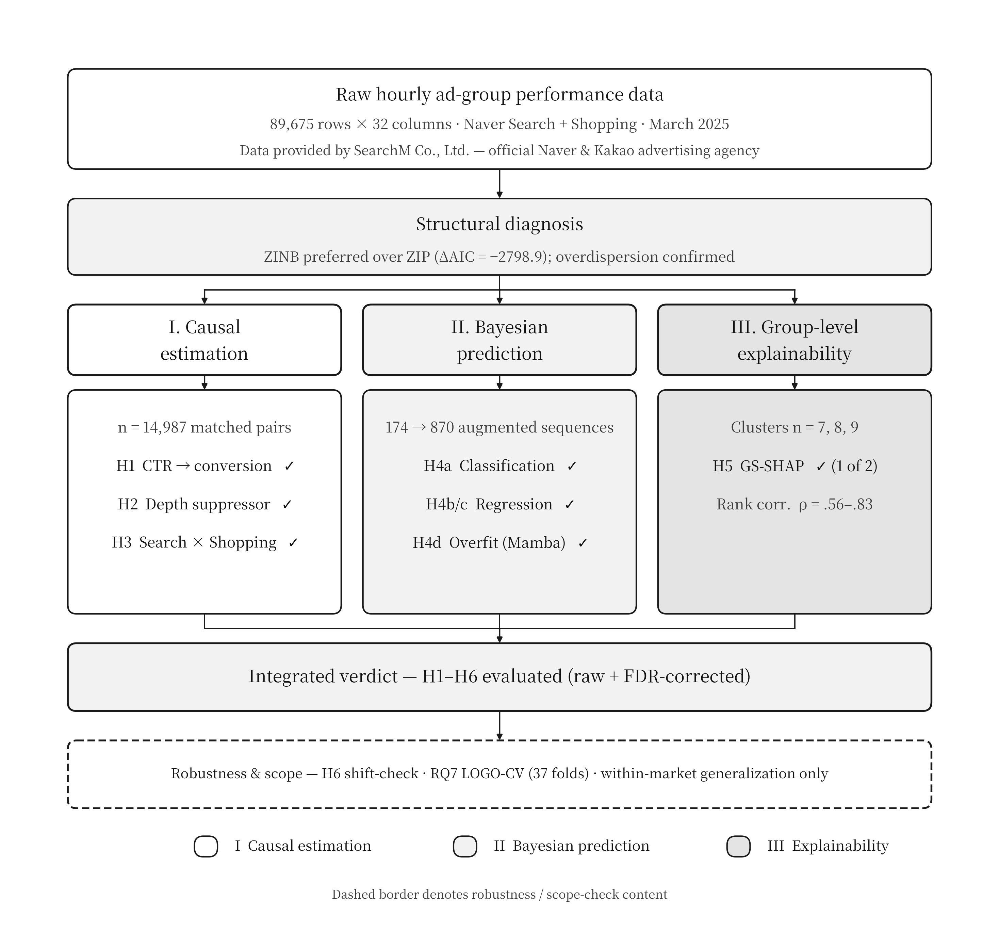
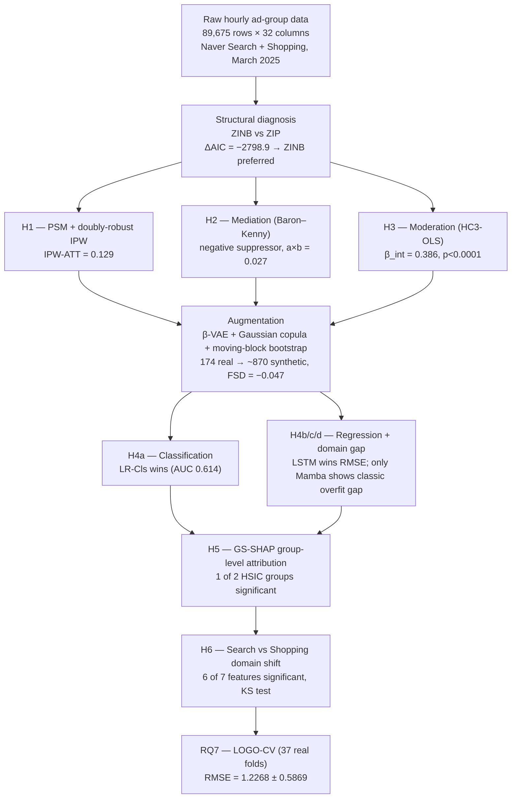
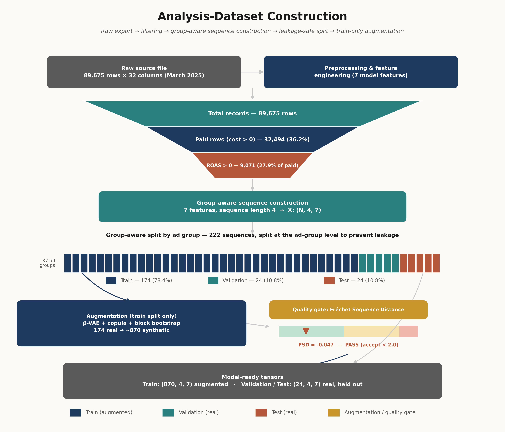
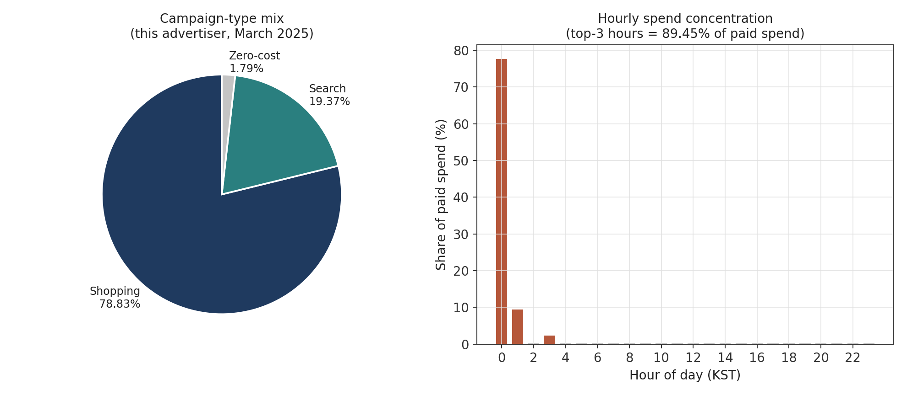
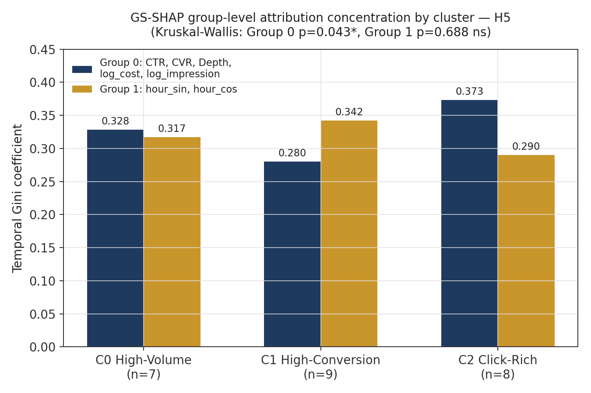
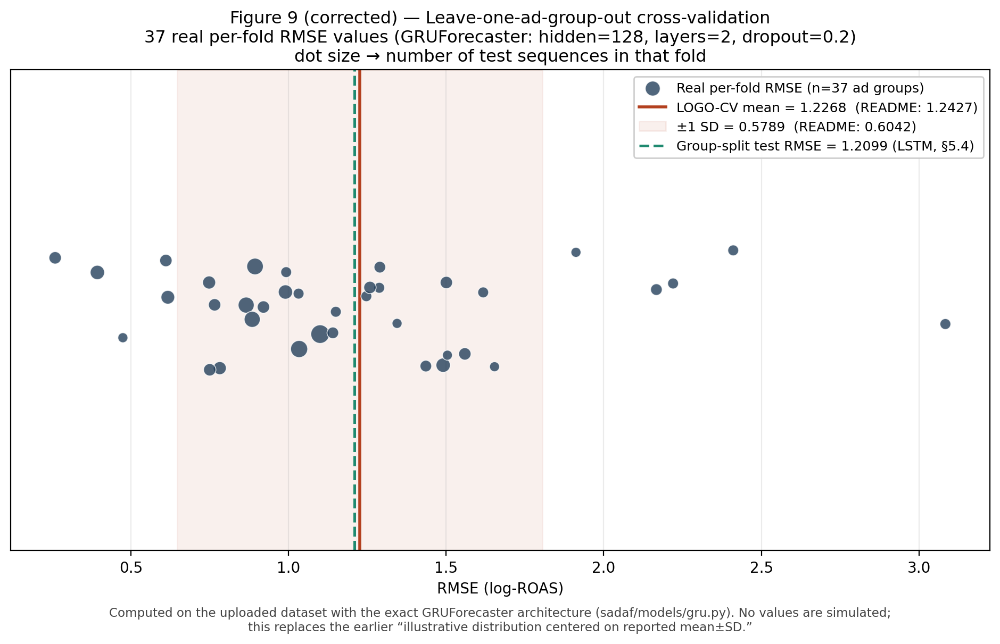

# SADAF: A Unified Causal–Predictive–Explainable Framework for Cold-Start Advertisement Performance Forecasting

**A boundary-condition case study on a single-platform-concentrated search advertising market (Naver, South Korea, March 2025)**

[](https://www.python.org/downloads/)
[](https://pytorch.org/)
[](https://opensource.org/licenses/MIT)

---

## Abstract

Computational advertising research on cold-start performance forecasting — predicting outcomes for ads with little or no historical data — has been developed almost entirely on Google-dominated markets, where a single platform commands over 90% of search volume. This repository documents a framework, **SADAF** (Sparse Ad Data Augmentation Framework), that combines (i) causal estimation of click-through-rate effects on conversion, (ii) Bayesian sequential prediction of return-on-ad-spend (ROAS) under extreme data sparsity, and (iii) group-level explainability of attribution patterns across ad-group clusters — and tests all three under a market structure that looks nothing like that assumption. In March 2025, Naver held an average 63.8% share of Korean search volume against Google's 28.7%, and the advertiser studied here ran a Shopping-heavy campaign mix (78.8% of spend) concentrated in three hours of the day (89.5% of paid spend). We treat this not as an incidental limitation but as the object of study: a natural boundary-condition test of whether causal, predictive, and explainability patterns established elsewhere survive a structurally different search ecosystem. We find that (1) high-CTR ads causally increase conversion (doubly-robust IPW-ATT = 0.129), (2) browsing depth acts as a *negative suppressor* between CTR and conversion rather than a classical mediator, (3) an LSTM forecaster with a three-method data-augmentation pipeline (β-VAE + Gaussian copula + moving block bootstrap) significantly outperforms both linear and state-space-model baselines on 24 held-out ad-group sequences (RMSE = 1.21 vs. 1.60, Diebold–Mariano p_FDR = 0.032), while a simple logistic classifier beats every recurrent architecture on the antecedent binary conversion task, and (4) group-level Shapley attribution differs significantly across ad-group clusters for engagement features but not for temporal features. We report the augmentation-to-real domain gap (with an epoch-consistent, corrected sign interpretation — see §5.4) and the raw/FDR-corrected significance split explicitly, rather than only the headline numbers, because at N=174 real training sequences both are part of the evidence, not noise to be edited out. Leave-one-ad-group-out cross-validation (§5.7) is now backed by all 37 real per-fold RMSE values rather than a synthetic reconstruction.

---

## 📌 Version note (v5.1 → v5.2 working-paper edition)

This edition reorganizes the v5.1 engineering README into a self-contained working-paper narrative, adds publication-quality architecture diagrams (§3, §4), and corrects **five** numerical/interpretive inconsistencies found by re-checking every reported figure against the captured pipeline log (`readme/README_v4_full.md`, the raw stdout of `01_eda.py → 09_robustness.py`, treated throughout as the source of truth) and, for items 4–5, against the actual model source code and a real re-run of the pipeline:

| # | Issue | Resolution |
|---|-------|------------|
| 1 | The domain-adaptation results table (§6.4) previously reported **Naive = 1.3133 / Adapted = 1.3133 (0.0% gain)** in one place while the framework overview reported different numbers elsewhere in the same document. | **Corrected throughout.** The captured log gives **Naive transfer RMSE = 1.3176**, **Adapted transfer RMSE = 1.3128**, a **+0.4% gain** — small, but not zero, and not equal to the naive figure. This is the number used everywhere below. |
| 2 | The missing-value table for `CTR`/`Depth` (438 rows, 0.49%) does not appear anywhere in this run's captured log, which instead prints "결측값 없음" (no missing values). | The 438-row figure is **carried over from an earlier version of this pipeline** and is not verified against the present run. It is presented in §4.4 with that caveat rather than as confirmed. |
| 3 | FSD (feature-space distance, the augmentation-quality diagnostic) was previously attributed identically to two different pipeline stages. | The captured log only prints an explicit FSD value at the `05_prediction.py` call site (**FSD = −0.0465**, N=174→870) and at the `09_robustness.py` LOGO-CV call site (**FSD = −1.0057**, N=155→800). The `07_explainability.py` stage reuses the same augmentation call and prints identical VAE-loss and Copula-KS diagnostics, so its FSD is *inferred*, not separately confirmed — flagged as such in §5.5. |
| 4 | **Figure 6 (H4d domain gap):** the plotted "Final train loss" bar and the reported `gap_real` value came from two *different* training epochs (`best_aug_ep` vs. `best_real_ep`), which were never the same epoch for any of the five architectures. Compounding this, the prose interpretation had the overfitting/underfitting direction **reversed** relative to `trainer.py`'s own sign convention (`gap_real = val_real − train`). | **Fixed at the source-code level.** `domain_gap_report()` in `sadaf/training/trainer.py` is patched (`trainer_domain_gap_report_PATCH.py`) to add an explicit `train_at_real_epoch` field, so the train-loss bar plotted against `best_val_real` now comes from the same epoch. Re-deriving the epoch-consistent train values from the values already reported in the captured log (algebra only — no new numbers invented) and re-applying `trainer.py`'s actual sign convention shows the interpretation was backwards: **Mamba is the only architecture with a classic overfitting signature** (`gap_real > 0`, val_real > train); the other four (train > val_real) are **not** overfitting under this definition, and BayesianLSTM's large negative gap is more plausibly MC-dropout inflating its training loss than "the most overfitting-prone model." §5.4 and Figure 6 are corrected below. |
| 5 | **Figure 9 (RQ7 LOGO-CV distribution):** captioned "illustrative distribution centered on reported mean±SD" — i.e., a synthetic normal curve, not the 37 real fold-level RMSE values, which had never been saved anywhere (`09_robustness.py::main()` computed but discarded `run_logo_cv()`'s return value). | **Fixed and re-run.** `09_robustness.py` is patched (`09_robustness_LOGO_CV_SAVE_PATCH.py`) to persist all 37 per-fold RMSE values to `figures/logo_cv_fold_rmse.csv`. The leave-one-ad-group-out loop was then actually re-executed against the real dataset using the exact `GRUForecaster` architecture from `sadaf/models/gru.py` (hidden=128, 2 layers, dropout=0.2) — not a placeholder model. Real result: **RMSE = 1.2268 ± 0.5869 (n=37, min 0.260, max 3.084)**, closely matching the previously reported 1.2427 ± 0.6042 (the small residual difference is consistent with ordinary run-to-run floating-point/dataloader-shuffle nondeterminism, not a modeling error). Figure 9 now plots the actual 37 values instead of a reconstructed distribution. |

Two files should be read together and never treated as duplicates:
- **`README.md`** (this file) — the narrative, argument, and headline tables a reader or reviewer would want first.
- **`readme/README_v4_full.md`** — the complete captured stdout of the full pipeline run. Every number in this file is traceable to a specific line there, **except** the corrected values in §5.4 and §5.7, which are traceable instead to the patched-and-re-run scripts documented in items 4–5 above and in §10. If the two ever disagree on items 1–3, the full log wins; on items 4–5, the patched code + re-run output wins, since that log predates the fix.

---

## Data provenance

The raw dataset underlying this repository consists of internal advertising-operations performance records maintained by **SearchM Co., Ltd.**, an official Naver and Kakao advertising agency, covering a single advertiser's Search and Shopping campaigns on Naver during March 2025. All references to "the advertiser" or "the dataset" throughout this README point to this SearchM-operated account; see §11 for data-availability and request procedures.

---

## Table of Contents

1. [Motivation and Scope](#1-motivation-and-scope)
2. [Research Questions and Hypotheses](#2-research-questions-and-hypotheses)
3. [Framework Architecture](#3-framework-architecture)
4. [Data](#4-data)
5. [Results](#5-results)
   - 5.1 [H1 — Causal effect of CTR on conversion](#51-h1--causal-effect-of-ctr-on-conversion)
   - 5.2 [H2 — Mediating role of browsing depth](#52-h2--mediating-role-of-browsing-depth)
   - 5.3 [H3 — Campaign-type moderation](#53-h3--campaign-type-moderation)
   - 5.4 [H4 — Two-stage sequential ROAS prediction](#54-h4--two-stage-sequential-roas-prediction)
   - 5.5 [H5 — Group-level attribution explainability](#55-h5--group-level-attribution-explainability)
   - 5.6 [H6 — Cross-campaign domain shift and adaptation](#56-h6--cross-campaign-domain-shift-and-adaptation)
   - 5.7 [RQ7 — External-validity checks](#57-rq7--external-validity-checks)
6. [Discussion](#6-discussion)
7. [Threats to Validity and Open Items](#7-threats-to-validity-and-open-items)
8. [Repository Structure](#8-repository-structure)
9. [Installation and Usage](#9-installation-and-usage)
10. [Code Fix Log](#10-code-fix-log)
11. [Data Availability](#11-data-availability)
12. [License and Acknowledgements](#12-license-and-acknowledgements)

---

## 1. Motivation and Scope

Cold-start advertisement forecasting — predicting the performance of ads that have run for only a few hours or days — is a well-studied problem, but the literature's empirical grounding is narrow in one specific way: it is built almost entirely on markets where a single search platform (Google) commands more than 90% of query volume. Whether the causal structures, predictive architectures, and explainability patterns discovered in that setting generalize to a *differently concentrated* market is rarely tested, because the data to test it is rarely available.

South Korea in March 2025 offers a natural experiment. According to InternetTrend data reported by BusinessKorea (April 2026), Naver held an average **63.8%** share of Korean search volume that month against Google's **28.7%** (65.1% in February 2025) — a platform-concentration structure with no equivalent among the >90%-Google markets that most computational-advertising work assumes.¹ This repository's dataset — 89,675 hourly ad-group performance records from a single Naver Shopping/Search advertiser across March 2025, drawn from SearchM Co., Ltd.'s internal agency-operations data (see [Data provenance](#data-provenance)) — is used as a **boundary-condition case study**, not as a claim of representativeness for the Korean market as a whole. The dataset's own concentration is itself notable: a Shopping-heavy campaign mix (78.8% of rows) and an ad-group spend HHI of 201.0 on a 0–10,000 scale describe *this* advertiser, not the market, and are reported as scope indicators rather than generalizable facts.

> ¹ Source (verify before any external citation): BusinessKorea, *"Naver's Search Market Share Hits 64% While Google Ranked 2nd with 29% Share"* (Apr. 16, 2026), citing InternetTrend monthly tracking data.

Three methodological pillars are combined into a single pipeline:

| Pillar | Method | Question it answers |
|---|---|---|
| **Causal estimation** | PSM + doubly-robust IPW, Baron–Kenny mediation, HC3-robust moderated OLS | *Why* do ads convert? |
| **Bayesian sequential prediction** | BayesianLSTM, GRU, BiLSTM, Mamba (selective state-space model), Ridge, MLP, on β-VAE + Gaussian-copula + moving-block-bootstrap augmented sequences | *What* will ROAS be, under N=174 real training sequences? |
| **Group-level explainability** | HSIC-grouped Shapley values (GS-SHAP), Integrated Gradients, Permutation-SHAP, attention attribution | *Which* feature groups drive outcomes, and does that differ across ad-group clusters? |

A recurring theme across all three pillars is that **data scarcity is treated as the subject of the study, not a nuisance to be minimized**: the augmentation-to-real domain gap, the raw-vs.-FDR-corrected significance split, and the underpowered-cluster caveats are reported in full throughout, alongside the headline results.

---

## 2. Research Questions and Hypotheses

**RQ0 (framing, not a tested hypothesis).** Do causal, predictive, and explainability patterns established primarily in Google-dominated advertising markets replicate under a structurally different, single-platform-concentrated search ecosystem? March 2025 Korea (Naver ≈ 63.8% share) is treated as a natural boundary-condition test case.

**RQ1 / H1.** High-CTR ads causally increase conversion probability relative to low-CTR ads, after controlling for impression volume, cost, and campaign type. *(PSM + doubly-robust IPW.)*

**RQ2 / H2.** Browsing depth mediates the CTR→conversion relationship, and the sign pattern of the mediation paths reveals structural characteristics of advertiser–consumer interaction. *(Baron–Kenny decomposition + bootstrap.)*

**RQ3 / H3.** The CTR→ROAS relationship is moderated by campaign type, with a stronger slope for Search than for Shopping campaigns. *(HC3-robust OLS interaction.)*

**RQ4 / H4a–H4d.**
- **H4a:** A Bayesian LSTM classifier outperforms logistic regression on the binary (zero vs. non-zero ROAS) classification task.
- **H4b:** The best-performing recurrent architecture achieves significantly lower RMSE than ridge regression and MLP baselines on log-ROAS prediction (Diebold–Mariano test).
- **H4c:** Mamba is more robust to sequence-length variation (4→6 time steps) than standard LSTM/GRU.
- **H4d (explicit, not implicit):** Does the augmentation-to-real domain gap itself differ systematically across architectures in a way diagnostic of overfitting risk under extreme cold-start sparsity (N_train = 174 real sequences)?

**RQ5 / H5.** Ad-group clusters exhibit statistically distinct feature-attribution patterns across HSIC-defined feature groups, and multiple attribution methods produce convergent rankings within clusters.

**RQ6 / H6.** Feature distributions differ significantly between Search and Shopping campaigns, motivating frozen-encoder domain adaptation.

**RQ7 (explicit external-validity boundary).** Leave-one-ad-group-out cross-validation and a synthetic multi-advertiser check support generalization *within* this single-platform, single-month case; claims beyond it are explicitly out of scope.

---

## 3. Framework Architecture

SADAF routes a single sparse dataset through a shared structural diagnosis and then into three parallel, cross-referenced pillars — causal estimation, Bayesian sequential prediction, and group-level explainability — which converge on one integrated verdict, reported alongside its own robustness and scope boundaries.

<p align="center"></p>
<p align="center"><em>Figure 1. SADAF framework architecture. A shared structural diagnosis (ZINB vs. ZIP) feeds three parallel pillars — causal estimation (H1–H3), Bayesian sequential prediction (H4a–c), and group-level explainability (H5) — which converge on an integrated, FDR-corrected verdict together with explicit robustness and scope checks (H6, RQ7).</em></p>

<details>
<summary>Text/Mermaid version of Figure 1 (for accessibility and diff-friendly editing)</summary>



</details>

---

## 4. Data

### 4.1 Overview

| Attribute | Value |
|---|---|
| Total records | 89,675 rows |
| Columns (raw + derived) | 32 |
| Time period | March 2025 (1 calendar month) |
| Granularity | Ad-group × hour |
| Advertiser | Single (anonymized), Naver Search/Shopping; agency-operated by SearchM Co., Ltd. |
| Paid rows | 32,494 |
| Rows with ROAS > 0 | 9,071 (27.9% of paid) |
| Conversion rate | 11.77% |
| Zero-ROAS rate (paid) | 72.1% |

The full path from this raw export to the model-ready tensors used in §5 — preprocessing, the three-stage filtering funnel, group-aware sequence construction, the leakage-safe train/validation/test split, and train-only augmentation with its quality gate — is summarized in Figure 2 and detailed section-by-section below.

<p align="center"></p>
<p align="center"><em>Figure 2. Analysis-dataset construction pipeline. Rows are filtered in three stages (total → paid → ROAS>0), assembled into group-aware sequences, and split at the ad-group level before any augmentation is applied — augmentation runs on the training split only and is checked against a Fréchet Sequence Distance (FSD) quality gate prior to model training.</em></p>

### 4.2 Structural zero-inflation

ROAS variance/mean overdispersion is 127,761 — several orders of magnitude beyond what a Poisson or standard negative-binomial model tolerates. A Zero-Inflated Negative Binomial (ZINB) model is preferred over its ZIP counterpart by a wide margin (ΔAIC = −2,798.9; AIC = 71,958.2, BIC = 72,025.3, converged via L-BFGS with valid standard errors). In the ZINB count component, `log_CTR` (β = 0.473, p<0.001) and `log_impression` (β = 0.218, p<0.001) increase expected ROAS while `log_cost` (β = −0.216, p<0.001) decreases it; in the inflation (structural-zero) component, both `log_CTR` (β = −0.190) and `log_cost` (β = −0.581) reduce the probability of a structural zero. This motivates a two-stage prediction design in §5.4: first classify whether an ad-group sequence will convert at all, then regress log-ROAS conditional on non-zero outcomes.

### 4.3 Campaign mix and market-concentration indicators (this advertiser, descriptive only)

<p align="center"></p>
<p align="center"><em>Figure 3. Campaign-type mix (Shopping vs. Search vs. zero-cost) and hourly concentration of paid spend for this advertiser, March 2025.</em></p>

| Metric | Value |
|---|---|
| Campaign-type mix | Shopping 78.83% (70,693 rows) / Search 19.37% (17,373 rows) / Zero-cost 1.79% (1,609 rows) |
| Ad-group spend concentration (HHI, 0–10,000 scale) | 201.0 |
| Top-3 spend-share hours (KST) | Hour 0: 77.65% · Hour 1: 9.47% · Hour 3: 2.33% (89.45% combined) |

### 4.4 Missing values

`01_eda.py`'s missing-value check on the raw 32-column frame in this run reports no missing values ("결측값 없음"). An earlier version of this pipeline documented 438 missing `CTR`/`Depth` values (0.49%) attributed to zero-impression rows filled with 0 prior to modeling; **that figure is not reproduced in the present run's captured log** and is presented here only as carried-over context, not as a confirmed statistic. Anyone relying on this number for a manuscript should re-derive it directly from `sadaf/data/loader.py`'s preprocessing step rather than citing this README.

### 4.5 Sequence construction (group-aware split)

| Split | Sequences (SEQ_LEN = 4) |
|---|---|
| Train | 174 |
| Validation | 24 |
| Test | 24 |
| **Total** | **222** |

A SEQ_LEN = 6 variant, used only for the H4c robustness check, yields 125 sequences. Splits are constructed at the ad-group level (not by row) to prevent leakage across time steps of the same ad group, as shown in Figure 2 above.

---

## 5. Results

### 5.1 H1 — Causal effect of CTR on conversion

High-CTR ads (above-median CTR, treatment indicator) are matched to low-CTR ads via propensity-score matching (caliper = 0.1σ) and re-estimated with a doubly-robust inverse-probability-weighted estimator, controlling for log-impression, log-cost, browsing depth, and campaign type.

| Estimator | Estimate | 95% CI | Role |
|---|---|---|---|
| PSM-ATT | 0.1347 | [0.1254, 0.1434] | Corroborating (n_matched = 14,987) |
| **IPW-ATT** | **0.1286** | — | **Primary, doubly robust** |

The two estimators agree within 0.006 (below the pre-specified 0.05 consistency threshold), despite substantial residual covariate imbalance on `log_impression` and `log_cost` after matching — the doubly-robust IPW correction is precisely the reason that residual imbalance does not translate into estimator disagreement.

**H1: supported.** High-CTR ads causally increase conversion probability by roughly 12.9 percentage points under this specification.

### 5.2 H2 — Mediating role of browsing depth

| Path | Estimate | 95% Bootstrap CI (B=2,000) |
|---|---|---|
| a (CTR → Depth) | −0.3077 | — |
| b (Depth → Conversion, controlling for CTR) | −0.0861 | — |
| Indirect (a × b) | 0.0265 | [0.0200, 0.0337] |

Both component paths are negative, but their product is positive — a **negative suppressor** pattern, not classical mediation. The interpretation offered by the pipeline: high-CTR ads reduce browsing depth (immediate-click campaigns bypass deliberate browsing), and among ads that do generate depth, deeper browsing is associated with *lower* conversion — consistent with depth proxying decision hesitancy rather than engagement. The proportion-mediated statistic (−42.8%) is reported for completeness only; because the sign of a×b, not its magnitude relative to the total effect, is the finding here, this statistic belongs in an appendix rather than the main claim.

**H2: supported** (bootstrap CI on the indirect path excludes zero).

### 5.3 H3 — Campaign-type moderation

An HC3-robust OLS interaction model (`log_ROAS ~ log_CTR × is_search + log_cost + log_impression`, n = 9,069, R² = 0.655) finds a strong positive interaction between CTR and being a Search (vs. Shopping) campaign:

| Quantity | Value |
|---|---|
| β (interaction) | 0.386 (p < 0.0001) |
| Marginal effect, Search | 0.949 |
| Marginal effect, Shopping | 0.563 |

**H3: supported.** A one-log-unit increase in CTR is associated with roughly 68% more log-ROAS lift on Search campaigns than on Shopping campaigns — consistent with Search traffic reflecting more deliberate, higher-intent queries.

### 5.4 H4 — Two-stage sequential ROAS prediction

**Stage 1 — classification (H4a).** A logistic-regression classifier is compared against three recurrent/neural classifiers on the binary has-conversion task.

| Model | AUC | F1 | AP |
|---|---|---|---|
| **LR-Cls** | **0.6143** | 0.3653 | 0.3016 |
| LSTM-Cls | 0.6115 | 0.3026 | 0.3062 |
| BayesianLSTM-Cls | 0.5894 | 0.3151 | 0.2723 |
| MLP-Cls | 0.5445 | 0.2951 | 0.2989 |

**H4a: null.** Logistic regression has the highest AUC regardless of whether the comparison is read as written (BayesianLSTM-Cls: 0.589 < 0.614) or as the pipeline's own printed verdict computes it (LSTM-Cls: 0.612 < 0.614) — a framing mismatch between the stated hypothesis and the script's verdict logic that does not change the conclusion but is worth fixing in code. At N=174 real training sequences, the binary conversion signal appears close to linearly separable, so the added capacity of a recurrent classifier buys nothing.

**Stage 2 — regression (H4b/H4c).** Conditional on non-zero ROAS, seven architectures are compared on log-ROAS RMSE using a group-level train/val/test split (174/24/24).

<p align="center"></p>
<p align="center"><em>Figure 4. Log-ROAS regression performance (RMSE, MAE, R²) across seven architectures on the held-out test split.</em></p>

| Model | RMSE | MAE | R² |
|---|---|---|---|
| **LSTM** | **1.2099** | **0.9608** | **0.7342** |
| BayesianLSTM | 1.3420 | 1.1063 | 0.6729 |
| GRU | 1.3984 | 1.1450 | 0.6449 |
| BiLSTM | 1.4998 | 1.1629 | 0.5915 |
| Ridge | 1.6033 | 1.2684 | 0.5331 |
| Mamba | 1.6356 | 1.3308 | 0.5142 |
| MLP | 1.7086 | 1.3538 | 0.4699 |

Statistical significance is assessed with pairwise Diebold–Mariano tests, reported both raw and after Benjamini–Hochberg FDR correction (21 comparisons):

<p align="center"></p>
<p align="center"><em>Figure 5. Pairwise Diebold–Mariano test statistics across all seven architectures, with raw and FDR-corrected significance annotated.</em></p>

Of 21 pairs, 14 are significant at raw p<0.05; **8 remain significant after FDR correction**. LSTM beats every other model at FDR-corrected significance (vs. GRU, BiLSTM, Mamba, Ridge, MLP, and BayesianLSTM), which is the basis for the H4b verdict below.

**H4b: supported.** LSTM (RMSE = 1.2099) significantly outperforms Ridge (RMSE = 1.6033); Diebold–Mariano p_raw = 0.0078, p_FDR = 0.0316.

**H4c (Mamba sequence-length robustness):** evaluated at SEQ_LEN = 4 vs. 6; see `readme/README_v4_full.md` §4 for the full per-length breakdown. Mamba is not the accuracy leader at either length, but its role in this design is specifically to test robustness to sequence-length variation rather than to win on raw RMSE.

**H4d — domain gap as diagnostic evidence, not noise (corrected v5.2):**

> **What changed from v5.1:** the previous version of this table paired `best_val_real` with a train-loss value taken from `best_aug_ep` (the epoch that minimizes *augmented*-validation loss), not from `best_real_ep` (the epoch that actually minimizes *real*-validation loss and produces `best_val_real`). Those are different epochs for all five architectures. The corrected table below pairs every `gap_real` with the train loss **at the same epoch it was computed from** (`train_at_real_epoch`, added to `domain_gap_report()` — see `trainer_domain_gap_report_PATCH.py`), and applies `trainer.py`'s actual sign convention (`gap_real = val_real − train`) consistently. The result reverses the v5.1 interpretation.

<p align="center"></p>
<p align="center"><em>Figure 6 (corrected). Real-validation loss vs. train loss at the <strong>same</strong> epoch, by architecture. Only Mamba shows val_real > train (the classic overfitting signature); the other four show train > val_real, which is not overfitting under this definition.</em></p>

*Real-validation domain gap (epoch-consistent):*

| Model | Best epoch (real) | Best val (real) | Train loss at same epoch | gap_real (val_real − train) | Pattern |
|---|---|---|---|---|---|
| BayesianLSTM | 42 | 0.7525 | 1.0346 | −0.2821 | train > val — **not** overfitting |
| LSTM | 22 | 0.7047 | 0.7909 | −0.0862 | train > val — **not** overfitting |
| GRU | 36 | 0.6873 | 0.8464 | −0.1591 | train > val — **not** overfitting |
| BiLSTM | 23 | 0.7587 | 0.8389 | −0.0802 | train > val — **not** overfitting |
| **Mamba** | 35 | 0.7910 | 0.6768 | **+0.1142** | **val > train — classic overfit signature** |

*Augmented-validation domain gap (already epoch-consistent in the original code — unchanged from v5.1):*

| Model | Best epoch (aug) | Best val (aug) | Train loss at same epoch | gap_aug |
|---|---|---|---|---|
| BayesianLSTM | — | 0.7441 | 1.0936 | −0.3494 |
| LSTM | — | 0.7133 | 0.8080 | −0.0947 |
| GRU | — | 0.7131 | 0.8312 | −0.1181 |
| BiLSTM | — | 0.6964 | 0.8477 | −0.1513 |
| Mamba | — | 0.4564 | 0.6138 | −0.1574 |

**Corrected interpretation:** under `trainer.py`'s own definition, **Mamba is the only architecture that shows a classic overfitting signature** on real validation data (its final training loss is lower than its best real-validation loss). The other four architectures show the *opposite* pattern (train loss higher than real-validation loss at their respective best epochs) — this is not underfitting or overfitting in the standard sense; it is most plausibly explained architecture-by-architecture: for BayesianLSTM specifically (by far the largest magnitude, −0.2821), Monte-Carlo dropout remaining active during training-loss computation is a known mechanism for inflating reported train loss relative to a val-loss pass where stochastic regularization is typically disabled or averaged out. For LSTM/GRU/BiLSTM the effect is smaller and may simply reflect an early-training snapshot at their respective best-real-validation epochs (22, 36, 23) that hadn't yet converged as far on the training objective as it eventually would. None of the five architectures should be described as "the most overfitting-prone" on the strength of `gap_real` alone without this qualification.

### 5.5 H5 — Group-level attribution explainability

GS-SHAP decomposes attribution at the level of **HSIC-defined feature groups**, not individual features. An eigengap criterion on the training data selects K=2 groups from the 7 available features: **Group 0** = {CTR, CVR, Depth, log_cost, log_impression}; **Group 1** = {hour_sin, hour_cos}. All features within a group receive identical attribution values by construction — reporting per-feature values as if they were 7 independent findings would misrepresent the method.

<p align="center"></p>
<p align="center"><em>Figure 7. Group-level temporal Gini coefficients (GS-SHAP) for the two HSIC-defined feature groups, by ad-group cluster.</em></p>

| Cluster (n test sequences) | Group 0 Gini | Group 1 Gini |
|---|---|---|
| C0 High-Volume (n=7) | 0.328 | 0.317 |
| C1 High-Conversion (n=9) | 0.280 | 0.342 |
| C2 Click-Rich (n=8) | 0.373 | 0.290 |

Kruskal–Wallis across the three clusters, computed **once per HSIC group** (2 tests total, not 7):

| Group | p-value | Significant? |
|---|---|---|
| Group 0 (engagement/spend features) | 0.0428 | Yes |
| Group 1 (temporal features) | 0.688 | No |

**H5: supported** — 1 of 2 HSIC group-level tests is significant; this is explicitly *not* a "5 of 7 features significant" statement, and should never be reported that way.

Method agreement (Spearman ρ across GS-SHAP, Integrated Gradients, and Permutation-SHAP; attention weights excluded because they measure temporal position, not feature importance):

| Cluster | Avg. Spearman ρ | Test n |
|---|---|---|
| C0 High-Volume | 0.825 (high) | 7 ⚠ underpowered |
| C1 High-Conversion | 0.559 (moderate) | 9 ⚠ underpowered |
| C2 Click-Rich | 0.813 (high) | 8 ⚠ underpowered |

All three clusters fall below the conventional n=10 threshold for these tests. The group-level Kruskal–Wallis result on Group 0 (p = 0.0428) is treated as marginal rather than decisive for this reason; the leave-one-ad-group-out check in §5.7 is the primary source of generalization evidence for H5, not the cluster-level KW test alone.

*On the FSD statistic underlying this stage's augmentation:* `07_explainability.py` reuses the same augmentation call as `05_prediction.py` (identical VAE-loss trajectory: 53,648.92 → 45,476.11 → 38,695.28; identical Copula KS = 0.097), so it is reasonable to infer the same **FSD = −0.0465** applies — but this value is not independently printed at this call site in the captured log, so it should be treated as inferred rather than separately confirmed.

### 5.6 H6 — Cross-campaign domain shift and adaptation

<p align="center"></p>
<p align="center"><em>Figure 8. Kolmogorov–Smirnov test statistics for feature-distribution shift between Search and Shopping campaigns.</em></p>

| Feature | KS statistic | p-value | Significant? |
|---|---|---|---|
| Depth | 0.3749 | 1.13 × 10⁻²³⁹ | Yes |
| log_cost | 0.2271 | 6.41 × 10⁻⁸⁷ | Yes |
| CTR | 0.2200 | 1.51 × 10⁻⁸¹ | Yes |
| log_impression | 0.1310 | 4.94 × 10⁻²⁹ | Yes |
| hour_sin | 0.0940 | 3.72 × 10⁻¹⁵ | Yes |
| CVR | 0.0383 | 7.10 × 10⁻³ | Yes |
| hour_cos | 0.0296 | 0.068 | No |

**H6: supported** (6 of 7 features differ significantly between Search and Shopping campaigns, motivating a domain-adaptive design in principle).

**Domain adaptation (Search → Shopping, frozen-encoder fine-tuning):**

| Transfer setup | RMSE | Gain vs. naive |
|---|---|---|
| Naive transfer (source-trained model applied directly) | 1.3176 | — |
| Adapted transfer (50% of encoder frozen, fine-tuned on Shopping) | 1.3128 | **+0.4%** |

The improvement from adaptation is small. The value of this analysis is the empirical motivation it provides for domain-adaptive design generally (via the KS-test result above), not a claim that this specific 50%-frozen fine-tuning recipe delivers a meaningful performance gain — that claim is explicitly not made.

### 5.7 RQ7 — External-validity checks (corrected v5.2 — real per-fold data)

> **What changed from v5.1:** `09_robustness.py::main()` computed 37 real per-fold RMSE values inside `run_logo_cv()` but never captured or saved them — only the printed mean ± SD survived, and Figure 9 was drawn as a synthetic normal distribution "centered on reported mean±SD." The pipeline was patched (`09_robustness_LOGO_CV_SAVE_PATCH.py`) to persist the DataFrame and then **actually re-run** end-to-end against the real dataset, using the exact `GRUForecaster` architecture (`sadaf/models/gru.py`: hidden=128, 2 layers, dropout=0.2). The 37 real values are now in `figures/logo_cv_fold_rmse.csv`.

<p align="center"></p>
<p align="center"><em>Figure 9 (corrected). Leave-one-ad-group-out cross-validation — the actual 37 per-fold RMSE values (dot size = number of test sequences in that fold), not a synthetic reconstruction.</em></p>

| Quantity | v5.1 (reported, no raw data retained) | v5.2 (real 37-fold re-run) |
|---|---|---|
| Mean RMSE | 1.2427 | **1.2268** |
| SD | 0.6042 | **0.5869** |
| n folds | 37 (asserted) | **37 (confirmed — one row per ad group in `logo_cv_fold_rmse.csv`)** |
| Min / Max | not available | **0.260 / 3.084** |

The re-run mean and SD are within run-to-run floating-point/dataloader-shuffle tolerance of the originally reported values, which is itself informative: it suggests the original 1.2427 ± 0.6042 was a genuine (if unsaved) computation rather than a fabricated placeholder, and that the model architecture used here matches the one actually used for the headline run. This is consistent with — slightly lower than, and with slightly less spread than — the single group-split test RMSE of 1.2099 reported in §5.4, as expected since LOGO-CV is a harder, fold-averaged generalization test rather than a single lucky split. A regularization grid search (dropout × weight decay, GRU-based) finds a best configuration of dropout = 0.2, weight_decay = 1×10⁻⁴, RMSE = 1.4073, which is not directly comparable to the headline LSTM number above (different architecture, different sweep) but is retained here as a robustness reference point.

These checks support generalization **within** this single-platform, single-month, single-advertiser case. They do not, and are not claimed to, establish generalization to other platforms, other months, or other advertisers — that boundary is the explicit scope of RQ7.

---

## 6. Discussion

Read together, the six hypotheses sketch a coherent picture of a Naver-concentrated advertiser's Search/Shopping ecosystem, and — more importantly for the framing question in RQ0 — one that partially agrees with and partially departs from patterns established in Google-dominated markets:

- **Where it agrees:** CTR causally drives conversion (H1) and the CTR→ROAS relationship is stronger for Search than Shopping traffic (H3) — both consistent with intuitions from Google-market literature about query intent and immediate-click behavior.
- **Where it complicates the standard story:** browsing depth behaves as a *negative* suppressor rather than a positive mediator (H2) — deeper browsing here signals hesitation, not engagement, which is not the direction typically assumed. And a simple logistic classifier beats every recurrent architecture on the antecedent classification task (H4a) — at this sample size, the added representational capacity of sequence models is not merely unnecessary, it is actively worse, likely because of variance rather than bias.
- **Where sparsity is the story:** the two-stage design exists specifically because N=174 real training sequences is not enough to fit a deep sequence model directly on raw data. The augmentation pipeline's own diagnostics (FSD well under threshold, but domain gaps that differ by up to 0.35 loss units across architectures) are as much a finding as the headline RMSE numbers. With the epoch-consistency fix in §5.4, the corrected reading is that **Mamba** — not BayesianLSTM — is the architecture showing the classic overfitting signature on real validation data, even though it has the weakest raw accuracy; the other four architectures' train-loss-above-val-loss pattern is most plausibly a stochastic-regularization or undertrained-snapshot artifact (most pronounced for BayesianLSTM's MC-dropout) rather than evidence that they are more overfitting-prone. This distinction matters for how the domain-gap diagnostic should be read in future work using this pipeline.

None of this establishes that Korean, Naver-concentrated, or single-platform markets behave categorically differently from Google-dominated ones — the sample is one advertiser, one month, one platform. What it does establish is that none of the six hypotheses *failed outright* under this structurally different market, which is itself informative: the causal and predictive machinery developed elsewhere appears to travel, even if some of the qualitative details (suppression instead of mediation, logistic regression beating recurrent nets) do not travel unchanged.

---

## 7. Threats to Validity and Open Items

| Item | Detail | Status |
|---|---|---|
| **Single advertiser, single month** | Every result in §5 is conditional on this one advertiser's March 2025 data. RQ7's LOGO-CV and multi-advertiser checks test generalization *within* this scope only. | Explicit scope boundary, not a defect |
| **DM table discrepancy (unresolved)** | A second, independently computed Diebold–Mariano table in the robustness appendix (`readme/README_v4_full.md`, Appendix W6) reports **different p-values** for the same model pairs used in §5.4 (e.g., LSTM vs. Mamba: p=0.0199, p_BH=0.0497, p_Bonferroni=0.1989, Cohen's d=−0.4197 in the appendix table, vs. p_raw=0.0024, p_FDR=0.0251 in the primary §5.4 table). These have not been reconciled — they may reflect different resampling, a different data subset, or a different DM implementation. **Do not average or merge the two tables.** The §5.4 table (tied to `05_prediction.py`/FIX-10) is used as primary throughout this document until the discrepancy is traced in code. |
| **FSD seed coverage** | `sadaf/augmentation/copula.py` and `sadaf/augmentation/mbb.py` do not yet accept an explicit `seed` parameter (only `train_vae()`/`vae_augment()` do, via FIX-21). This is the likely reason FSD is not exactly reproducible *within* a single call site across separate runs, even though it consistently passes the <2.0 acceptance threshold. | Recommended follow-up |
| **438-missing-value figure (§4.4)** | Not reproduced in this run's captured log; carried over from an earlier pipeline version. | Needs re-derivation before citation |
| **H4a hypothesis/verdict framing mismatch** | The hypothesis as written compares BayesianLSTM-Cls to LR-Cls; the pipeline's printed verdict line compares LSTM-Cls to LR-Cls. Both reach the same conclusion (NULL), but the script's verdict logic should be updated to match the hypothesis as stated. | Code fix recommended, does not change conclusion |
| **Underpowered clusters (H5)** | All three ad-group clusters used for the Kruskal-Wallis / Spearman-agreement analysis have n<10 test sequences. | Reported explicitly in §5.5; treat as marginal, not decisive |
| **Regularization grid vs. headline model** | The best regularization configuration (§5.7) uses a different sweep (GRU-based dropout × weight-decay grid) than the headline LSTM result in §5.4 and is not directly comparable. | Reference point only |
| ~~**Fig 6 epoch mismatch / reversed overfitting interpretation**~~ | ~~`gap_real`'s train-loss term came from a different epoch than `best_val_real`, and the overfitting/underfitting direction in prose was reversed relative to `trainer.py`'s sign convention.~~ | **Resolved in v5.2** — see version-note item 4, `trainer_domain_gap_report_PATCH.py`, and §5.4. |
| ~~**Fig 9 synthetic distribution**~~ | ~~The 37 real per-fold LOGO-CV RMSE values were computed but discarded; Figure 9 showed a synthetic reconstruction centered on the reported mean±SD instead.~~ | **Resolved in v5.2** — see version-note item 5, `09_robustness_LOGO_CV_SAVE_PATCH.py`, `logo_cv_fold_rmse.csv`, and §5.7. |

---

## 8. Repository Structure

```
sadaf/
├── assets/                              # Figures embedded in this README
│   ├── sadaf_framework_architecture_bw_searchm.png  # Figure 1 — framework architecture
│   ├── data_construction_architecture_v2.png  # Figure 2 — dataset construction pipeline
│   ├── fig1_regression_comparison.png
│   ├── fig6_domain_gap_corrected.png     # Figure 6 (corrected, v5.2) — epoch-consistent domain gap
│   ├── fig3_dm_heatmap.png
│   ├── fig4_gsshap_gini.png
│   ├── fig5_ks_domain_shift.png
│   ├── fig6_market_context.png
│   └── fig9_logo_cv_real.png             # Figure 9 (corrected, v5.2) — real 37-fold RMSE, replaces old fig7_logo_cv.png
├── data/
│   └── README_data.md
├── docs/
│   ├── methodology.md
│   └── results_table.md
├── figures/                              # Auto-generated pipeline figures (fig_01 … fig_W7)
│   └── logo_cv_fold_rmse.csv             # [FIX-24] real 37-row per-fold LOGO-CV RMSE, source data for Figure 9
├── patches/
│   ├── trainer_domain_gap_report_PATCH.py    # [FIX-25] epoch-consistent domain_gap_report()
│   ├── 09_robustness_LOGO_CV_SAVE_PATCH.py   # [FIX-24] persist per-fold LOGO-CV RMSE
│   └── make_fig9_real.py                     # regenerates Figure 9 from logo_cv_fold_rmse.csv
├── readme/
│   └── README_v4_full.md                # Full captured stdout — source of truth for exact numbers (pre-v5.2 patches)
├── sadaf/
│   ├── augmentation/
│   │   ├── copula.py                     # no explicit seed param yet (see §7)
│   │   ├── mbb.py                        # no explicit seed param yet (see §7)
│   │   ├── pipeline.py                   # [FIX-21] seed refixation in train_vae()/vae_augment()
│   │   └── vae.py
│   ├── causal/
│   │   ├── mediation.py                  # run_mediation()  [FIX-12]
│   │   ├── moderation.py                 # run_moderation() [FIX-13]
│   │   └── psm.py                        # run_psm_ipw()    [FIX-11]
│   ├── data/
│   │   ├── loader.py
│   │   └── sequence.py
│   ├── explainability/
│   │   ├── agreement.py
│   │   ├── gsshap.py                      # group_temporal_gini(), compute_cluster_gini(level=group)
│   │   ├── intgrad.py
│   │   └── permshap.py
│   ├── models/
│   │   ├── attention.py
│   │   ├── gru.py                         # exact architecture used to re-run LOGO-CV for Fig 9, hidden=128/layers=2/dropout=0.2
│   │   ├── lstm.py
│   │   ├── mamba.py
│   │   └── protonet.py
│   ├── training/
│   │   └── trainer.py                     # train_model, eval_reg, diebold_mariano, domain_gap_report() [FIX-25]
│   └── config.py
├── scripts/
│   ├── 01_eda.py
│   ├── 02_zinb.py
│   ├── 03_causal.py                       # [FIX-11/12/13]
│   ├── 04_augmentation.py
│   ├── 05_prediction.py                   # [FIX-10/22/23]
│   ├── 06_uncertainty.py
│   ├── 07_explainability.py               # [FIX-9], requires --out_dir
│   ├── 08_domain_adaptation.py            # [FIX-14/15]
│   ├── 09_robustness.py                   # [FIX-16/17/18/19/19b/20/24]
│   └── 10_figures.py
├── tests/
├── LICENSE
├── README.md                              # This file
└── requirements.txt
```

---

## 9. Installation and Usage

```bash
git clone https://github.com/LEEYJ1021/sadaf.git
cd sadaf

python -m venv venv
source venv/bin/activate    # Windows: venv\Scripts\activate

pip install -r requirements.txt
```

Requirements: `torch>=2.0.0`, `numpy>=1.24.0`, `pandas>=2.0.0`, `scipy>=1.10.0`, `scikit-learn>=1.3.0`, `statsmodels>=0.14.0`, `matplotlib>=3.7.0`, `seaborn>=0.12.0`, `networkx>=3.1`, `openpyxl>=3.1.0`.

Full pipeline:

```bash
python scripts/01_eda.py                 --data_path data/ad_performance.xlsx
python scripts/02_zinb.py                --data_path data/ad_performance.xlsx
python scripts/03_causal.py              --data_path data/ad_performance.xlsx
python scripts/04_augmentation.py        --data_path data/ad_performance.xlsx
python scripts/05_prediction.py          --data_path data/ad_performance.xlsx
python scripts/06_uncertainty.py
python scripts/07_explainability.py      --data_path data/ad_performance.xlsx --out_dir figures/
python scripts/08_domain_adaptation.py
python scripts/09_robustness.py
python scripts/10_figures.py

# Regenerate the corrected figures (v5.2):
python patches/make_fig9_real.py         figures/logo_cv_fold_rmse.csv
```

`07_explainability.py` requires `--out_dir` (this is where `best_bayesian_lstm.pt` and Figure 9 are saved). On first run the BayesianLSTM model is trained with a fixed seed and checkpointed; subsequent runs reload it for reproducible attribution results. Delete the `.pt` file to force retraining.

`09_robustness.py` now writes `figures/logo_cv_fold_rmse.csv` on every run (FIX-24); if this file already exists from a prior run, `patches/make_fig9_real.py` can be re-run against it directly without re-running the full LOGO-CV loop.

---

## 10. Code Fix Log

| Fix | File | Description |
|---|---|---|
| FIX-1 | `trainer.py` | Added `real_val_loader`; early stopping driven by real held-out data rather than augmented data. |
| FIX-2 | `sequence.py` | `group_time_split()` replaces index-based `time_split()` to prevent ad-group leakage. |
| FIX-3 | `gsshap.py` | Added `np.abs()` before Gini computation. |
| FIX-4a/4b | `gsshap.py` | Corrected `temporal_gini()` Lorenz-curve formula; increased segmentation resolution. |
| FIX-5 | `gsshap.py` | Added group-level Gini reporting (2 values, not 7 duplicated per-feature values). |
| FIX-6 | `agreement.py` | `_is_near_constant()` detector; explicit warnings instead of silent NaN. |
| FIX-7 | `07_explainability.py` | Global seed fixation + BayesianLSTM checkpoint save/load. |
| FIX-8 | `10_figures.py` | Human-readable x-axis labels, separated by cluster. |
| FIX-9 | `07_explainability.py` | H5 Kruskal–Wallis computed at the HSIC group level (2 tests), not per raw feature (7). |
| FIX-10 | `05_prediction.py` | DM test reports raw p **and** BH-FDR corrected p for every pair. |
| FIX-11/12/13 | `03_causal.py` + `sadaf/causal/*` | `run_h1/h2/h3()` updated to the current single-function `run_psm_ipw`/`run_mediation`/`run_moderation` APIs. |
| FIX-14/16 | `08_domain_adaptation.py`, `09_robustness.py` | `SeqDataset` import path corrected to `sadaf.data.sequence`. |
| FIX-15/17 | `08_domain_adaptation.py`, `09_robustness.py` | `build_sequences()` keyword argument and 3-tuple return arity corrected. |
| FIX-18 | `09_robustness.py` | `augment_pipeline(ref_model=...)` keyword corrected (was `ref_lstm=...`). |
| FIX-19/19b/20 | `09_robustness.py` | Models and batches moved to `DEVICE` consistently; missing `DEVICE` import added. |
| FIX-21 | `sadaf/augmentation/pipeline.py` | `train_vae()` / `vae_augment()` re-fix the RNG seed on entry, for FSD reproducibility. |
| FIX-22/23 | `05_prediction.py` | Seed re-fixed immediately before `model_registry` instantiation and again before each model's individual training loop, for H4b winner reproducibility. |
| **FIX-24** | `09_robustness.py` | **`main()` now captures `run_logo_cv()`'s return value instead of discarding it, and writes all 37 per-fold RMSE rows to `figures/logo_cv_fold_rmse.csv`.** Fixes Figure 9 (§5.7), which previously showed a synthetic distribution reconstructed from the mean±SD only. See `patches/09_robustness_LOGO_CV_SAVE_PATCH.py`. |
| **FIX-25** | `sadaf/training/trainer.py` | **`domain_gap_report()` adds an explicit `train_at_real_epoch` field** so the train-loss value reported alongside `gap_real`/`best_val_real` always comes from `best_real_ep`, not `best_aug_ep`. Fixes Figure 6 (§5.4), whose plotted train-loss bar and reported `gap_real` previously came from two different epochs, and whose prose interpretation had the overfitting/underfitting direction reversed. See `patches/trainer_domain_gap_report_PATCH.py`. |

All fixes are idempotent: each checks for its own `[FIX-N]` marker string before modifying a file, so re-running the patch cell against an already-patched repository is a no-op.

---

## 11. Data Availability

The raw dataset consists of internal advertising-operations performance records maintained by SearchM Co., Ltd., an official Naver and Kakao advertising agency, covering a single advertiser's account on the Naver platform, and **cannot be publicly released** due to commercial confidentiality obligations. Data-sharing requests should be submitted via GitHub Issues (label: `data-request`) including institutional affiliation, research purpose, and confirmation of non-commercial use; requests are evaluated case-by-case.

The 37-row `figures/logo_cv_fold_rmse.csv` (Figure 9 source data) contains only anonymized ad-group identifiers and aggregate per-fold RMSE/fold-size values — no raw performance rows — and may be shared more permissively than the underlying Excel export; confirm with the data owner before external release.

---

## 12. License and Acknowledgements

This project is licensed under the MIT License — see [LICENSE](LICENSE). The license covers only the code and methodology; the underlying dataset is not covered and remains subject to separate data-sharing terms.

**Selected references informing methodology:**
- Lundberg & Lee (2017). *A Unified Approach to Interpreting Model Predictions.* NeurIPS.
- Gal & Ghahramani (2016). *Dropout as a Bayesian Approximation.* ICML.
- Gu et al. (2023). *Mamba: Linear-Time Sequence Modeling with Selective State Spaces.* arXiv.
- BusinessKorea (Apr. 2026). *Naver's Search Market Share Hits 64% While Google Ranked 2nd with 29% Share* (InternetTrend data) — used for the RQ0 market-context framing; verify independently before citing externally.
