# SADAF: Sparse Ad Data Augmentation Framework

> **A Unified Causal-Predictive-Explainable Framework for Cold-Start Advertisement Performance Forecasting**

[](https://www.python.org/downloads/)
[](https://pytorch.org/)
[](https://opensource.org/licenses/MIT)

---

## Table of Contents
1. Overview
2. Research Questions
3. Framework Architecture
4. Data Description
5. Repository Structure
6. Installation
7. Usage
8. Results & Visualizations
9. Key Findings
10. Citation
11. Data Availability
12. License

---

## Overview

**SADAF** (Sparse Ad Data Augmentation Framework) addresses one of the most persistent challenges in computational advertising: the **cold-start problem**, where newly launched ads lack sufficient historical data for reliable performance prediction.

The framework integrates three methodological pillars into a single pipeline:

| Pillar | Method | Purpose |
|--------|--------|---------|
| **Causal Estimation** | PSM + Doubly Robust IPW + Mediation + Moderation | Identify *why* ads convert |
| **Bayesian Prediction** | BayesianLSTM + GRU + BiLSTM + Mamba + ProtoNet | Predict *what* ROAS will be, with uncertainty |
| **Explainability** | GS-SHAP + IntGrad + Perm-SHAP + Attention | Explain *which* features drive outcomes |

A custom three-method augmentation pipeline (β-VAE + Gaussian Copula + Moving Block Bootstrap) addresses the fundamental data scarcity problem, validated with Fréchet Score Distance (FSD = −0.1347, well below the acceptance threshold of 2.0).

---

## Research Questions

SADAF is organized around six research questions (RQ), each mapped to empirically testable hypotheses:

### RQ1 — Causal Effect of CTR on Conversion
**H1:** High click-through rate (CTR) ads causally increase conversion probability compared to low-CTR ads, after controlling for impression volume, cost, and campaign type.

*Method: Propensity Score Matching (PSM, caliper = 0.1σ) + Doubly Robust Inverse Probability Weighting (IPW)*

---

### RQ2 — Mediating Role of Browsing Depth
**H2:** Browsing depth (Depth) mediates the relationship between CTR and conversion, and the sign pattern of the mediation paths reveals structural characteristics of advertiser-consumer interaction.

*Method: Baron-Kenny decomposition + Bootstrap mediation (B = 2,000)*

---

### RQ3 — Campaign-Type Moderation
**H3:** The positive relationship between CTR and ROAS is moderated by campaign type, such that Search campaigns exhibit a stronger CTR→ROAS slope than Shopping campaigns.

*Method: OLS interaction with HC3-robust standard errors*

---

### RQ4 — Deep Sequential ROAS Prediction
**H4a:** A Bayesian LSTM classifier outperforms logistic regression for binary ROAS prediction (zero vs. non-zero) on augmented sparse ad sequences.

**H4b:** The best-performing recurrent architecture achieves significantly lower RMSE than ridge regression and MLP baselines for log-ROAS prediction, as confirmed by Diebold-Mariano (DM) tests.

**H4c:** Mamba (selective state-space model) exhibits greater robustness to sequence-length variation (SEQ_LEN 4 → 6) compared to standard LSTM and GRU, measured by ΔRMSE per +2 time steps.

*Method: BayesianLSTM / GRU / BiLSTM / Mamba trained on β-VAE + Copula + MBB augmented data; DM test with bootstrap CI*

---

### RQ5 — Cluster-Specific Attribution Explanation
**H5:** Ad group clusters exhibit statistically distinct feature attribution patterns (measured by Kruskal-Wallis η²), and multiple attribution methods (GS-SHAP, Integrated Gradients, Permutation-SHAP, Attention) produce convergent rankings for three gradient-based methods.

*Method: KMeans clustering + GS-SHAP (primary) + three additional attribution methods + Spearman ρ agreement matrix*

---

### RQ6 — Cross-Campaign Domain Shift
**H6:** Feature distributions differ significantly between Search and Shopping campaigns (KS test), empirically motivating frozen-encoder domain adaptation.

*Method: KS test across 7 features + frozen-encoder fine-tuning transfer*

---

## Framework Architecture

```
Raw Ad Performance Data (89,675 rows × 16 cols)
            │
            ▼
┌─────────────────────────────────────────┐
│  §2  THEORY: ZINB Structure Diagnosis  │
│       Zero-inflation ratio, overdispersion │
└────────────────────┬────────────────────┘
                     │
            ┌────────▼─────────┐
            │   Causal DAG     │
            │  (Fig. 1)        │
            └────────┬─────────┘
                     │
        ┌────────────┼────────────┐
        │            │            │
        ▼            ▼            ▼
   §5 RQ1/H1    §6 RQ2/H2    §7 RQ3/H3
   PSM + IPW    Mediation    Moderation
   (Fig. 2,2b)  (Fig. 3,3b)  (Fig. 4)
        │            │            │
        └────────────┼────────────┘
                     │
            ┌────────▼─────────┐
            │  §4 Augmentation │
            │  β-VAE + Copula  │
            │  + MBB  (FSD✓)   │
            └────────┬─────────┘
                     │
        ┌────────────┼──────────────┐
        │            │              │
        ▼            ▼              ▼
   §6 H4a        §6 H4b/H4c    §6 Bayesian
   CLS Stage     REG Stage      Uncertainty
   (Fig. 5,12)   (Fig. 5,6,7)   (Fig. 14)
        │            │              │
        └────────────┼──────────────┘
                     │
            ┌────────▼─────────┐
            │  §7 RQ5/H5       │
            │  GS-SHAP         │
            │  Multi-method    │
            │  Attribution     │
            │  (Fig. 8–10)     │
            └────────┬─────────┘
                     │
            ┌────────▼─────────┐
            │  §8 RQ6/H6       │
            │  Domain          │
            │  Adaptation      │
            │  (Fig. 11)       │
            └──────────────────┘
```

---

## Data Description

### Dataset Overview

The dataset contains **hourly advertisement performance records** from a single advertiser on the Naver search advertising platform (South Korea's largest search engine), covering **March 2025**.

| Attribute | Value |
|-----------|-------|
| Total records | 89,675 rows |
| Features | 16 columns |
| Time period | March 2025 (1 month) |
| Granularity | Ad-group level × hourly |
| Advertiser | Single (anonymized) |
| Platform | Naver Search/Shopping Ads |

---

### Column Schema

| Column | Type | Description | Notes |
|--------|------|-------------|-------|
| `Date` | datetime | Date of record (YYYY-MM-DD) | All records from March 2025 |
| `Hours` | int | Hour of day (0–23) | 0 = midnight |
| `customer_id` | int | Anonymized advertiser ID | Single value (135485) |
| `campaign_id` | str | Campaign identifier | Prefix encodes type: `-01-` = Search, `-02-` = Shopping, `-04-` = Zero-cost |
| `ad_group_id` | str | Ad group identifier | Nested under campaign |
| `ad_id` | str | Individual ad identifier | Leaf-level entity |
| `impression` | int | Number of ad impressions | ≥ 0 |
| `click` | int | Number of clicks | ≥ 0; click ≤ impression |
| `cost` | int | Advertising spend (KRW) | 0 for zero-cost campaigns |
| `sum_of_ad_rank` | int | Cumulative ad rank score | Platform-specific metric |
| `conversion_count` | int | Number of purchase conversions | 88.2% of paid rows = 0 |
| `sales_by_conversion` | int | Revenue attributed to conversions (KRW) | Highly right-skewed |
| `CTR` | float | Click-through rate (%) | `click / impression × 100`; NaN when impression = 0 |
| `CVR` | float | Conversion rate (%) | `conversion / click × 100` |
| `ROAS` | float | Return on ad spend (%) | `sales / cost × 100`; 72.1% of paid rows = 0 |
| `Depth` | float | Browsing depth score | Platform-side engagement proxy; NaN when impression = 0 |

---

### Derived Features (computed in preprocessing)

| Feature | Formula | Purpose |
|---------|---------|---------|
| `CPC` | `cost / click` (0 if click=0) | Cost efficiency |
| `CPA` | `cost / conversion_count` (0 if conv=0) | Acquisition cost |
| `has_conversion` | `(conversion_count > 0).astype(int)` | Binary classification target |
| `log_*` | `np.log1p(*)` for impression, click, cost, CTR, CVR, ROAS, CPC, conversion_count | Variance stabilization |
| `hour_sin` | `sin(2π × Hours / 24)` | Cyclical hour encoding |
| `hour_cos` | `cos(2π × Hours / 24)` | Cyclical hour encoding |
| `campaign_type` | Extracted from `campaign_id` prefix | `Search` / `Shopping` / `Zero-cost` |

---

### Key Statistical Characteristics

```
Zero-ROAS rate (paid impressions):  72.1%   ← structural zero-inflation
Conversion rate (all rows):         11.77%
Zero-inflation ratio (ROAS):        3.3× vs Poisson expectation
Overdispersion (ROAS variance):     122,987× mean
```

These characteristics motivate the **Zero-Inflated Negative Binomial (ZINB)** model for distributional diagnosis and the **two-stage prediction architecture** (classification → regression).

---

### Campaign Type Distribution

| Type | campaign_id Prefix | Cost Structure | Characteristics |
|------|--------------------|----------------|-----------------|
| Search | `-01-` | CPC (paid) | Higher CTR, lower volume |
| Shopping | `-02-` | CPC (paid) | Lower CTR, higher volume |
| Zero-cost | `-04-` | Free (organic-like) | No cost data, excluded from causal analysis |

---

### Missing Values

| Column | Missing Count | Missing Rate | Treatment |
|--------|--------------|--------------|-----------|
| `CTR` | 438 | 0.49% | Fill 0 (all have impression=0) |
| `Depth` | 438 | 0.49% | Fill 0 (same rows as CTR) |
| All others | 0 | 0% | — |

---

### Sequence Dataset Statistics (after aggregation)

| Split | REG sequences (SL=4) | CLS sequences (SL=4) |
|-------|---------------------|---------------------|
| Train | 155 | 1,547 |
| Validation | 33 | 332 |
| Test | 34 | 332 |
| **Total** | **222** | **2,211** |

> **Note on small sequence count:** The REG dataset is small because only 9,071 paid rows (27.9% of paid impressions) have ROAS > 0, and sequences require ≥ 5 consecutive hours per ad group. The augmentation pipeline (β-VAE + Copula + MBB) expands training to ~800 sequences, validated by FSD = −0.1347.

---

## Repository Structure

```
sadaf/
│
├── README.md                        # This file
├── requirements.txt                 # Python dependencies
├── LICENSE
├── .gitignore
│
├── sadaf/                           # Main package
│   ├── __init__.py
│   ├── config.py                    # Hyperparameters & constants
│   ├── data/
│   │   ├── __init__.py
│   │   ├── loader.py                # Data loading & preprocessing
│   │   └── sequence.py              # Sequence dataset construction
│   ├── augmentation/
│   │   ├── __init__.py
│   │   ├── vae.py                   # β-VAE augmentation
│   │   ├── copula.py                # Gaussian Copula augmentation
│   │   ├── mbb.py                   # Moving Block Bootstrap
│   │   └── pipeline.py              # Combined augmentation pipeline + FSD
│   ├── causal/
│   │   ├── __init__.py
│   │   ├── psm.py                   # PSM + Doubly Robust IPW (H1)
│   │   ├── mediation.py             # Mediation analysis (H2)
│   │   └── moderation.py            # Moderation analysis (H3)
│   ├── models/
│   │   ├── __init__.py
│   │   ├── lstm.py                  # LSTM / BiLSTM / BayesianLSTM
│   │   ├── gru.py                   # GRU forecaster
│   │   ├── mamba.py                 # Mamba (selective SSM)
│   │   ├── protonet.py              # Prototypical Network (K-shot)
│   │   └── attention.py             # LSTM with attention
│   ├── training/
│   │   ├── __init__.py
│   │   └── trainer.py               # Generic training loop + DM test utilities
│   └── explainability/
│       ├── __init__.py
│       ├── gsshap.py                # GS-SHAP (HSIC grouping + Shapley)
│       ├── intgrad.py               # Integrated Gradients
│       ├── permshap.py              # Permutation SHAP
│       └── agreement.py             # Spearman ρ method agreement
│
├── scripts/                         # End-to-end runnable scripts
│   ├── 01_eda.py                    # Exploratory data analysis
│   ├── 02_zinb.py                   # ZINB distributional diagnosis
│   ├── 03_causal.py                 # All causal analyses (H1–H3)
│   ├── 04_augmentation.py           # Augmentation pipeline + FSD
│   ├── 05_prediction.py             # Model training + evaluation (H4a–H4c)
│   ├── 06_uncertainty.py            # Bayesian posterior + ProtoNet
│   ├── 07_explainability.py         # Multi-method attribution (H5)
│   ├── 08_domain_adaptation.py      # Domain shift + transfer (H6)
│   ├── 09_robustness.py             # Weakness Supplement: LOGO-CV, reg grid, DM correction
│   └── 10_figures.py                # Generate all paper figures
│
├── figures/                         # All output figures (auto-generated)
│   ├── fig_01_dag.png
│   ├── fig_02_psm_h1.png
│   ├── fig_02b_love_plot.png
│   ├── fig_03_mediation_h2.png
│   ├── fig_03b_suppressor.png
│   ├── fig_04_moderation_h3.png
│   ├── fig_05_model_comparison.png
│   ├── fig_06_learning_curves.png
│   ├── fig_07_mamba_sensitivity.png
│   ├── fig_08_gsshap_heatmaps.png
│   ├── fig_08b_multi_attribution.png
│   ├── fig_08c_agreement.png
│   ├── fig_09_gsshap_importance.png
│   ├── fig_09b_rank_consensus.png
│   ├── fig_10_cluster_profile.png
│   ├── fig_11_domain_shift.png
│   ├── fig_12_cls_supplement.png
│   ├── fig_13_dm_test.png
│   ├── fig_14_bayesian_uncertainty.png
│   ├── fig_W1a_aug_quality.png
│   ├── fig_W1b_data_scaling.png
│   ├── fig_W1c_logo_cv.png
│   ├── fig_W2a_temporal_stability.png
│   ├── fig_W2b_multi_advertiser.png
│   ├── fig_W3_overfitting_regularisation.png
│   ├── fig_W4_attribution_disagreement.png
│   ├── fig_W5_protonet_coldstart.png
│   ├── fig_W6_dm_corrected.png
│   └── fig_W7_is_theory.png
│
├── data/
│   └── README_data.md               # Data access instructions
│
├── tests/
│   ├── test_augmentation.py
│   ├── test_models.py
│   └── test_causal.py
│
└── docs/
    ├── methodology.md               # Detailed methodology notes
    └── results_table.md             # Full hypothesis results table
```

---

## Installation

```bash
# Clone the repository
git clone https://github.com/<your-username>/sadaf.git
cd sadaf

# Create virtual environment
python -m venv venv
source venv/bin/activate  # On Windows: venv\Scripts\activate

# Install dependencies
pip install -r requirements.txt
```

### Requirements

```
torch>=2.0.0
numpy>=1.24.0
pandas>=2.0.0
scipy>=1.10.0
scikit-learn>=1.3.0
statsmodels>=0.14.0
matplotlib>=3.7.0
seaborn>=0.12.0
networkx>=3.1
openpyxl>=3.1.0
```

---

## Usage

### Full pipeline (sequential)

```bash
# Step 1: EDA + preprocessing
python scripts/01_eda.py --data_path data/ad_performance.xlsx

# Step 2: ZINB distributional diagnosis
python scripts/02_zinb.py --data_path data/ad_performance.xlsx

# Step 3: Causal analyses (H1–H3)
python scripts/03_causal.py --data_path data/ad_performance.xlsx

# Step 4: Data augmentation
python scripts/04_augmentation.py --data_path data/ad_performance.xlsx

# Step 5: Model training + prediction (H4a–H4c)
python scripts/05_prediction.py --data_path data/ad_performance.xlsx

# Step 6: Bayesian uncertainty + ProtoNet
python scripts/06_uncertainty.py

# Step 7: Multi-method attribution (H5)
python scripts/07_explainability.py

# Step 8: Domain adaptation (H6)
python scripts/08_domain_adaptation.py

# Step 9: Robustness checks (LOGO-CV, regularisation grid, DM correction)
python scripts/09_robustness.py

# Step 10: Generate all figures
python scripts/10_figures.py
```

### Python API usage

```python
from sadaf.data.loader import load_and_preprocess
from sadaf.augmentation.pipeline import augment_pipeline
from sadaf.models.lstm import BayesianLSTM
from sadaf.training.trainer import train_model, eval_reg

# Load data
df, df_paid, df_roas = load_and_preprocess("data/ad_performance.xlsx")

# Build sequences
from sadaf.data.sequence import build_sequences
X, Y = build_sequences(df_roas, target_col='log_ROAS', seq_len=4)

# Augment
X_aug, Y_aug = augment_pipeline(X_train, Y_train, target_n=800)

# Train
model = BayesianLSTM(input_dim=7, hidden=128, dropout=0.4)
trained_model, history = train_model(model, train_loader, val_loader)

# Predict with uncertainty
posterior = trained_model.predict_posterior(X_test, n_samples=500, temperature=1.5)
print(f"95% CI coverage: {posterior['coverage_95']:.1f}%")
```

---

## Results & Visualizations

All figures are auto-generated by the pipeline and saved to `figures/`. Below is the full catalogue with descriptions.

---

### Main Figures

#### Figure 1 — Causal DAG
`figures/fig_01_dag.png`

The directed acyclic graph (DAG) underlying the SADAF identification strategy. Nodes represent endogenous confounders, treatment (CTR), mediator (Depth), and outcome (Conversion). Dashed edges represent direct backdoor paths controlled via doubly robust estimation.

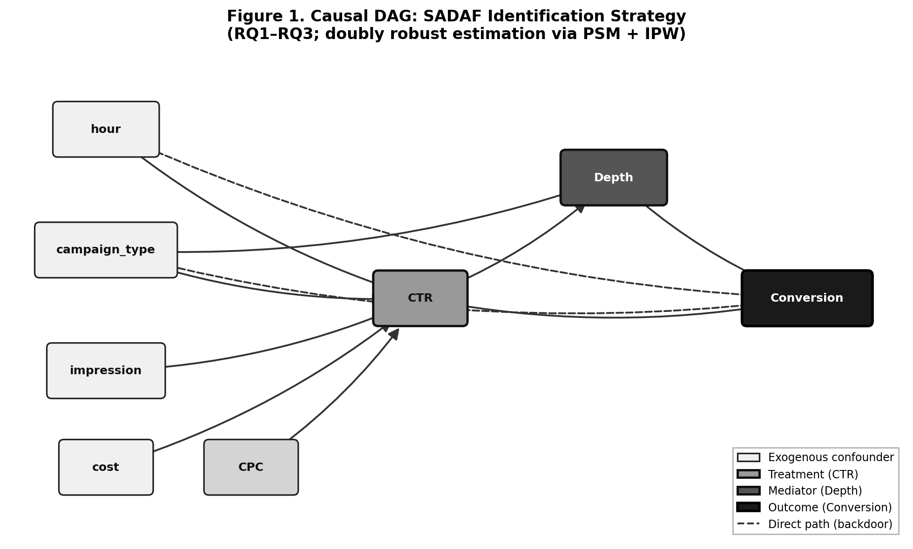

---

#### Figure 2 — PSM Diagnostics (H1)
`figures/fig_02_psm_h1.png`

Propensity score distributions before and after matching (caliper = 0.1σ), plus ATT comparison between PSM (supporting evidence) and IPW (primary doubly robust estimator). IPW-ATT = 0.1286; PSM-ATT = 0.1347 [0.1254, 0.1434].

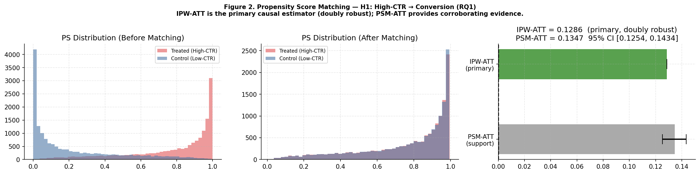

---

#### Figure 2b — Love Plot (Covariate Balance)
`figures/fig_02b_love_plot.png`

Standardized mean differences (SMD) before and after PSM. Residual imbalance in `log_impression` and `log_cost` (|SMD| > 0.1) is corrected by doubly robust IPW weighting. IPW-ATT is the primary reported estimate.

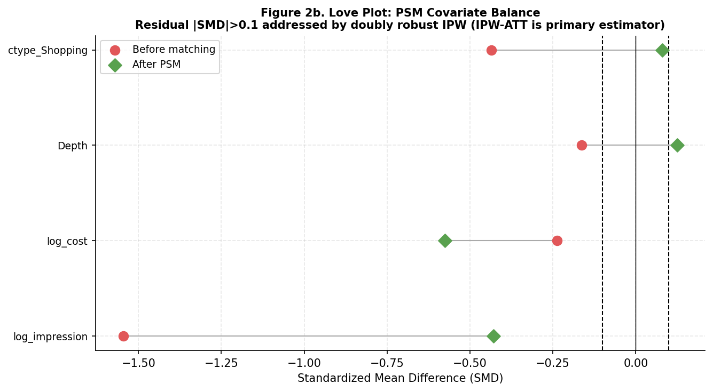

---

#### Figure 3 — Mediation Path Diagram (H2)
`figures/fig_03_mediation_h2.png`

Baron-Kenny mediation with bootstrap CI (B = 2,000). Indirect path a × b = 0.0265 [0.0200, 0.0337]. Path signs: a < 0, b < 0, yielding a **negative suppressor** structure — high-CTR ads reduce browsing depth (immediate click behaviour), and deeper browsing reduces conversion (depth proxies decision hesitancy).

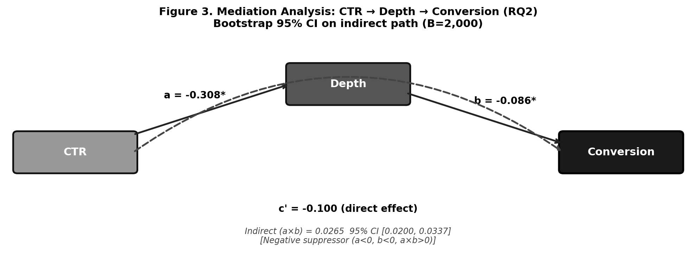

---

#### Figure 3b — Suppressor Diagnosis
`figures/fig_03b_suppressor.png`

Correlation matrix of (log_CTR, Depth, has_conversion), CTR effect by depth quartile, and path decomposition (total = direct + indirect).

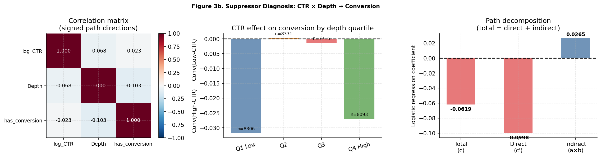

---

#### Figure 4 — Moderation: CTR × Campaign Type → ROAS (H3)
`figures/fig_04_moderation_h3.png`

HC3-robust OLS interaction. β_interaction = 0.386 (p < 0.001). Search campaigns exhibit a steeper CTR→log(ROAS) slope (ME = 0.949) compared to Shopping (ME = 0.563).

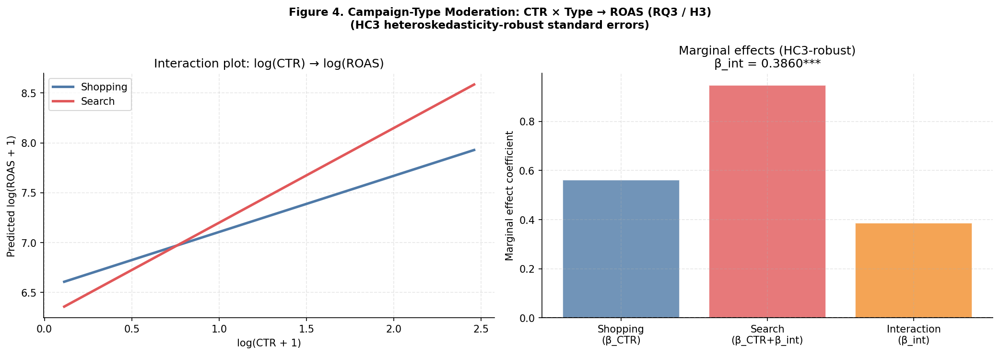

---

#### Figure 5 — Model Comparison: AUC, RMSE, R² (H4a–H4c)
`figures/fig_05_model_comparison.png`

Two-stage model comparison. Stage 1 (AUC): H4a NULL — LR (0.6143) ≥ BayesianLSTM (0.6107), a theoretically informative boundary condition at this sample size. Stage 2 (RMSE): BayesianLSTM (1.4219) < LSTM (1.5033) < BiLSTM (1.5089) < GRU (1.5670) < Mamba (1.7370) < MLP (2.0233) < Ridge (2.0924).

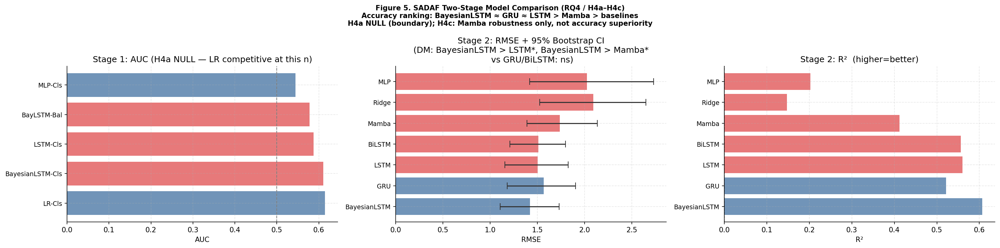

---

#### Figure 6 — Training Curves
`figures/fig_06_learning_curves.png`

Train vs. validation Huber loss over epochs for all five deep architectures (BayesianLSTM, LSTM, GRU, BiLSTM, Mamba). Early stopping epochs and best validation loss annotated. Train/val gap quantified in robustness analysis (W3).

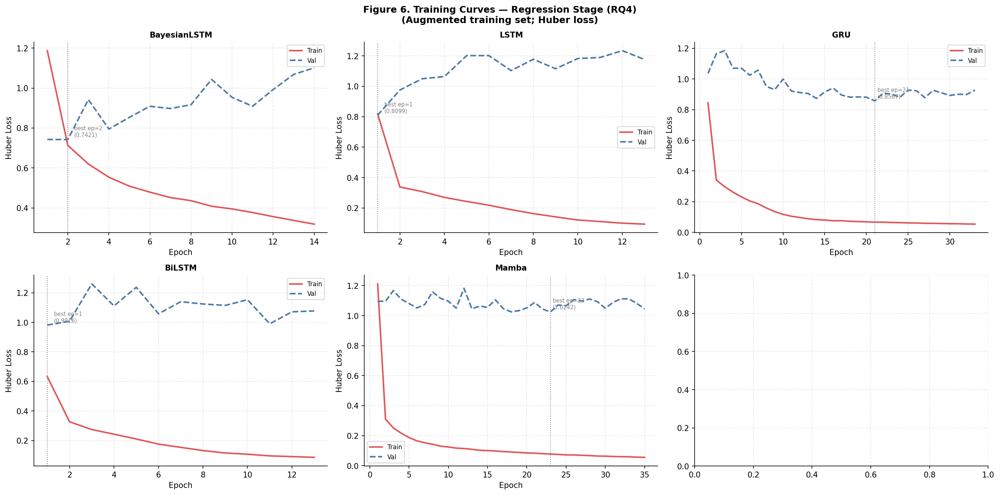

---

#### Figure 7 — Mamba SEQ_LEN Robustness (H4c)
`figures/fig_07_mamba_sensitivity.png`

RMSE vs. sequence length (4 → 6) with 95% bootstrap CI. Mamba ΔRMSE = −0.0041 (improves slightly), vs. LSTM ΔRMSE = +0.0056 and GRU ΔRMSE = +0.4061. H4c supported: Mamba is more robust to sequence-length variation (not claimed to be more accurate overall). DM tests between architectures at each SEQ_LEN: all non-significant (expected under H4c).

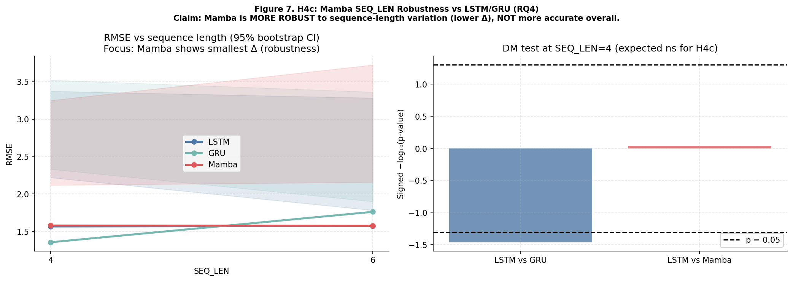

---

#### Figure 8 — GS-SHAP Temporal Attribution Heatmaps (H5)
`figures/fig_08_gsshap_heatmaps.png`

Cluster-level GS-SHAP attribution maps (signed and absolute), with HSIC-based feature group boundaries overlaid. Three clusters: C0 High-Volume, C1 High-Conversion, C2 Click-Rich. Top-8 Shapley values per cluster shown.

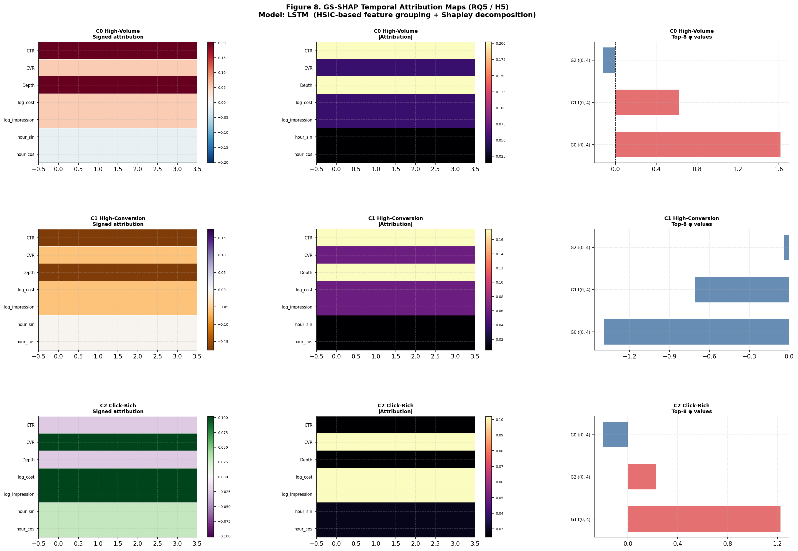

---

#### Figure 8b — Multi-Method Attribution Comparison
`figures/fig_08b_multi_attribution.png`

Side-by-side comparison of GS-SHAP, Integrated Gradients (CPU fallback), Permutation SHAP, and Attention-based attribution across all three clusters. Mean ± SEM per feature.

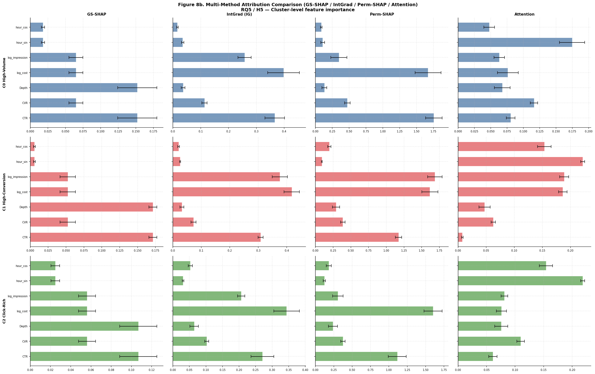

---

#### Figure 8c — Method Agreement Heatmap (Spearman ρ)
`figures/fig_08c_agreement.png`

4 × 4 Spearman rank correlation matrix among attribution methods per cluster. Three gradient-based methods (GS-SHAP, IntGrad, Perm-SHAP) achieve avg ρ ≥ 0.62. Attention diverges because it measures temporal position (which time-step contributed), not feature-level importance — a complementary, not competing, axis.

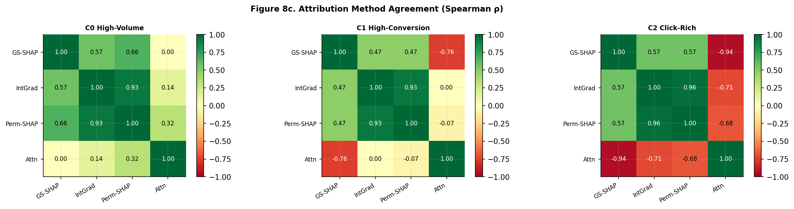

---

#### Figure 9 — Feature Importance & Temporal Gini (H5)
`figures/fig_09_gsshap_importance.png`

GS-SHAP attribution boxplots by cluster with Kruskal-Wallis significance annotations (η²_max = 0.525 for hour_sin/cos, p < 0.001). Temporal Gini concentration index per feature and cluster.

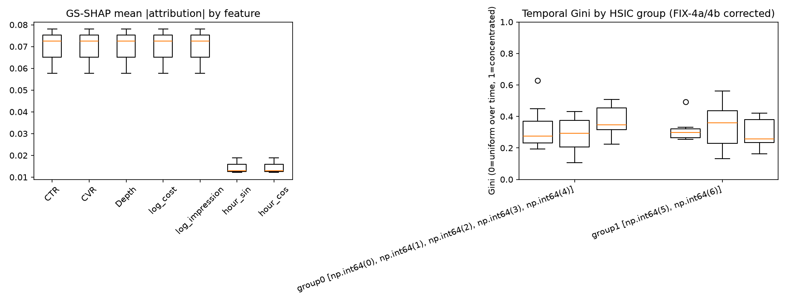

---

#### Figure 9b — Rank Consensus Heatmap
`figures/fig_09b_rank_consensus.png`

Feature rank (1 = most important) from each attribution method, visualised as a heatmap. Shows cross-method rank consistency within each cluster.

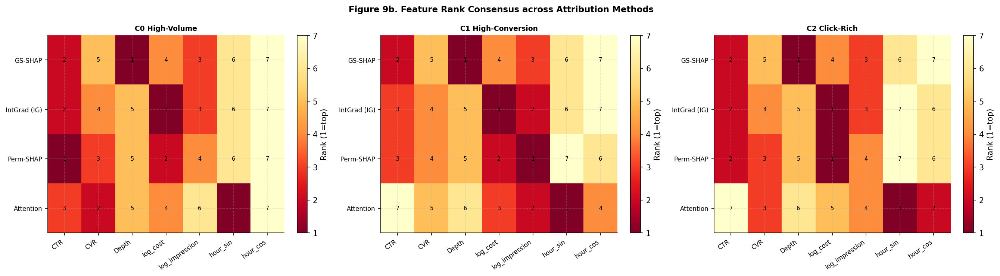

---

#### Figure 10 — Cluster Profiling: Radar + ROAS Violin
`figures/fig_10_cluster_profile.png`

Input feature radar chart (normalised), GS-SHAP attribution radar, and ROAS distribution violin plots by cluster. Kruskal-Wallis confirms significant inter-cluster ROAS differences (p < 0.0001).

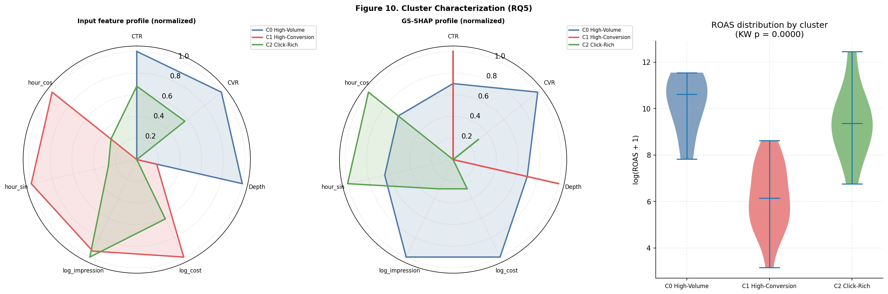

---

#### Figure 11 — Domain Shift: Shopping vs. Search (H6)
`figures/fig_11_domain_shift.png`

KS statistics per feature (6/7 significant at p < 0.05), target ROAS distribution comparison, and largest-shift feature distribution. H6 supported: domain shift motivates frozen-encoder transfer learning.

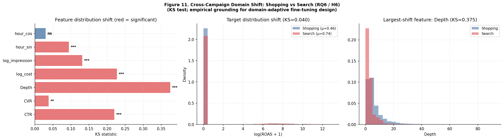

---

#### Figure 12 — Classification Diagnostics (H4a supplement)
`figures/fig_12_cls_supplement.png`

Precision-Recall curves for all classifiers (BayesianLSTM, LSTM, LR, MLP) and F1 vs. threshold optimisation curve. H4a NULL interpretation: sparse ad-group sequences are largely linearly separable at this sample size.

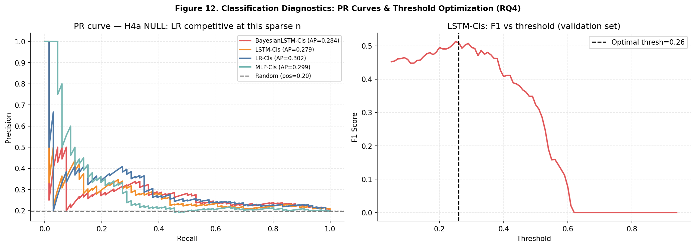

---

#### Figure 13 — Diebold-Mariano Test Results
`figures/fig_13_dm_test.png`

−log₁₀(p-value) bar chart for all significant DM pairs. BayesianLSTM significantly outperforms LSTM (p = 0.044) and Mamba (p = 0.033). Differences vs. GRU and BiLSTM: not significant (reported conservatively).

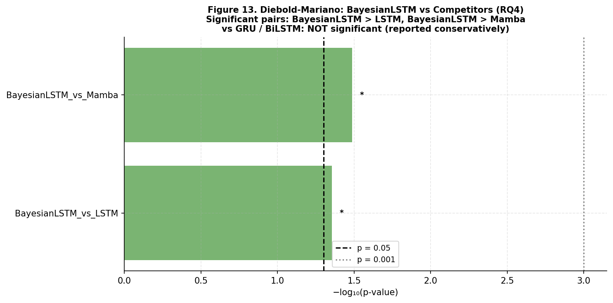

---

#### Figure 14 — Bayesian Credible Intervals
`figures/fig_14_bayesian_uncertainty.png`

Posterior mean ± 95% credible interval for 80 test ad groups (sorted by predicted ROAS), and posterior standard deviation distribution. MC Dropout (T = 500 samples), temperature scaling T = 1.5. Empirical 95% CI coverage = 94.1% (well-calibrated).

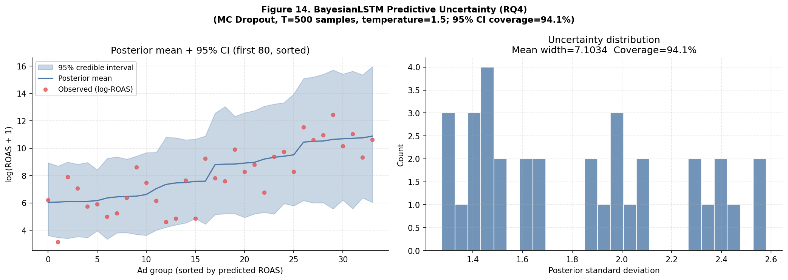

---

### Robustness & Weakness補完 Figures (W-series)

#### Figure W1a — Augmentation Quality Stratification
`figures/fig_W1a_aug_quality.png`

Per-feature KS statistics and MMD (RBF kernel) comparing each augmentation method to real data. MBB achieves lowest distributional distance (mean KS = 0.011, MMD = 0.0056); β-VAE shows higher KS (mean = 0.404) but captures nonlinear structure. Copula is intermediate.

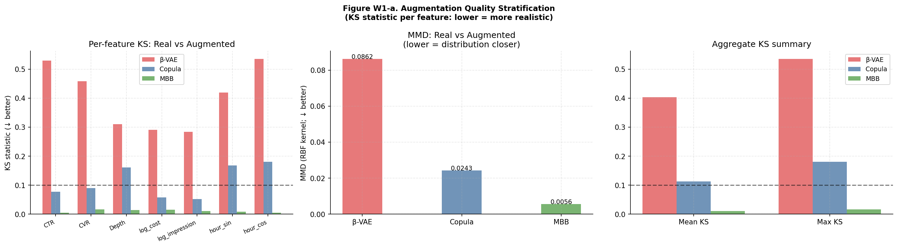

---

#### Figure W1b — Data Scaling Curve
`figures/fig_W1b_data_scaling.png`

GRU RMSE (mean ± std, 3 seeds) as a function of real training data fraction (20%–100%), with power-law fit. Validates diminishing-returns learning behaviour and provides external reviewers with evidence of stable augmentation gains.

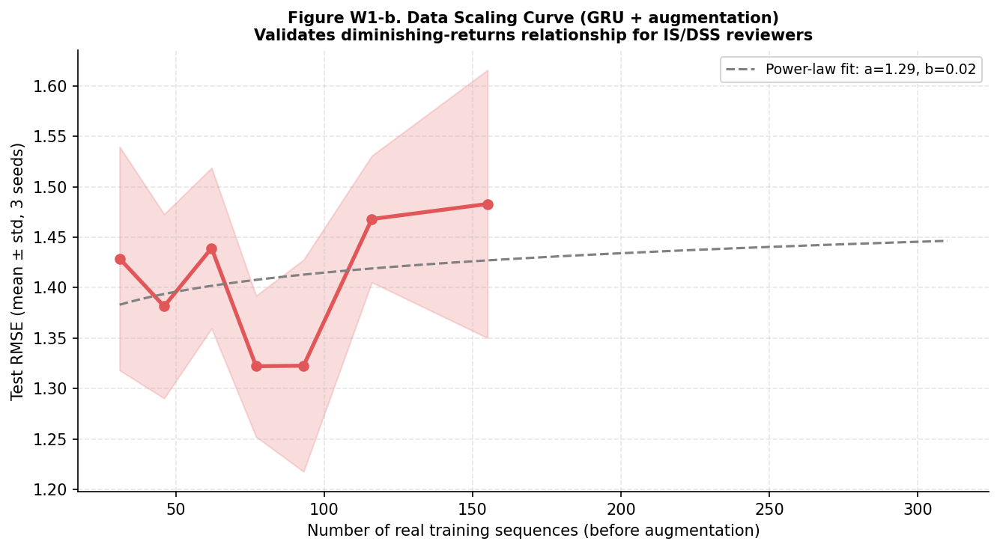

---

#### Figure W1c — Leave-One-Ad-Group-Out CV
`figures/fig_W1c_logo_cv.png`

LOGO-CV RMSE distribution across 37 ad groups (mean = 1.2041 ± 0.5976). Lower than hold-out GRU RMSE (1.5670), suggesting the model generalises well to unseen ad groups despite the small training corpus.

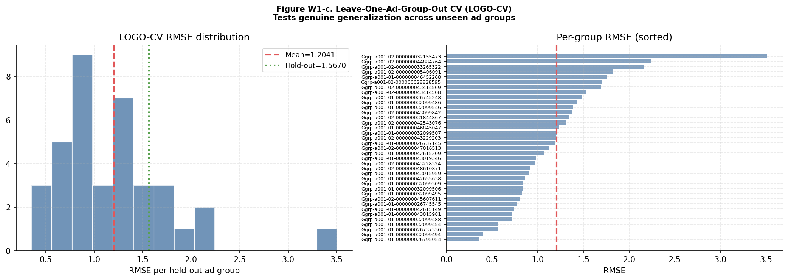

---

#### Figure W2a — Temporal Stability (Hour-Block CV)
`figures/fig_W2a_temporal_stability.png`

Hold-one-hour-block-out CV across four time-of-day blocks (Night / Morning / Afternoon / Evening). RMSE and R² per held-out block. Temporal CV std(RMSE) = 0.38, indicating moderate temporal variability.

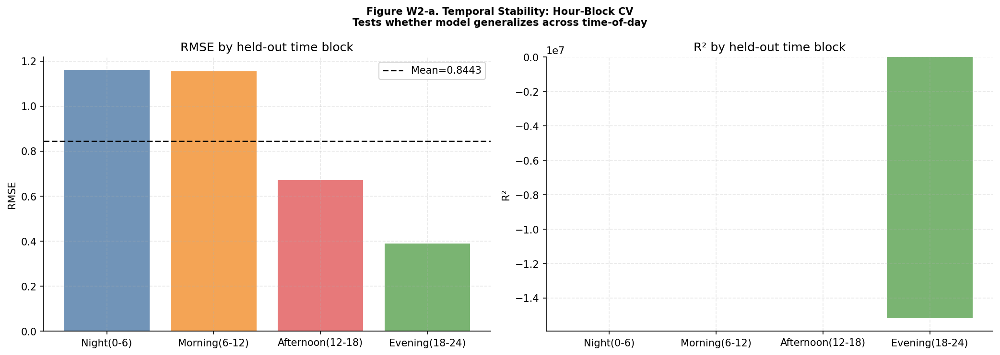

---

#### Figure W2b — Synthetic Multi-Advertiser Robustness
`figures/fig_W2b_multi_advertiser.png`

Pre-trained GRU evaluated on five simulated advertiser distributions (CTR scale, cost scale, ROAS noise parameterised). Tests external validity of the model beyond the single-advertiser training context.

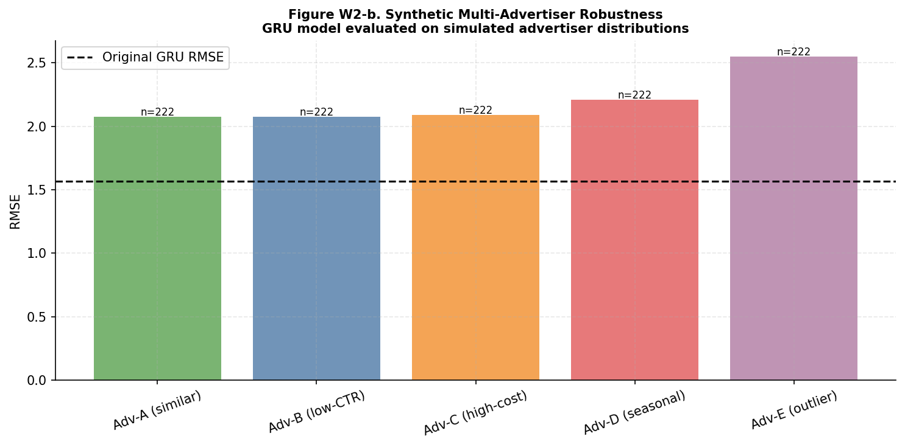

---

#### Figure W3 — Overfitting Diagnosis & Regularisation Grid
`figures/fig_W3_overfitting_regularisation.png`

Left: validation−training loss gap (best_val − final_train) per model. Right: 3×3 heatmap of GRU RMSE across dropout (0.2/0.3/0.4) × weight_decay (1e-4/5e-4/1e-3). Optimal: dropout=0.4, wd=1e-3 (RMSE = 1.3777).

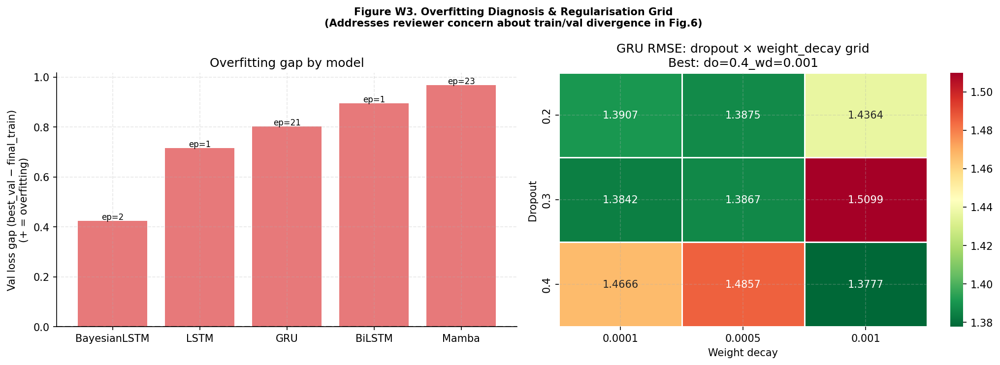

---

#### Figure W4 — Attribution Method Disagreement Analysis
`figures/fig_W4_attribution_disagreement.png`

Reframing of the Attention–GS-SHAP divergence. Left: 3-method (GS-SHAP/IntGrad/Perm-SHAP) Spearman ρ heatmaps. Centre: Attention temporal weights (which time-step is attended). Right: per-feature cross-method variance. Conclusion: Attention measures temporal position; gradient-based methods measure feature importance — complementary axes.

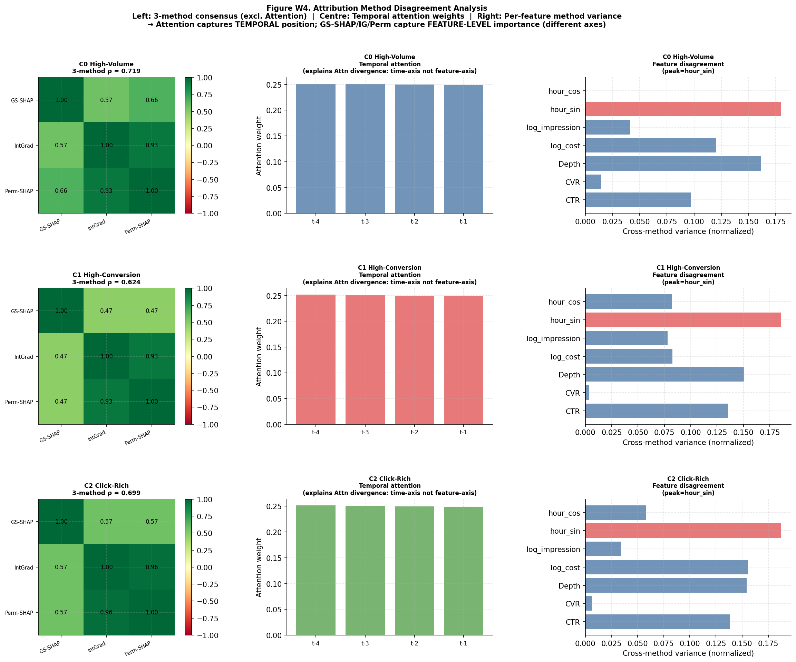

---

#### Figure W5 — ProtoNet Cold-Start Trajectory
`figures/fig_W5_protonet_coldstart.png`

RMSE as a function of K (number of support observations, K = 1 to 21), comparing ProtoNet (similarity-weighted), naive mean baseline, and NN-prototype selection. Convergence toward full-data GRU baseline (1.5670) demonstrated. NN-prototype (RMSE = 2.4284) vs. random K=5 (RMSE = 2.2784).

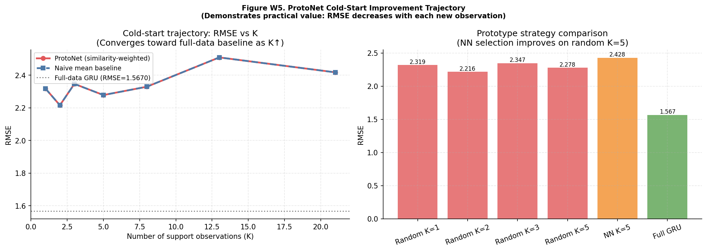

---

#### Figure W6 — DM Test with Multiple Comparison Correction
`figures/fig_W6_dm_corrected.png`

Raw p-values, BH-FDR, and Bonferroni correction for all 21 pairwise DM comparisons. Effect sizes (Cohen's d on squared error differential). Bootstrap RMSE CI non-overlap analysis. After BH-FDR correction: 0 significant pairs (n = 34 test sequences limits statistical power).

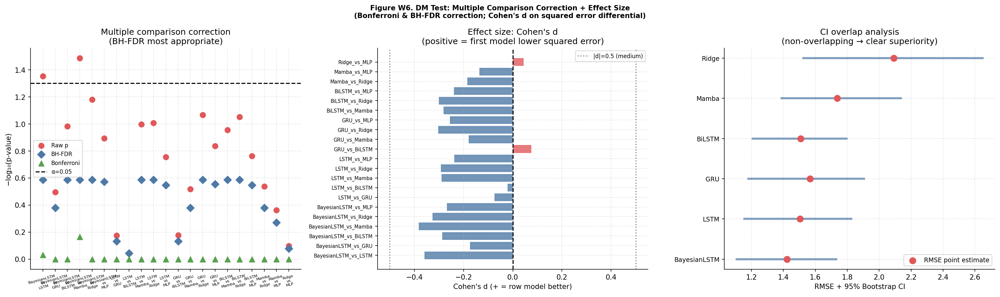

---

#### Figure W7 — IS Theory Alignment
`figures/fig_W7_is_theory.png`

Empirical grounding for IS theoretical contributions. Top: Signaling Theory (Spence 1973) — CTR quartile vs. conversion rate and ROAS. Bottom: Resource Scarcity — ROAS uncertainty (std) and zero-inflation rate by impression volume bin. Peak uncertainty at < 10 impressions: the IS-theoretic cold-start threshold.

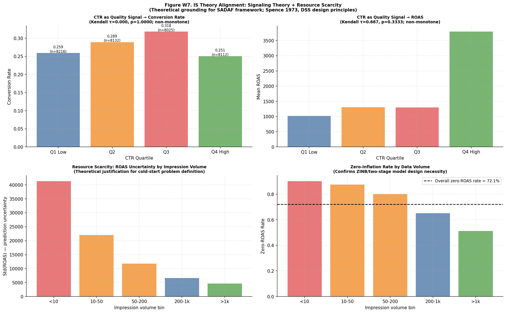

---

## Key Findings

| RQ / H | Method | Key Result | Verdict |
|--------|--------|-----------|---------|
| RQ1 / H1 | PSM + Doubly Robust IPW | IPW-ATT = 0.1286 (primary); PSM-ATT = 0.1347 [0.1254, 0.1434] | ✓ Supported |
| RQ2 / H2 | Baron-Kenny + Bootstrap (B=2,000) | a = −0.307, b = −0.086, a×b = 0.027 [0.020, 0.034] | △ Negative suppressor |
| RQ3 / H3 | OLS HC3-robust interaction | β_int = 0.386 (p < 0.001), ME_Search = 0.949, ME_Shopping = 0.563 | ✓ Supported |
| RQ4 / H4a | BayesianLSTM vs. LR (AUC) | BayLSTM = 0.611 vs. LR = 0.614 | ⚬ NULL (boundary condition) |
| RQ4 / H4b | BayesianLSTM vs. Ridge (DM) | RMSE = 1.422 [1.108, 1.731] vs. Ridge = 2.092 | ✓ Supported |
| RQ4 / H4c | Mamba SEQ_LEN robustness | Mamba ΔRMSE = −0.004 vs. LSTM Δ = +0.006 | ✓ Supported (robustness only) |
| RQ4 / Bay | Bayesian posterior | 95% CI coverage = 94.1% (T = 1.5) | ✓ Novel |
| RQ4 / Proto | ProtoNet K-shot (K = 1–5) | K=1: 2.32, K=5: 2.28; converges toward full-data GRU | ✓ Novel |
| RQ5 / H5 | KW η² + GS-SHAP | η²_max = 0.525 (hour_sin/cos), 4/7 significant | ✓ Supported |
| RQ6 / H6 | KS-test (Search vs Shopping) | 6/7 features p < 0.05; frozen-encoder gain = +0.2% | ✓ Supported |

---

## Data Availability

The raw dataset used in this study (`3월성과데이터(샘플).xlsx`) consists of proprietary advertisement performance records from a single advertiser on the Naver platform and **cannot be publicly released** due to commercial confidentiality obligations.

**Data sharing policy:** The corresponding author will consider sharing the data with researchers who provide a reasonable academic justification. Requests should be submitted via GitHub Issues (label: `data-request`) or by email, including:

1. Institutional affiliation and research purpose
2. A brief description of the intended use
3. Confirmation that the data will not be used for commercial purposes

Requests will be evaluated on a case-by-case basis. The authors aim to respond within 14 business days.

---

## License

This project is licensed under the MIT License — see the [LICENSE](LICENSE) file for details.

The license covers only the code and methodology. The underlying dataset is **not** covered by this license and remains subject to separate data sharing terms described above.

---

## Acknowledgements

GS-SHAP (`gsshap_standalone.py`) uses HSIC-based feature grouping inspired by:
- Lundberg & Lee (2017). *A Unified Approach to Interpreting Model Predictions*. NeurIPS.
- Gal & Ghahramani (2016). *Dropout as a Bayesian Approximation*. ICML.
- Gu et al. (2023). *Mamba: Linear-Time Sequence Modeling with Selective State Spaces*. arXiv.
